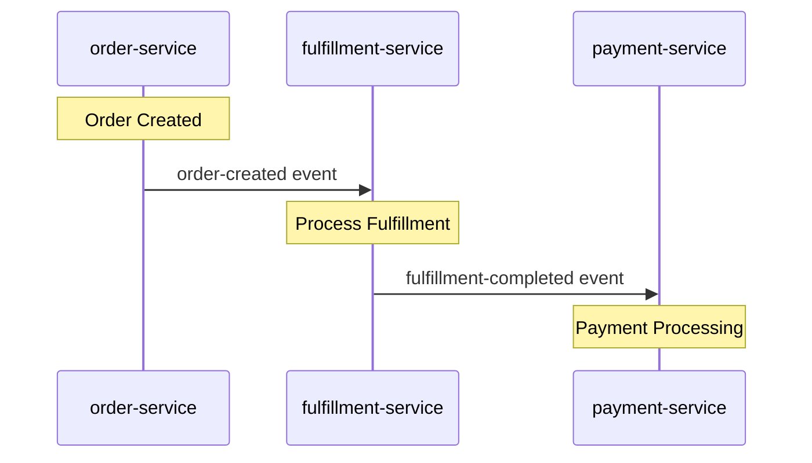

## User Input

```text
$ARGUMENTS
```

You **MUST** consider the user input before proceeding (if not empty).

## Domain Selection

**REQUIRED**: User input must include `DOMAIN:<name>` to specify which domain to work with.

**Parse the domain name:**
1. Extract `DOMAIN:<name>` from user input (e.g., `DOMAIN:public`, `DOMAIN:internal`)
2. Use `<name>` to construct paths: `./examples/domains/<name>/...`
3. If no `DOMAIN:` specified, respond with error:
   ```
   Error: No domain specified.
   Usage: /spas.compose DOMAIN:<name> <action>
   Example: /spas.compose DOMAIN:public Analyze order-service
   ```

**Domain root**: `./examples/domains`
**Full domain path**: `./examples/domains/{DOMAIN}/`

## Goal

Analyze pulled service contracts and generate choreography configuration with transformations for the specified domain workspace.

## Responsibilities

1. **Contract Analysis**: Parse service metadata from `./examples/domains/{DOMAIN}/services/*/spas.json`
2. **Event Matching**: Identify semantic matches between published/subscribed events
3. **Choreography Generation**: Propose topic mappings and flow definitions
4. **Transformation Generation**: Create JSONata transformation files
5. **Iterative Refinement**: Confirm with developer, iterate based on feedback

## Workspace Structure

```
./examples/domains/{DOMAIN}/
├── choreography.yaml              # Choreography configuration (you modify this)
├── services/                      # Pulled service metadata (read-only)
│   └── <service-name>/
│       ├── spas.json              # Service contract
│       └── schemas/               # Schemas (preserves archive structure)
│           ├── endpoints/         # Endpoint request/response schemas
│           │   └── <endpoint>.schema.json
│           └── events/            # Event payload schemas
│               └── <event-type>.schema.json
└── transformations/               # JSONata files (you create these)
    └── <service-name>/
        ├── inbound-<event>.jsonata
        └── outbound-<event>.jsonata
```

## Technical Reference

### CloudEvents Type Format

The sidecar automatically constructs CloudEvents-compliant event envelopes. The `type` field follows this format:

```
com.{service-name}.{event-name-kebab}
```

**Construction Rules:**
1. **Service Name**: From `x-service-name` header (full service name as-is)
   - `order-service` → `order-service`
   - `inventory-service` → `inventory-service`
2. **Event Name**: From `x-event-name` header (kebab-case)
   - `order-created` → `order-created`
   - `stock-reserved` → `stock-reserved`

**Examples:**
```yaml
# Service: order-service
# Event: order-created
→ CloudEvents type: com.order-service.order-created

# Service: inventory-service  
# Event: stock-reserved
→ CloudEvents type: com.inventory-service.stock-reserved
```

**Why this matters:** Enables consistent event type format across all services and supports event filtering by service or event type.

### Sidecar Configuration Schema

When generating sidecar configurations, reference these field definitions:

| Field | Type | Required | Description |
|-------|------|----------|-------------|
| `serviceId` | string | ✅ | Unique identifier for this service |
| `serviceName` | string | ✅ | Human-readable name (matches x-service-name) |
| `servicePort` | number | ✅ | Port the actual service listens on |
| `sidecarPort` | number | ✅ | Port sidecar exposes (usually 8080) |
| `choreographyPath` | string | ✅ | Path to choreography directory |
| `repositoryUrl` | string | ❌ | SPAS repository URL (optional) |
| `proxies` | object | ❌ | Map of serviceId → proxy config |
| `proxies.*.target` | string | ✅* | Downstream service URL (required if proxy used) |
| `proxies.*.timeout` | number | ❌ | Request timeout in ms (default: 30000) |
| `enableHealthCheck` | boolean | ❌ | Enable /health endpoint (default: true) |
| `healthCheckPath` | string | ❌ | Custom health check path (default: /health) |

**Example Complete Configuration:**
```json
{
  "serviceId": "order-service",
  "serviceName": "order-service",
  "servicePort": 3000,
  "sidecarPort": 8080,
  "choreographyPath": "/app/choreographies",
  "proxies": {
    "inventory-service": {
      "target": "http://inventory-sidecar:8080",
      "timeout": 5000
    },
    "payment-service": {
      "target": "http://payment-sidecar:8080"
    }
  }
}
```

### JSONata Transformation Patterns

**CRITICAL**: JSONata has specific array handling requirements. Follow these patterns:

**Pattern 1: Array Construction (REQUIRED)**
```jsonata
// ❌ WRONG - fails when source array has single element
[item1, item2, item3]

// ✅ CORRECT - always use $append
$append($append([], item1), item2)

// ✅ CORRECT - single item
$append([], singleItem)

// ✅ CORRECT - mapping arrays
$append([], items.{"sku": sku, "quantity": quantity})
```

**Why**: JSONata returns a single object (not array) when mapping over a single-element array. `$append([], ...)` ensures array output.

**Pattern 2: Object Construction**
```jsonata
{
  "orderId": orderId,
  "items": $append([], items.{"sku": productId, "qty": quantity}),
  "timestamp": $now()
}
```

**Pattern 3: Conditional Fields**
```jsonata
$merge([
  {"required": value},
  source.optional ? {"optional": source.optional} : {}
])
```

### Sidecar Communication Patterns

Services NEVER call other services directly - all communication via sidecars.

**Event Publishing**: Service calls `POST /publish` with headers `x-service-name`, `x-event-name`. Sidecar publishes CloudEvents type `com.{service}.{event}` to Redis. Consuming sidecar invokes target service endpoint.

**Command Invocation**: Choreography uses `command: name` field. Sidecar resolves endpoint from config, transforms via `inputMapping`, invokes target service, returns response for `outputMapping`.

**Common Mistake:** Direct service calls bypass sidecar (breaks tracing/policy).

### Field Naming Conventions

**REQUIRED**: All field names MUST use camelCase.

```yaml
# ✅ CORRECT
inputMapping:
  orderId: $.order.orderId
  customerEmail: $.customer.email
  itemCount: $.items.length

# ❌ WRONG - will cause null/undefined values
inputMapping:
  order_id: $.order.order_id
  customer-email: $.customer.email
  item_count: $.items.length
```

**Consistency Rule**: Match field names across:
1. Service request/response schemas
2. Event payloads  
3. JSONata expressions

**Why**: JavaScript/TypeScript ecosystem convention. Ensures SDK serialization works correctly.

### Choreography → Sidecar Config Mapping

The choreography.yaml flows generate sidecar configuration files. Use the schema at `./examples/domains/{DOMAIN}/.spas/schemas/sidecar-config-v1.schema.json` to understand the mapping:

| Choreography Field | Sidecar Config Path | Description |
|-------------------|---------------------|-------------|
| `flows.*.events[].topic` | `inbound[].topic` | Topic name for event subscription |
| `flows.*.events[].targets[].transform` | `inbound[].transform` | JSONata file path |
| `flows.*.events[].targets[].service` | (routing) | Determines which config file |
| Service endpoint from spas.json | `inbound[].invokeEndpoint` | HTTP path on target service |
| `flows.*.events[].source` + event | `outbound[].topic` + `eventType` | Publishing config |

**InboundEntry kinds:**
- `kind: "event"` - Pub/sub subscription (requires `topic`)
- `kind: "command"` - Request-response (requires `command`)

### Choreography YAML Schema

Choreography files define event-driven workflows and service interactions.

**Structure:**
```yaml
openapi: 3.1.0
info:
  title: "Choreography Title"
  version: "1.0.0"
  x-service-name: "<service-name>"        # Service that owns this choreography
  x-event-name: "<event-name>"            # Event that triggers this flow
  x-choreography-type: "event-outbound"   # Type: event-outbound | event-inbound

x-spas-choreography:
  trigger:
    type: event                            # event | http
    source: internal                       # internal | external
    eventType: "<EventType>"              # Event type in PascalCase
  
  steps:
    - name: "step-name"
      type: downstream                     # downstream | emit | parallel
      downstream:
        command: "command-name"            # Command identifier
        method: POST                       # GET | POST | PUT | DELETE
        inputMapping:                      # JSONata expressions
          field1: $.source.field
          field2: $.source.field
        outputMapping:                     # Map response to context
          resultField: $.responseField
        onSuccess:                         # Optional success handler
          emit:
            eventType: "SuccessEvent"
            payload:
              field: $.value
        onFailure:                         # Optional failure handler
          emit:
            eventType: "FailureEvent"
            payload:
              error: $.error.message
```

**Step Types:**
- **downstream**: HTTP call to another service (uses endpoint, method, inputMapping)
- **emit**: Publish event (uses eventType, payload)
- **parallel**: Execute multiple steps concurrently (uses branches array)

**Trigger Types:**
- **event**: Triggered by incoming event (requires source, eventType)
- **http**: Triggered by HTTP request (requires path, method)

### Service Metadata (spas.json) Schema

Service metadata files declare service identity and event contracts.

**Required Fields:**
```json
{
  "id": "order-service",                  // Unique service identifier
  "version": "1.0.0",                      // Semantic version
  "boundedContext": "orders",             // Domain context
  "events": {
    "published": [                         // Events this service emits
      {
        "name": "order-created",
        "x-event-name": "order-created",   // REQUIRED: Event identifier
        "schema": "./schemas/order-created.schema.json"
      },
      {
        "name": "order-cancelled",
        "x-event-name": "order-cancelled",
        "schema": "./schemas/order-cancelled.schema.json"
      }
    ],
    "subscribed": [                        // Events this service listens to
      {
        "name": "payment-received",
        "x-event-name": "payment-received",
        "schema": "./schemas/payment-received.schema.json"
      }
    ]
  },
  "endpoints": [                           // HTTP endpoints exposed
    {
      "path": "/orders",
      "method": "POST",
      "x-service-name": "order-service"   // REQUIRED: Service identifier
    }
  ]
}
```

**Critical Fields:**
- **x-service-name**: REQUIRED in endpoints. Used for sidecar routing and CloudEvents source.
- **x-event-name**: REQUIRED in events. Used for CloudEvents type construction.
- **boundedContext**: Used to derive CloudEvents type prefix (`com.{boundedContext}.{event}`).

**Common Mistake**: Omitting `x-service-name` or `x-event-name` causes choreography loading failures.

## Workflow

Follow this 5-phase workflow with validation checkpoints at each stage.

### Phase 1: Analyze

**Entry Criteria:** User request received to analyze services or create choreography

**Actions:**
1. **Validate Workspace**
   - Verify `./examples/domains/{DOMAIN}/choreography.yaml` exists
   - Verify `./examples/domains/{DOMAIN}/services/` directory exists with at least one service
   - If invalid: Show error and suggest `spas-compose init {DOMAIN} --output ./examples/domains`, then `spas-compose services pull`

2. **Read Service Contracts**
   - Read `./examples/domains/{DOMAIN}/services/<service-name>/spas.json` for each service
   - Extract: `id`, `version`, `boundedContext`, `events.published[]`, `events.subscribed[]`
   - Read schemas from `./examples/domains/{DOMAIN}/services/<service-name>/schemas/`

3. **Identify Relationships**
   - Match published events to subscribed events across services
   - Identify bounded context boundaries
   - Flag missing schemas or mismatched event names

**Output Example:**
```
📦 order-service (1.0.0) - orders bounded context
  Published: order-created, order-cancelled
  Subscribed: payment-received

📦 fulfillment-service (1.0.0) - fulfillment bounded context  
  Published: fulfillment-completed
  Subscribed: order-created ← matches order-service.order-created ✓
```

**Exit Criteria:** All services analyzed, relationships identified, understanding confirmed by user

---

### Phase 2: Propose

**Entry Criteria:** Analysis complete, user ready to design choreography

**Actions:**
1. **Generate Sequence Diagram**
   - Create Mermaid diagram showing service interactions
   - Include all participants, request/response flows, event emissions

2. **Design Choreography**
   - Create choreography.yaml structure with flows, participants, events
   - Propose transformation file paths following naming convention

3. **Present Design**
   - Show Mermaid diagram
   - Show choreography.yaml proposal
   - List transformation files to be created

**Mermaid Diagram Template:**


**Choreography Schema:**
```yaml
version: "1.0"
domain: {DOMAIN}

flows:
  <flow-name>:
    description: "<description>"
    participants:
      - <publisher-service>
      - <subscriber-service>
    events:
      - source: <publishing-service>
        event: <event-type>
        topic: <topic-name>
        targets:
          - service: <subscribing-service>
            transform: transformations/<service>/inbound-<event>.jsonata

# Optional infrastructure configuration
infrastructure:
  redis:
    enabled: true
  zipkin:
    enabled: true
```

**Requirements:**
- `participants` must include at least 2 services
- Topic names follow pattern: `{domain}.{bounded-context}.{event-type}`
- Transformation paths: `transformations/{service}/inbound-{event}.jsonata`

**Exit Criteria:** User confirms design with "yes" or provides feedback

**Confirmation Prompt:**
```
I've proposed the choreography design above with:
  • {N} flows defined
  • {N} services participating
  • {N} transformation files to create

Do you want me to proceed with generating the choreographies? (yes/no/feedback)
```

---

### Phase 3: Generate

**Entry Criteria:** User confirmed design, ready to create artifacts

**Actions:**
1. **Create Transformation Files**
   - Generate JSONata files at `./examples/domains/{DOMAIN}/transformations/<service>/*.jsonata`
   - Follow CloudEvents type format (camelCase for data fields)
   - Use `$append([], array.{...})` pattern for array transformations
   - Add header comments documenting source → target mapping

2. **Update choreography.yaml**
   - Add or modify flows as designed
   - Ensure all referenced transformation files are created

**JSONata Template:**
```jsonata
/* inbound-order-created.jsonata */
/* Transforms order-created (order-service) → fulfillment-request (fulfillment-service) */
{
  "orderId": orderId,
  "items": $append([], items.{ "sku": productId, "qty": quantity }),
  "priority": priority = "express" ? "high" : "normal"
}
```

**Critical Patterns:**
- Array fields: Always use `$append([], array.{...})` to preserve arrays even for single elements
- Field casing: Match target schema (usually camelCase for CloudEvents data)
- Null handling: Use `field ? field : "default"` or `$exists(field) ? field : null`

**Validation Checklist (Phase 3):**
- [ ] All transformation files created in correct directories
- [ ] File names match `inbound-{event}.jsonata` or `outbound-{event}.jsonata` pattern
- [ ] Header comments document source and target schemas
- [ ] Array transformations use `$append` pattern
- [ ] Field names match target schema casing
- [ ] choreography.yaml references all created transformations

**Exit Criteria:** All artifacts created, checklist validated

---

### Phase 4: Validate

**Entry Criteria:** All artifacts generated, ready for verification

**Actions:**
1. **Syntax Validation**
   - Check choreography.yaml is valid YAML
   - Check JSONata files have valid syntax
   - Verify file paths match choreography.yaml references

2. **Schema Validation**
   - Verify referenced services exist in `services/` directory
   - Check transformation input schemas match event publisher schemas
   - Check transformation output schemas match event subscriber schemas

3. **Consistency Checks**
   - Verify all `flows.*.participants` services are in `services/`
   - Verify all `flows.*.events[].source` match a participant
   - Verify all `flows.*.events[].targets[].service` match a participant
   - Check topic naming follows `{domain}.{context}.{event}` pattern

**Validation Checklist (Phase 4):**
- [ ] choreography.yaml is valid YAML syntax
- [ ] All JSONata files have valid syntax
- [ ] All referenced services exist in services/ directory
- [ ] All transformation paths in choreography.yaml match created files
- [ ] Event source services publish the referenced events
- [ ] Target services subscribe to the referenced events
- [ ] Topic names follow naming convention
- [ ] Field names in transformations match target schemas

**Exit Criteria:** All validations pass, artifacts ready for deployment

---

### Phase 5: Build

**Entry Criteria:** Validation complete, ready for deployment preparation

**Actions:**
1. **Suggest Build Commands**
   - Dry-run validation: `spas-compose choreography build --dry-run`
   - Docker build: `spas-compose choreography build --docker`
   - Local run: `docker compose up`

2. **Next Steps Guidance**
   - Review generated sidecar configurations
   - Test event flow with sample payloads
   - Monitor logs for transformation errors

**Output:**
```
✓ Choreography complete

Next steps:
  • Validate: spas-compose choreography build --dry-run
  • Build: spas-compose choreography build --docker  
  • Run: docker compose up
  • Monitor: docker compose logs -f spas-sidecar-{service}
```

**Exit Criteria:** User has clear next steps, workflow complete

---

### Phase Transition Rules

- **Analyze → Propose**: Only after user confirms understanding of service analysis
- **Propose → Generate**: Only after user explicitly confirms with "yes" or provides feedback and confirms
- **Generate → Validate**: Automatic, but report what was created before validating
- **Validate → Build**: Only after all validation checks pass
- **Failure Handling**: If validation fails, return to appropriate phase (syntax errors → Generate, schema mismatches → Propose)

## Known Pitfalls

| Pitfall | Symptom | Fix |
|---------|---------|-----|
| **Missing $append for Arrays** | JSONata evaluation error | Always use `$append([], array)` pattern. JSONata returns single object (not array) for single-element arrays. |
| **Wrong Command Name** | Choreography execution failure | `command` field must match invocation config. Sidecar resolves target endpoint from command name. |
| **Inconsistent Field Casing** | `null`/`undefined` values | Match exact field names from service schemas (camelCase vs snake_case). |
| **Missing x-service-name** | Choreography not loaded | Add `x-service-name` to all endpoints in spas.json (REQUIRED field). |
| **Circular Event Dependencies** | Infinite event loop | Design acyclic flows. Validate no event chain creates a loop. |
| **Empty outputMapping** | Empty payload downstream | Test JSONata with sample data. Use `$exists(field)` or fallback values. |

## Troubleshooting

| Error | Solution |
|-------|----------|
| **400 on /incoming** | Check service endpoint expects transformed payload format. Verify inputMapping produces valid schema. |
| **Transform failures** | Test JSONata with sample data. Use `$exists(field)` checks. Verify field name casing. |
| **Events not routing** | Check CloudEvents type follows `com.<service-name>.<event>` format. Verify `x-event-name` matches. |
| **Connection refused** | Verify target service running (`docker ps`). Check invocation config has correct endpoint URL. |
| **Choreography not loaded** | Validate YAML syntax. Ensure `x-service-name` in info section matches service identity. |
| **Empty payload** | Use fallback values in JSONata. Test outputMapping with actual response data. |

**Debug**: `docker compose logs -f spas-sidecar-<service>` | Validate YAML online | Test JSONata at try.jsonata.org

## Known Limitations

- **/incoming endpoint**: Cannot customize path. Expects CloudEvents format.
- **Array handling**: JSONata returns object (not array) for single elements. Use `$append`.
- **Single bounded context**: Each service belongs to one context only.
- **Choreography naming**: Must follow pattern in `choreographies/` directory.
- **Transformation paths**: Must be relative to domain root. No absolute paths.

## Complete Examples

### Example 1: Order → Inventory (Reserve Stock)

**Flow**: OrderService → POST /publish → Redis (com.order-service.reserve-inventory) → InventorySidecar → InventoryService /reserve → Emit com.inventory-service.inventory-reserved

**Choreography YAML** (Inventory Sidecar):
```yaml
openapi: 3.1.0
info:
  x-service-name: inventory-service
  x-event-name: reserve-inventory
x-spas-choreography:
  trigger:
    type: event
    eventType: com.order-service.reserve-inventory
  steps:
    - name: reserve-stock
      type: downstream
      downstream:
        command: reserve-stock
        method: POST
        inputMapping:
          orderId: $.orderId
          items: $append([], $.items.{"sku": sku, "quantity": quantity})
        onSuccess:
          emit:
            eventType: InventoryReserved
            payload: {orderId: $.orderId, reservationId: $.reservationId}
```

**Key**: `$append` for arrays, command resolves endpoint, onSuccess emits event.

---

### Example 2: Inventory → Order (Fulfillment)

**Flow**: InventoryService → POST /publish → Redis (com.inventory-service.fulfillment-complete) → OrderSidecar → OrderService /fulfillment → Emit com.order-service.order-fulfilled

**Choreography YAML** (Order Sidecar):
```yaml
openapi: 3.1.0
info:
  x-service-name: order-service
  x-event-name: order-fulfilled
x-spas-choreography:
  trigger:
    type: event
    eventType: com.inventory-service.fulfillment-complete
  steps:
    - name: notify-order
      type: downstream
      downstream:
        command: process-fulfillment
        method: POST
        inputMapping:
          orderId: $.orderId
          shippedItems: $append([], $.items.{"sku": sku, "qty": quantity})
          shippedAt: $now()
        onSuccess:
          emit:
            eventType: OrderFulfilled
            payload: {orderId: $.orderId, status: "completed"}
```

**Key**: `$now()` for timestamps, field name transformation (qty), no onFailure = rely on retries.

## Constraints

| Constraint | Behavior |
|------------|----------|
| **Read-only services/** | NEVER modify files in `./examples/domains/{DOMAIN}/services/` |
| **Preserve existing flows** | When adding flows, preserve all existing flows |
| **Valid JSONata** | All .jsonata files must have valid syntax |
| **Confirm before write** | ALWAYS wait for explicit confirmation |
| **Kebab-case naming** | Topics and file names use lowercase-hyphenated format |

## Error Handling

| Error | Response |
|-------|----------|
| No DOMAIN specified | "Error: No domain specified. Usage: /spas.compose DOMAIN:<name> <action>" |
| No choreography.yaml | "Error: Workspace not initialized. Run `spas-compose init {DOMAIN} --output ./examples/domains` first." |
| No services pulled | "Error: No services found. Run `spas-compose services pull` first." |
| Service not found | "Error: Service '<name>' not found in services/ directory." |
| Schema mismatch | "Warning: Cannot auto-generate transformation. Manual mapping required." |

## Example Prompts

```
/spas.compose DOMAIN:public Analyze order-service and fulfillment-service

/spas.compose DOMAIN:public Generate transformation for order-created to fulfillment-service

/spas.compose DOMAIN:internal Review choreography.yaml and identify missing transformations

/spas.compose DOMAIN:partner Add notification-service to order-fulfillment flow
```
