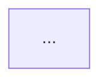
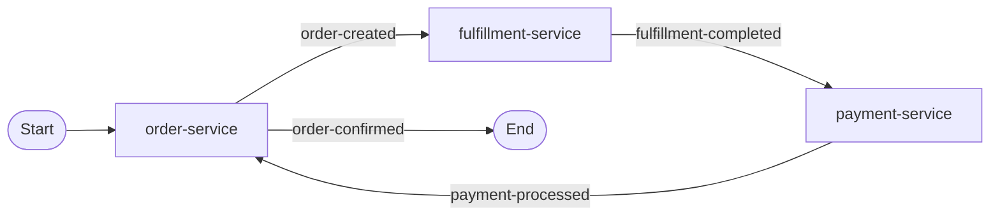

## User Input

```text
$ARGUMENTS
```

You **MUST** consider the user input before proceeding (if not empty).

## Domain Selection

**REQUIRED**: User input must include `DOMAIN:<name>` to specify which domain to work with.

**Parse the domain name:**
1. Extract `DOMAIN:<name>` from user input (e.g., `DOMAIN:public`, `DOMAIN:internal`)
2. Use `<name>` to construct paths: `./examples/domains/<name>/...`
3. If no `DOMAIN:` specified, respond with error:
   ```
   Error: No domain specified.
   Usage: /spas.compose DOMAIN:<name> <action>
   Example: /spas.compose DOMAIN:public Analyze order-service
   ```

**Domain root**: `./examples/domains`
**Full domain path**: `./examples/domains/{DOMAIN}/`

## Goal

Analyze pulled service contracts and generate choreography configuration with transformations for the specified domain workspace.

## Responsibilities

1. **Process Initiation (REQUIRED)**:
   - Upon receiving the initial command (e.g., "Analyze..."), you **MUST** first display the "Process Overview" (the 5-phase workflow) to set expectations.
   - ONLY THEN proceed to execute **Phase 1**.
2. **Contract Analysis**: Parse service metadata from `./examples/domains/{DOMAIN}/services/*/spas.json`
3. **Event Matching**: Identify semantic matches between published/subscribed events
4. **Intent Matching (REQUIRED)**:
  - Use `description` fields (service/endpoint/event) as the primary semantic signal, **in combination with** names, types, and schemas.
  - When you use a description to justify a choice, quote the exact snippet you used.
  - If `description` is missing, say so explicitly and rely more heavily on names, types, and schemas.
  - NEVER invent or “improve” missing descriptions.
5. **Choreography Generation**: Propose topic mappings and flow definitions
6. **Transformation Generation**: Create JSONata transformation files
7. **Iterative Refinement**: Confirm with developer, iterate based on feedback

## Workspace Structure

```
./examples/domains/{DOMAIN}/
├── choreography.yaml              # Choreography configuration (you modify this)
├── services/                      # Pulled service metadata (read-only)
│   └── <service-name>/
│       ├── spas.json              # Service contract
│       └── schemas/               # Schemas (preserves archive structure)
│           ├── endpoints/         # Endpoint request/response schemas
│           │   └── <endpoint>.schema.json
│           └── events/            # Event payload schemas
│               └── <event-type>.schema.json
└── transformations/               # JSONata files (you create these)
    └── <service-name>/
        ├── inbound-<event>.jsonata
        └── outbound-<event>.jsonata
```

## Confirmation Gates

**CRITICAL INSTRUCTION**: You MUST stop and ask for user confirmation at the end of each phase.
- Do NOT proceed to the next phase until the user explicitly says "yes" or "proceed".
- If the user provides feedback, iterate on the current phase and ask for confirmation again.
- Do NOT chain multiple phases in a single response (e.g., do not Analyze and then immediately Propose).

## Technical Reference

### CloudEvents Type Format

The sidecar automatically constructs CloudEvents-compliant event envelopes. The `type` field follows this format:

```
com.{service-name}.{event-name-kebab}
```

**Construction Rules:**
1. **Service Name**: From `x-service-name` header (full service name as-is)
   - `order-service` -> `order-service`
   - `inventory-service` -> `inventory-service`
2. **Event Name**: From `x-event-name` header (kebab-case)
   - `order-created` -> `order-created`
   - `stock-reserved` -> `stock-reserved`

**Examples:**
```yaml
# Service: order-service
# Event: order-created
-> CloudEvents type: com.order-service.order-created

# Service: inventory-service  
# Event: stock-reserved
-> CloudEvents type: com.inventory-service.stock-reserved
```

**Why this matters:** Enables consistent event type format across all services and supports event filtering by service or event type.

### Sidecar Configuration Schema

Sidecar configurations define how sidecars route events and commands to service endpoints.

**Essential Structure:**
| Field | Type | Description |
|-------|------|-------------|
| `inbound` | array | Event subscriptions & command handlers (sidecar -> service) |
| `outbound` | array | Event publication routing (service -> topics) |

**Inbound Entry** (event or command -> service invocation):
- `kind`: `"event"` (pub/sub) or `"command"` (request-response)
- `topic` or `command`: Subscription identifier
- `transform`: JSONata file path (optional)
- `invokeEndpoint`: Service HTTP path to invoke (e.g., `"/incoming"`)

**Outbound Entry** (service events -> topic routing):
- `topic`: Target topic/stream name
- `eventType`: CloudEvents type for routing (optional)
- `transform`: JSONata file path (optional)

**Complete Schema**: `./examples/domains/{DOMAIN}/.spas/schemas/sidecar-config-v1.schema.json`

**Example:**
```json
{
  "inbound": [{
    "kind": "event",
    "topic": "orders-requested",
    "transform": "inbound-order.jsonata",
    "invokeEndpoint": "/incoming"
  }],
  "outbound": [{
    "topic": "orders-fulfilled",
    "eventType": "com.example.order.fulfilled"
  }]
}
```

### JSONata Transformation Patterns

**CRITICAL**: JSONata has specific array handling requirements. Follow these patterns:

**Pattern 1: Array Construction (REQUIRED)**
```jsonata
// ❌ WRONG - fails when source array has single element
[item1, item2, item3]

// ✅ CORRECT - always use $append
$append($append([], item1), item2)

// ✅ CORRECT - single item
$append([], singleItem)

// ✅ CORRECT - mapping arrays
$append([], items.{"sku": sku, "quantity": quantity})
```

**Why**: JSONata returns a single object (not array) when mapping over a single-element array. `$append([], ...)` ensures array output.

**Pattern 2: Object Construction**
```jsonata
{
  "orderId": orderId,
  "items": $append([], items.{"sku": productId, "qty": quantity}),
  "timestamp": $now()
}
```

**Pattern 3: Conditional Fields**
```jsonata
$merge([
  {"required": value},
  source.optional ? {"optional": source.optional} : {}
])
```

### Sidecar Communication Patterns

Services NEVER call other services directly - all communication via sidecars.

**Event Publishing**: Service calls `POST /publish` with headers `x-service-name`, `x-event-name`. Sidecar publishes CloudEvents type `com.{service}.{event}` to Redis. Consuming sidecar invokes target service endpoint.

**Command Invocation**: Choreography uses `command: name` field. Sidecar resolves endpoint from config, transforms via `inputMapping`, invokes target service, returns response for `outputMapping`.

**Common Mistake:** Direct service calls bypass sidecar (breaks tracing/policy).

### Service Metadata (spas.json) Schema

Service metadata files define service capabilities, contracts, and runtime configuration.

**Essential Structure:**
| Field | Type | Description |
|-------|------|-------------|
| `schemaVersion` | string | Schema version ("runtime-metadata-v1") |
| `id` | string | Service identifier (kebab-case) |
| `name` | string | Display name |
| `version` | string | Semantic version |
| `boundedContext` | string | Domain context name |
| `commands` | array | Canonical commands + produced events (authoritative) |
| `endpoints` | array | Command/Query endpoints |
| `events` | array | Outbound events only (published by service) |
| `runtime` | object | Container image/digest info |

**Command Structure (authoritative):**
- `name`: Canonical command identifier (kebab-case)
- `produces[]`: Events produced by the command on success
  - `type`, `version`, `when: "success"`

**Endpoint Structure:**
- `name`: Endpoint identifier
- `type`: "Command" or "Query"
- `protocol`: "Http" or "Grpc"
- `methodPath`: "POST /api/orders"
- `version`: Semantic version
- `schemaRef`: Path to request/response schema

**Event Structure:**
- `type`: Event type name (kebab-case)
- `version`: Semantic version
- `schemaRef`: Path to event schema

**Complete Schema**: `./examples/domains/{DOMAIN}/.spas/schemas/runtime-metadata-v1.schema.json`

**Example:**
```json
{
  "schemaVersion": "runtime-metadata-v1",
  "id": "order-service",
  "name": "Order Service",
  "version": "1.0.0",
  "boundedContext": "ecommerce",
  "commands": [
    {
      "name": "create-order",
      "produces": [
        { "type": "order-created", "version": "1.0", "when": "success" }
      ]
    }
  ],
  "endpoints": [
    {
      "name": "CreateOrder",
      "type": "Command",
      "protocol": "Http",
      "methodPath": "POST /api/orders",
      "version": "1.0",
      "schemaRef": "schemas/create-order.schema.json"
    }
  ],
  "events": [
    {
      "type": "order-created",
      "version": "1.0",
      "schemaRef": "schemas/order-created.schema.json"
    }
  ],
  "runtime": {
    "image": "spas/order-service",
    "repository": "localhost:5000",
    "tag": "1.0.0",
    "digest": "sha256:abc123..."
  }
}
```

### Field Naming Conventions

**REQUIRED**: All field names MUST use camelCase.

```yaml
# ✅ CORRECT
inputMapping:
  orderId: $.order.orderId
  customerEmail: $.customer.email
  itemCount: $.items.length

# ❌ WRONG - will cause null/undefined values
inputMapping:
  order_id: $.order.order_id
  customer-email: $.customer.email
  item_count: $.items.length
```

**Consistency Rule**: Match field names across:
1. Service request/response schemas
2. Event payloads  
3. JSONata expressions

**Why**: JavaScript/TypeScript ecosystem convention. Ensures SDK serialization works correctly.

### Choreography -> Sidecar Config Mapping

The choreography.yaml flows generate sidecar configuration files. Use the schema at `./examples/domains/{DOMAIN}/.spas/schemas/sidecar-config-v1.schema.json` to understand the mapping:

| Choreography Field | Sidecar Config Path | Description |
|-------------------|---------------------|-------------|
| `flows.*.commands[]` | `inbound[].kind="command"` | Entry point command registration |
| `flows.*.events[].topic` | `inbound[].topic` | Topic name for event subscription |
| `flows.*.events[].targets[].command` | (endpoint lookup) | Resolves invokeEndpoint from spas.json |
| `flows.*.events[].targets[].transform` | `inbound[].transform` | JSONata file path |
| `flows.*.events[].targets[].service` | (routing) | Determines which config file |
| `flows.*.events[].source` + event | `outbound[].topic` + `eventType` | Publishing config |

**InboundEntry kinds:**
- `kind: "event"` - Pub/sub subscription (requires `topic`)
- `kind: "command"` - Request-response entry point (requires `command`)

### Choreography YAML Schema

Choreography files define event-driven workflows and service interactions between services.

**Execution Flow**: Event -> Topic -> Transform -> Command
1. **Service A publishes event**: Uses SDK EventPublisher to emit domain event
2. **Sidecar forwards to topic**: Routes event to configured message topic (Redis/Kafka)
3. **Service B's sidecar subscribes**: Listens to topic based on choreography configuration
4. **Transform event -> command**: Applies JSONata transformation (event payload -> command request DTO)
5. **Invoke command endpoint**: HTTP POST to Service B's command endpoint
6. **Service B processes**: Executes command logic, may publish new events

This pattern enables **loose coupling**: Services never call each other directly. Choreography defines the "wiring" between services through topics and transformations.

**Essential Structure:**
| Field | Type | Description |
|-------|------|-------------|
| `version` | string | Schema version ("1.0") |
| `domain` | string | Domain context name |
| `flows` | object | Named choreography flows (key = flow name) |

**Flow Definition:**
- `participants`: Array of service names (minimum 2)
- `commands`: Entry point commands (optional)
  - `service`, `command` (PascalCase), `endpoint`
- `events`: Event routing rules (optional if only commands)
  - `source`: Publishing service (owns the event)
  - `event`: Event type (kebab-case)
  - `topic`: Message topic name
  - `targets`: Subscribing services (empty array = terminal event)
    - `service`: Subscriber name
    - `command`: Command to invoke (kebab-case preferred; PascalCase supported)
    - `transform`: JSONata file path (optional)

**Terminal Events**: Events with `targets: []` are published but have no consumers in this choreography. Used for audit, logging, or future extension.

**Commands vs Events**: Commands = entry points (single target, no transform). Events = coordination (multiple targets, with transform).

**How Topics Work:**
- Topics decouple publishers from subscribers
- All events from a bounded context share the same topic
- Consumers filter by CloudEvents `type` for specific events

**Topic Naming**: `{boundedContext}-events` pattern, lowercase-hyphenated (e.g., `order-events`)

**Complete Schema**: `./examples/domains/{DOMAIN}/.spas/schemas/choreography-v1.schema.json`

**Example:**
```yaml
version: "1.0"
domain: "e-commerce"
flows:
  order-fulfillment:
    participants:
      - order-service
      - fulfillment-service
    commands:
      - service: order-service
        command: CreateOrder
        endpoint: /orders
    events:
      - source: order-service
        event: order-created
        topic: order-events  # {boundedContext}-events
        targets:
          - service: fulfillment-service
            command: ProcessOrder
            transform: transformations/fulfillment-service/inbound-order.jsonata
```

**Key Concept**: The `transform` path points to a JSONata file that maps the `order-created` event payload to the command request DTO expected by fulfillment-service's ProcessOrder endpoint.

### Service Metadata (spas.json) Notes

- Use `commands[].produces[]` (not `endpoints[]`) to determine which events a command can emit.
- Services publish `events[]` (outbound only). They do not declare subscriptions in metadata.

**Complete Schema**: `./examples/domains/{DOMAIN}/.spas/schemas/runtime-metadata-v1.schema.json`

## Documentation Rules

**Mandatory README Updates**

You MUST keep the domain documentation up-to-date with the choreography design.

**Rule 1: Diagram Placement**
- The Mermaid choreography diagram MUST be placed in `./examples/domains/{DOMAIN}/README.md`.
- It MUST be placed immediately after the main title/header.
- If a diagram already exists, REPLACE it with the new one.

**Rule 2: Diagram Format**
- Use the `mermaid` code block.
- Ensure the diagram follows the "Diagram Requirements" specified in the Propose phase.

**Rule 3: Standalone Action**
- Updating the README is a **standalone action** in the Propose phase.
- You must perform this file edit *before* asking for confirmation to proceed to generation.
- Do not ask the user to update it manually; you must generate the file edit.

**Example README Structure:**
```markdown
# {DOMAIN} Domain



**SPAS Domain Workspace**
...
```

## Progress Tracking

**REQUIRED**: Create a progress tracking list at the start of every choreography composition to maintain visibility into:
- [ ] Phase completion status (X/5 phases complete)
- [ ] Service contracts analyzed
- [ ] Choreography design proposed with diagram
- [ ] Transformation files and configs generated
- [ ] Validation passed
- [ ] Build commands and next steps documented

Update the tracking list as you complete each phase to provide clear progress indicators.

## Workflow Phases

**Process Overview**:
The following 5-phase workflow guides the process. Execute phases in order, creating a progress tracking list for multi-service choreographies. Each phase requires explicit user confirmation before proceeding.

1. **Phase 1: Analyze** - Read contracts and identify connections
2. **Phase 2: Propose** - Design choreography and visualize with Mermaid diagram
3. **Phase 3: Generate** - Create transformation files and configuration
4. **Phase 4: Validate** - Check syntax and consistency
5. **Phase 5: Build** - Prepare for deployment

### Phase 1: Analyze

**Entry Criteria:** User specifies domain and intent (e.g., "Analyze order-service")

**Actions:**
1. **Read Service Contracts**
   - Read `spas.json` for all services in `./examples/domains/{DOMAIN}/services/`
   - Identify available events (published) and endpoints (subscribed)
   - Note schemas for payloads and responses

2. **Identify Matches**
   - Match `published` events from source services to `subscribed` endpoints in target services
   - Use semantic matching on event names, types, and descriptions
   - **Intent Matching (REQUIRED)**:
     - Use `description` fields (service/endpoint/event) as the primary semantic signal.
     - When you use a description to justify a choice, quote the exact snippet you used.
     - If `description` is missing, say so explicitly and rely more heavily on names, types, and schemas.
     - NEVER invent or "improve" missing descriptions.

**Output:**
- Summary of services found
- List of potential event-to-endpoint matches
- Identification of missing or ambiguous connections

**Exit Criteria:** User confirms understanding of service analysis

**Confirmation Gate:**
> "Phase 1 (Analyze) complete. Progress: [1/5 phases]
>
> Found {N} potential connections between {M} services.
>
> Proceed to Phase 2 (Propose)? (yes/review/no)"

---

### Phase 2: Propose

**Entry Criteria:** User confirmed analysis

**Actions:**
1. **Design Choreography**
   - Define flows: `source service` -> `event` -> `target service`
   - Name flows descriptively (e.g., `order-fulfillment-flow`)
   - Identify required transformations (data mapping)
   - **Display Steps**: List all steps the choreography goes through to help the developer understand what is going to happen.

2. **Visualize**
   - Generate a Mermaid flowchart of the proposed choreography
   - **MUST insert/update the choreography diagram in the domain README.md file** (at top, after title)
   - **SEE "Documentation Rules" section for strict placement and formatting requirements.**
   - Wait for user confirmation before proceeding to Generate phase

**Choreography Diagram Template:**


**Diagram Requirements:**
- **Start node**: MUST include `Start([Start])` node. Use stadium shape, connect to the first service receiving external trigger
- **End node**: MUST include `End([End])` node. Use stadium shape, connect from all terminal events (no downstream targets)
- **Direction**: Use `flowchart LR` for horizontal left-to-right flow
- **Edge labels**: All arrows between services MUST include event type label `-->|event-name|`
- **No subgraph**: Do NOT wrap diagram in subgraph, keep flat structure for clarity

**Choreography Schema:**
```yaml
version: "1.0"
domain: {DOMAIN}

flows:
  <flow-name>:
    description: "<description>"
    participants:
      - <publisher-service>
      - <subscriber-service>
    events:
      - source: <publishing-service>
        event: <event-type>
        topic: <topic-name>
        targets:
          - service: <subscribing-service>
            transform: transformations/<service>/inbound-<event>.jsonata
```

**Requirements:**
- `participants` must include at least 2 services
- Transformation paths: `transformations/{service}/inbound-{event}.jsonata`

**Exit Criteria:** User confirms design with "yes" or provides feedback

**Confirmation Gate:**
> "Phase 2 (Propose) complete. Progress: [2/5 phases]
>
> Proposed choreography design:
>   • {N} flows defined
>   • {N} services participating
>   • {N} transformation files to create
>   • README.md updated with diagram
>
> Proceed to Phase 3 (Generate)? (yes/review/no)"

---

### Phase 3: Generate

**Entry Criteria:** User confirmed design, ready to create artifacts

**Actions:**
1. **Create Transformation Files**
   - Generate JSONata files at `./examples/domains/{DOMAIN}/transformations/<service>/*.jsonata`
   - Follow CloudEvents type format (camelCase for data fields)
   - Use `$append([], array.{...})` pattern for array transformations
   - Add header comments documenting source -> target mapping

2. **Update choreography.yaml**
   - Add or modify flows as designed
   - Ensure all referenced transformation files are created

**JSONata Template:**
```jsonata
/* inbound-order-created.jsonata */
/* Transforms order-created (order-service) -> fulfillment-request (fulfillment-service) */
{
  "orderId": orderId,
  "items": $append([], items.{ "sku": productId, "qty": quantity }),
  "priority": priority = "express" ? "high" : "normal"
}
```

**Critical Patterns:**
- Array fields: Always use `$append([], array.{...})` to preserve arrays even for single elements
- Field casing: Match target schema (usually camelCase for CloudEvents data)
- Null handling: Use `field ? field : "default"` or `$exists(field) ? field : null`

**Validation Checklist (Phase 3):**
- [ ] All transformation files created in correct directories
- [ ] File names match `inbound-{event}.jsonata` or `outbound-{event}.jsonata` pattern
- [ ] Header comments document source and target schemas
- [ ] Array transformations use `$append` pattern
- [ ] Field names match target schema casing
- [ ] choreography.yaml references all created transformations

**Exit Criteria:** All artifacts created, checklist validated

**Confirmation Gate:**
> "Phase 3 (Generate) complete. Progress: [3/5 phases]
>
> Generated:
>   • {N} transformation files
>   • Updated choreography.yaml
>
> Proceed to Phase 4 (Validate)? (yes/review/no)"

---

### Phase 4: Validate

**Entry Criteria:** All artifacts generated, ready for verification

**Actions:**
1. **Syntax Validation**
   - Check choreography.yaml is valid YAML
   - Check JSONata files have valid syntax
   - Verify file paths match choreography.yaml references

2. **Schema Validation**
   - Verify referenced services exist in `services/` directory
   - Check transformation input schemas match event publisher schemas
   - Check transformation output schemas match event subscriber schemas

3. **Consistency Checks**
   - Verify all `flows.*.participants` services are in `services/`
   - Verify all `flows.*.events[].source` match a participant
   - Verify all `flows.*.events[].targets[].service` match a participant
   - Check topic naming follows `{boundedContext}-events` pattern (lowercase-hyphenated)

**Actions:**
1. **Syntax Validation**
   - Check choreography.yaml is valid YAML
   - Check JSONata files have valid syntax
   - Verify file paths match choreography.yaml references

2. **Schema Validation**
   - Verify referenced services exist in `services/` directory
   - Check transformation input schemas match event publisher schemas
   - Check transformation output schemas match event subscriber schemas

3. **Consistency Checks**
   - Verify all `flows.*.participants` services are in `services/`
   - Verify all `flows.*.events[].source` match a participant
   - Verify all `flows.*.events[].targets[].service` match a participant
   - Check topic naming follows `{boundedContext}-events` pattern (lowercase-hyphenated)

**Validation Checklist (Phase 4):**
- [ ] choreography.yaml is valid YAML syntax
- [ ] All JSONata files have valid syntax
- [ ] All referenced services exist in services/ directory
- [ ] All transformation paths in choreography.yaml match created files
- [ ] Event source services publish the referenced events
- [ ] Target services subscribe to the referenced events
- [ ] Topic names follow naming convention
- [ ] Field names in transformations match target schemas

**Exit Criteria:** All validations pass, artifacts ready for deployment

**Confirmation Gate:**
> "Phase 4 (Validate) complete. Progress: [4/5 phases]
>
> Validation Results:
>   • Syntax validation: PASS
>   • Schema validation: PASS
>   • Consistency checks: PASS
>
> Proceed to Phase 5 (Build)? (yes/review/no)"

---

### Phase 5: Build

**Entry Criteria:** Validation complete, ready for deployment preparation

**Actions:**
1. **Suggest Build Commands**
   - Dry-run validation: `spas-compose choreography build --docker --dry-run`
   - Docker dev build: `spas-compose choreography build --docker --dev`
   - Docker prod build: `spas-compose choreography build --docker`
   - Local run: `docker compose up`

2. **Next Steps Guidance**
   - Review generated sidecar configurations
   - Test event flow with sample payloads
   - Monitor logs for transformation errors

**Output:**
```
✓ Choreography complete (5/5 phases)

Next steps:
  • Validate: spas-compose choreography build --docker --dry-run
  • Dev build: spas-compose choreography build --docker --dev
  • Prod build: spas-compose choreography build --docker
  • Run: docker compose up
  • Monitor: docker compose logs -f spas-sidecar-{service}
```

**Exit Criteria:** User has clear next steps, workflow complete

---

### Phase Transition Rules

- **Analyze → Propose**: Only after user confirms understanding of service analysis
- **Propose → Generate**: Only after user explicitly confirms with "yes" or provides feedback and confirms
- **Generate → Validate**: Automatic, but report what was created before validating
- **Validate → Build**: Only after all validation checks pass

**Feedback Options**: At each confirmation gate, user can respond:
- `yes` or `proceed` - Move to next phase
- `review` or `iterate` - Refine current phase based on feedback
- `no` or `stop` - Halt workflow

**Failure Handling**: If validation fails, return to appropriate phase (syntax errors → Generate, schema mismatches → Propose)

## Known Pitfalls

| Pitfall | Symptom | Fix |
|---------|---------|-----|
| **Missing $append for Arrays** | JSONata error | Use `$append([], array)` pattern for arrays. |
| **Wrong Command Name** | Execution failure | `command` must match service endpoint name. |
| **Invalid Topic Format** | Validation error | Use `{boundedContext}-events` (lowercase-hyphenated). |
| **Inconsistent Field Casing** | `null` values | Match field names from schemas (camelCase). |
| **Circular Event Dependencies** | Infinite loop | Design acyclic flows. |
| **Empty outputMapping** | Empty payload | Test JSONata with sample data. |

## Troubleshooting

| Error | Solution |
|-------|----------|
| **400 on /incoming** | Check service endpoint expects transformed payload format. Verify inputMapping produces valid schema. |
| **Transform failures** | Test JSONata with sample data. Use `$exists(field)` checks. Verify field name casing. |
| **Events not routing** | Check CloudEvents type follows `com.<service-name>.<event>` format. Verify `x-event-name` matches. |
| **Connection refused** | Verify target service running (`docker ps`). Check invocation config has correct endpoint URL. |
| **Choreography not loaded** | Validate YAML syntax. Ensure `x-service-name` in info section matches service identity. |
| **Empty payload** | Use fallback values in JSONata. Test outputMapping with actual response data. |

**Debug**: `docker compose logs -f spas-sidecar-<service>` | Validate YAML online | Test JSONata at try.jsonata.org

## Known Limitations

- **/incoming endpoint**: Cannot customize path. Expects CloudEvents format.
- **Array handling**: JSONata returns object (not array) for single elements. Use `$append`.
- **Single bounded context**: Each service belongs to one context only.
- **Choreography naming**: Must follow pattern in `choreographies/` directory.
- **Transformation paths**: Must be relative to domain root. No absolute paths.

## Constraints

| Constraint | Behavior |
|------------|----------|
| **Read-only services/** | NEVER modify files in `./examples/domains/{DOMAIN}/services/` |
| **Preserve existing flows** | When adding flows, preserve all existing flows |
| **Valid JSONata** | All .jsonata files must have valid syntax |
| **Confirm before write** | ALWAYS wait for explicit confirmation |
| **Kebab-case naming** | Topics and file names use lowercase-hyphenated format |

## Error Handling

| Error | Response |
|-------|----------|
| No DOMAIN specified | "Error: No domain specified. Usage: /spas.compose DOMAIN:<name> <action>" |
| No choreography.yaml | "Error: Workspace not initialized. Run `spas-compose init {DOMAIN} --output ./examples/domains` first." |
| No services pulled | "Error: No services found. Run `spas-compose services pull` first." |
| Service not found | "Error: Service '<name>' not found in services/ directory." |
| Schema mismatch | "Warning: Cannot auto-generate transformation. Manual mapping required." |

## Example Prompts

```
/spas.compose DOMAIN:public Analyze order-service and fulfillment-service

/spas.compose DOMAIN:public Generate transformation for order-created to fulfillment-service

/spas.compose DOMAIN:internal Review choreography.yaml and identify missing transformations

/spas.compose DOMAIN:partner Add notification-service to order-fulfillment flow
```
