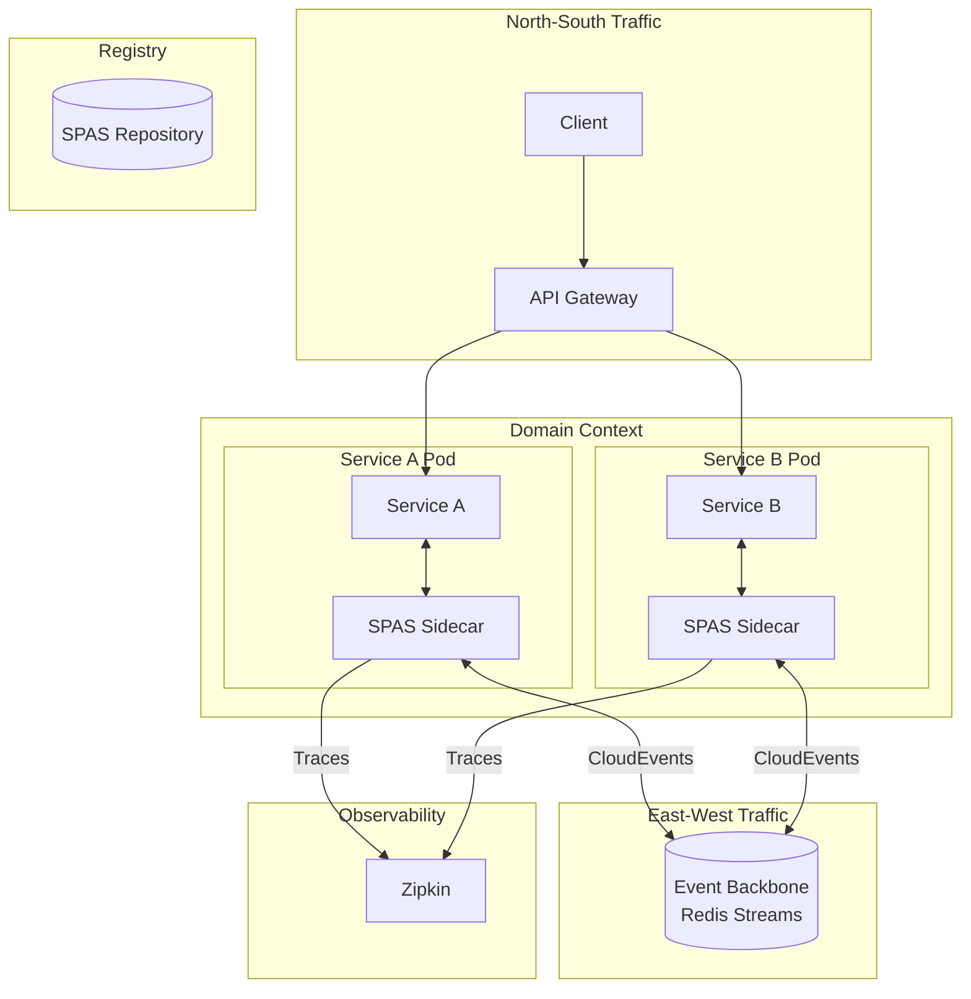
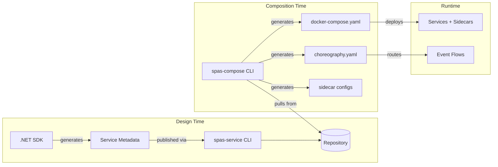
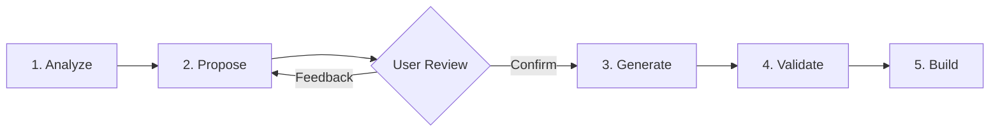

# Introduction

SPAS (Self-contained, Portable, Adaptable Services) is a framework and specification that enables building services around a single bounded context that are reusable across domain contexts through choreography, not direct dependencies. SPAS emphasizes strong encapsulation, portable packaging, and configuration-driven adaptation.

## Why SPAS

- Fragmented microservice practices create distributed monoliths; SPAS enforces strict boundaries and event-first integration.
- Portability across OS/cloud/container platforms requires minimal runtime assumptions; SPAS services package everything needed to run.
- Reuse across domains demands decoupling from domain specifics; SPAS uses adaptation/choreography to bind services into different Domain Contexts without code changes.

## Design Goals

- Self-contained: No synchronous cross-context dependencies
- Portable: OS/cloud/container agnostic
- Adaptable: Join different Domain Contexts via configuration
- Observable: First-class telemetry and health
- Secure-by-default: Zero-trust communication
- Versionable: Contracts evolve safely over time

## Relationship to Existing Paradigms

- Domain-Driven Design (DDD): 1 bounded context → 1 SPAS service
- Microservices: Smaller and stricter; no runtime service dependencies
- Event-driven architecture (EDA): East–West communication is event-first
- Service mesh/Sidecar: Offloads networking, security, and reliability concerns
- API Gateway: North–South traffic terminates at the edge; TLS termination, authentication, routing (Production: REST→gRPC translation)
- Very much inspired by [DAPR Project](https://dapr.io/)

## Architecture Overview

SPAS uses a **sidecar pattern** where each service is paired with a SPAS sidecar that handles all cross-cutting concerns: event publishing, subscription routing, distributed tracing, and health checks.

### Component Architecture

### Logical Flow

### Key Patterns

| Pattern | Implementation | Purpose |
|---------|---------------|---------|
| **Sidecar** | SPAS Sidecar (Node.js) | Offloads networking, events, tracing |
| **Event-first** | CloudEvents + Redis Streams | Decoupled east-west communication |
| **Choreography** | choreography.yaml + JSONata | Domain-specific event routing |
| **Schema-driven** | JSON Schema validation | Contract enforcement at boundaries |

### AI-in-the-Loop Choreography

SPAS supports **AI-assisted choreography design** through GitHub Copilot agent integration. The `spas-compose init` command scaffolds a domain workspace with an AI agent prompt (`.github/agents/spas.compose.agent.md`) that guides developers through a structured 5-phase workflow:

| Phase | AI Actions | Human Actions |
|-------|-----------|---------------|
| **Analyze** | Read service metadata, identify events/commands | Provide domain context |
| **Propose** | Generate choreography diagram, design flows | Review diagram, provide feedback |
| **Generate** | Create choreography.yaml, transformation files | Confirm to proceed |
| **Validate** | Check YAML syntax, schema compliance, consistency | Review validation results |
| **Build** | Suggest build commands | Execute deployment |

**Key Benefits:**
- **Visual-first design**: Mermaid diagrams let you see event flows before generating code
- **Schema-aware**: AI uses pulled service metadata to propose valid transformations
- **Iterative refinement**: Feedback loop between Propose and Generate phases
- **Guardrails**: Validation phase catches errors before deployment

To use: Run `spas-compose init <domain>` then invoke the agent with `/spas.compose` in GitHub Copilot Chat.

## Scope

SPAS specifies:

- What makes a service SPAS-compliant
- Protocols for sync (north-south) and async (east-west) communication
- Adaptation rules for choreography via `choreography.yaml`
- Packaging and repository integration
- Security, observability, and governance requirements

## Current Status

### PoC Phase (December 2025)

- ✅ **.NET SDK**: Production-ready implementation complete (2025-12-13)

  - Initial PoC (001-dotnet-spas-sdk): Metadata composition, event publishing, observability
  - Schema Alignment (002-metadata-schema-alignment): Design-time metadata aligned with spec
  - 60 unit tests passing, JsonSchema.Net validation
  - Builder APIs: ServiceIdentity, Contracts, Security, Consistency, Network
  - Schema location: `components/sdk/schemas/design-time-metadata-v1.schema.json`
  - See: `components/sdk/dotnet/README.md` and `specs/002-metadata-schema-alignment/COMPLETION.md`

- ✅ **Repository Service**: Service metadata registry complete (2025-12)

  - Publish/retrieve service archives with metadata and schemas
  - Search services with advanced filtering (name, version, tags)
  - Schema evolution validation following SPAS evolution rules
  - Runtime metadata enrichment (image digests, tags, repositories)
  - SQLite storage with IStorageProvider abstraction for future backends
  - 99 unit tests passing, 10 REST endpoints, OpenAPI contract
  - See: `components/repository/README.md` and `specs/003-repository-service/spec.md`

- ✅ **spas-service CLI**: Service publishing tooling complete (2025-01)

  - Publish service metadata to Repository from running service or archive
  - Pull service metadata archives by name and version
  - Dry-run mode for preview without publishing
  - CI/CD integration with `--archive` flag and runtime metadata injection
  - 48 unit tests passing
  - See: `components/cli/spas-service/README.md` and `specs/004-spas-service-cli/COMPLETION.md`

- ✅ **spas-compose CLI**: Domain composition tooling complete (2025-12-14)

  - Workspace scaffolding with `init` command
  - Service metadata pull from Repository with `services pull` command
  - Docker Compose deployment generation with `choreography build --docker`
  - Sidecar config file generation (`config.{service}.json`) for runnable deployments (006-sidecar-config-generator)
  - Custom backbone images with `--event-backbone` and `--observability-backbone` flags (008-compose-backbone-args)
  - Backbone disable support for BYO infrastructure (`--event-backbone none`)
  - AI-in-the-loop composition via `/spas.compose` agent prompt
  - 134 unit tests passing
  - See: `components/cli/spas-compose/README.md` and `specs/005-spas-compose-cli/COMPLETION.md`

- ✅ **SPAS Sidecar**: Production sidecar implementation complete (2025-12-15)
  - Event publishing via `POST /publish` with topic routing
  - Event subscription with Redis Streams delivery to service endpoints
  - Command invocation with request-response patterns
  - CloudEvents 1.0 envelope with W3C Trace Context
  - Distributed tracing with Zipkin span emission
  - Health and readiness endpoints for orchestration
  - File-based transform loading with JSONata compilation caching
  - 194 unit tests passing
  - See: `components/sidecar/README.md` and `specs/007-spas-sidecar/`

## Out of Scope (v1.0)

- Central orchestration (choreography-only)
- Control plane requirements (PoC avoids managed control plane)
- Serverless execution (container-only)
- Path parameters in command endpoints (e.g., `/order/{id}/confirm` not supported; use flat endpoints like `/confirm-order`)
- Input/output transformations for queries and commands (transformations apply to events only)
- Queries in choreography (queries are synchronous; route via API Gateway, not event flows)

> PoC vs Production
>
> - PoC: Local repository, no auth; metadata-only policy declarations
> - Production: AuthN/AuthZ, signed packages, enforceable policies

## Related Documents

- [Principles](./principles/README.md) - SPAS Framework guiding principles
- [Specs](./specs/README.md) - GitHub SpecKit files
- [Components](./components/README.md) - SPAS Framework component development
- Prototypes
  - [spas-sidecar](./prototypes/spas-sidecar-prototype/README.md) - SPAS Sidecar prototype
- [Examples](./examples/README.md)
- [Grooming](./GROOMING.md)
