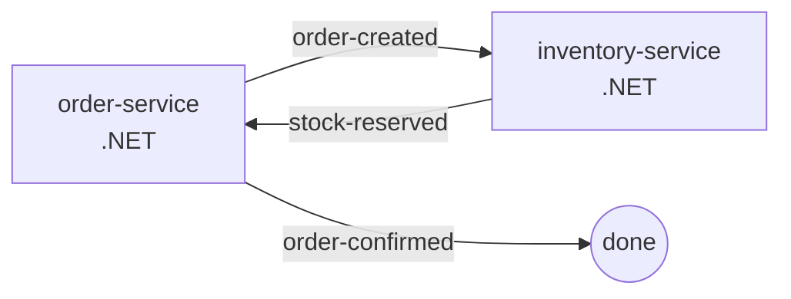
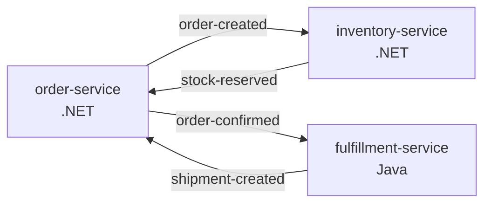
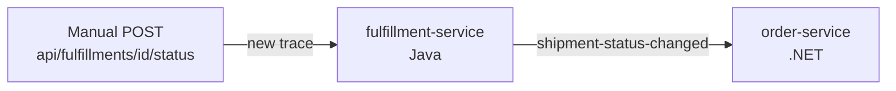
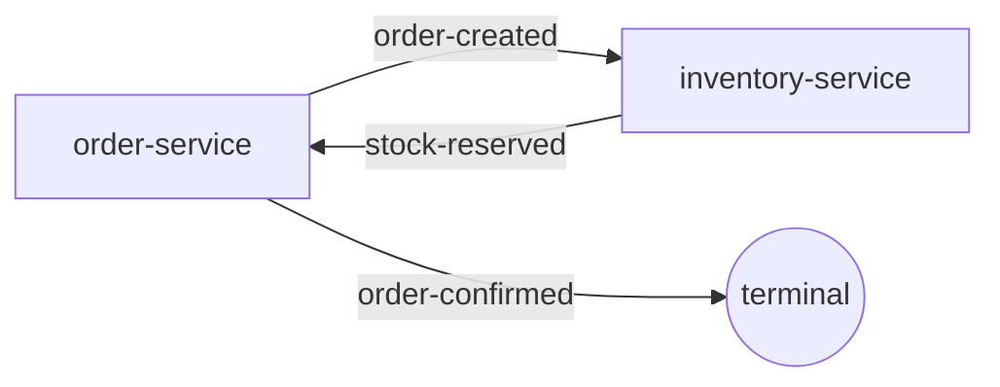
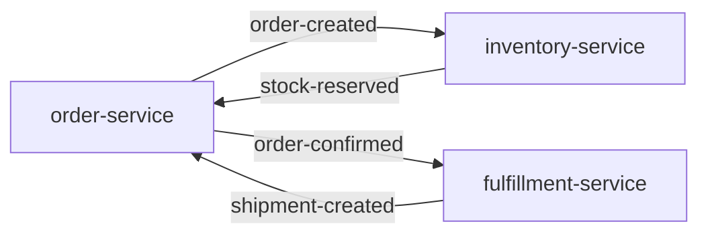

# Fulfillment Service (Java) - Design Document

> **NOTE**: This is a planning document for implementing a Java fulfillment service as part of the ecommerce choreography example. This document will be removed once the service is fully implemented and integrated into the choreography. This is NOT a SPAS framework feature - it's an example service demonstrating the Java SDK.

**Created**: December 19, 2025  
**Status**: Planning  
**Purpose**: "Extend the ecommerce example choreography by inclusion of fulfillment-service which should be developed as SPAS service using Java SDK"

## Overview

Develop a SPAS-compliant fulfillment service using the Java SDK (`016-java-spas-sdk`) to extend the e-commerce choreography. This service handles order fulfillment operations (pick, pack, ship) after inventory is reserved, completing the order-to-shipment flow.

**Purpose**: Demonstrate the Java SPAS SDK in a real-world choreography scenario, replacing the existing Node.js stub with a production-quality Java implementation that publishes metadata, propagates trace context, and integrates seamlessly with the existing order/inventory services.

## Architectural Context

### Current E-Commerce Flow



### Extended Flow with Fulfillment Service

**Flow 1: Order Fulfillment** (Single Trace)


**Flow 2: Shipment Status Update** (Separate Trace)


### Service Integration Points

| Integration | Direction | Event | Transform | Flow |
|-------------|-----------|-------|-----------|------|
| Order → Fulfillment | Inbound | `order-confirmed` | Extract shipment details from order | Flow 1 |
| Fulfillment → Order | Outbound | `shipment-created` | Map shipment ID to order update | Flow 1 |
| Fulfillment → Order | Outbound | `shipment-status-changed` | Map shipment status to order tracking | Flow 2 (separate trace) |

---

## Implementation Decisions

### Decision: Separate Choreography Flows (December 19, 2025)

**Chosen Approach**: Two independent flows with separate trace contexts

#### Flow 1: Order Fulfillment (Synchronous Choreography)

**Event Sequence**:
1. Receive `order-confirmed` event from sidecar (part of order creation trace)
2. Create shipment record (status: PENDING)
3. Publish `shipment-created` event **immediately** (same trace context)

**Timeline Example**:
```
Trace ID: 4bf92f3577b34da6a3ce929d0e0e4736

T+0.0s: POST /orders (order-service)
T+0.1s: order-created published
T+0.2s: inventory-service reserves stock
T+0.3s: stock-reserved published
T+0.4s: order-service confirms order
T+0.5s: order-confirmed published
T+0.6s: fulfillment-service creates shipment
T+0.7s: shipment-created published ← end of Flow 1
```

#### Flow 2: Shipment Status Update (Separate Async Process)

**Trigger**: Manual REST endpoint `POST /api/fulfillments/{id}/status` with body `{"status": "SHIPPED"}`

**Event Sequence**:
1. REST call initiates **new trace** (not connected to order creation)
2. Update shipment record with requested status (optionally generate tracking number if SHIPPED)
3. Publish `shipment-status-changed` event (new trace context)

**Timeline Example**:
```
Trace ID: 9a2c8b7f3e1d5a4c6b8e0f2d9a7c3e5b (NEW TRACE)

T+0.0s: POST /api/fulfillments/ship-789/status {"status": "SHIPPED"}
T+0.1s: Shipment updated to SHIPPED, tracking number generated
T+0.2s: shipment-status-changed published
T+0.3s: order-service receives event, updates shipmentStatus to SHIPPED
```

**Rationale**:
- **Realistic modeling**: Delivery confirmation is a separate asynchronous process in real logistics
- **Clear trace boundaries**: Two distinct traces show independent choreographies
- **Better demonstrates patterns**: Shows both synchronous choreography (Flow 1) and async event-driven processes (Flow 2)
- **Simpler implementation**: No background thread management, explicit triggering
- **Observable in Zipkin**: Two separate traces clearly visible in UI, shows multiple flows in one domain

**Future Enhancements**:
- Add scheduled job to auto-complete shipments after delay
- Add webhook endpoint to receive carrier delivery notifications

### Decision: Backward Compatibility (December 19, 2025)

**Requirement**: The ecommerce choreography MUST work with or without the fulfillment service present.

**Behavior**:
- **Without fulfillment-service**: `order-confirmed` event becomes terminal (original flow preserved)
- **With fulfillment-service**: `order-confirmed` routes to fulfillment, enabling extended flow

**Original Flow (No Fulfillment Service)**:


**Extended Flow (Fulfillment Service Present)**:


**How It Works**:
- `spas-compose` resolves targets based on which services are pulled during composition
- If `fulfillment-service-java` is not pulled, the `order-confirmed → fulfillment-service-java` mapping has no resolvable target
- Sidecar treats events with no routable targets as terminal events
- No configuration changes required - graceful degradation is automatic

**Testing**:
```bash
# Without fulfillment service (original flow)
spas-compose services pull order-service inventory-service
spas-compose choreography build --docker
docker compose up  # Only order + inventory services run

# With fulfillment service (extended flow)
spas-compose services pull order-service inventory-service fulfillment-service-java
spas-compose choreography build --docker
docker compose up  # All three services run with full flow
```

**Rationale**:
- Enables incremental adoption of new services
- Supports feature toggles at composition time
- Simplifies development/testing by allowing partial choreographies
- No breaking changes to existing ecommerce example

### Decision: Order Service Event Consumption (December 19, 2025)

**Chosen Approach**: Extend order-service to consume fulfillment events and maintain shipment tracking within order aggregate

**Implementation**:
- order-service will add `/incoming` endpoint to receive events from sidecar
- Handle `shipment-created` event → populate `shipmentId` and set `shipmentStatus` to `PENDING`
- Handle `shipment-status-changed` event → update `shipmentStatus` from event payload, store `trackingNumber` if present
- Add shipment tracking fields to Order entity:
  - `shipmentId`: ID of associated shipment
  - `shipmentStatus`: Current logistics status (PENDING, PROCESSING, SHIPPED, IN_TRANSIT, DELIVERED)
  - `shipmentStatusHistory[]`: Array of {status, timestamp} entries
  - `trackingNumber`: Carrier tracking number (populated on completion)
- Existing `GET /orders/{id}` endpoint will include shipment tracking fields in response

**Order vs Shipment Status**:
```
Order Status (Business):     Shipment Status (Logistics):
- PENDING                    - null (no shipment yet)
- CONFIRMED                  - PENDING (shipment created)
- CANCELLED                  - PROCESSING (being fulfilled)
                             - SHIPPED (completed, tracking number assigned)
                             - IN_TRANSIT (carrier update, future)
                             - DELIVERED (carrier update, future)
```

**Rationale**:
- **Separation of concerns**: Order status (business state) separate from shipment status (logistics state)
- **Realistic modeling**: Orders don't change status based on shipment - they track shipment progress
- **Richer lifecycle**: Can model complex shipment states (picked, packed, shipped, in-transit, delivered)
- **Bidirectional integration**: Demonstrates Java → .NET event consumption (reverse of current flow)
- **Audit trail**: Complete shipment lifecycle tracking with timestamps
- **Better observability**: Query shipment status to verify choreography completion
- **Event-driven saga**: Shows proper distributed state management pattern
- **Extensible**: Easy to add future shipment events (package-scanned, out-for-delivery, etc.)

**Demo Flow**:
```bash
# Step 1: Create order (triggers Flow 1)
curl -X POST http://localhost:5002/orders -d '{...}'
# Response: {"orderId": "ord-123", "status": "PENDING", "shipmentId": null, "shipmentStatus": null}

# Step 2: Wait ~1 second, check order (after Flow 1 completes)
curl http://localhost:5002/orders/ord-123
# Response: {
#   "orderId": "ord-123", 
#   "status": "CONFIRMED", 
#   "shipmentId": "ship-789", 
#   "shipmentStatus": "PENDING",
#   "trackingNumber": null,
#   "shipmentStatusHistory": [{"status": "PENDING", "timestamp": "2025-12-19T10:30:00Z"}]
# }

# Step 3: Update shipment status to SHIPPED (triggers Flow 2 - NEW TRACE)
curl -X POST http://localhost:5003/api/fulfillments/ship-789/status \
  -H "Content-Type: application/json" \
  -d '{"status": "SHIPPED"}'
# Response: {"shipmentId": "ship-789", "status": "SHIPPED", "trackingNumber": "TRACK-XYZ-789"}

# Step 4: Wait ~1 second, check order with updated shipment tracking
curl http://localhost:5002/orders/ord-123
# Response: {
#   "orderId": "ord-123", 
#   "status": "CONFIRMED",  # Order status unchanged
#   "shipmentId": "ship-789", 
#   "shipmentStatus": "SHIPPED",  # Shipment status updated
#   "trackingNumber": "TRACK-XYZ-789",
#   "shipmentStatusHistory": [
#     {"status": "PENDING", "timestamp": "2025-12-19T10:30:00Z"},
#     {"status": "SHIPPED", "timestamp": "2025-12-19T10:30:05Z"}
#   ]
# }

# Step 5: (Optional) Update to DELIVERED later (triggers another Flow 2 - ANOTHER NEW TRACE)
curl -X POST http://localhost:5003/api/fulfillments/ship-789/status \
  -H "Content-Type: application/json" \
  -d '{"status": "DELIVERED"}'
# Response: {"shipmentId": "ship-789", "status": "DELIVERED"}

# Step 6: Check Zipkin - see MULTIPLE separate traces
open http://localhost:9411
```

**choreography.yaml changes**:
- Define two separate flows: `order-fulfillment` and `shipment-completion`
- Add event mappings for both flows: `fulfillment-service-java → order-service`
- Create transformations for `shipment-created` and `fulfillment-completed` events
- Both events update order's shipment tracking fields (not order status)
- `shipment-completion` flow demonstrates separate async choreography pattern

---

## User Scenarios & Testing *(mandatory)*

### User Story 1 - Service Bootstrap with Java SDK (Priority: P1) 🎯 MVP

A developer creates a Spring Boot fulfillment service using the Java SPAS SDK, annotates endpoints/events, and runs Maven to generate valid `spas.json` metadata.

**Why this priority**: Foundation for all other stories. Without proper SDK integration and metadata generation, the service cannot participate in SPAS choreography.

**Independent Test**: Create service skeleton, add `@SpasService` annotation, run `mvn compile`, verify `spas.json` is generated with correct service identity.

**Acceptance Scenarios**:

1. **Given** Spring Boot project with Java SPAS SDK dependencies, **When** main class is annotated with `@SpasService(id="fulfillment-service", boundedContext="fulfillment")`, **Then** `mvn compile` generates `spas.json` with correct service identity
2. **Given** service has `@SpasEvent(type="ShipmentCreated")` annotation, **When** Maven compiles, **Then** `spas.json` contains event contract with `type: "shipment-created"`
3. **Given** service has `@SpasCommand` annotated endpoints, **When** Maven compiles, **Then** `spas.json` contains endpoint contracts with kebab-case names

---

### User Story 2 - Event Subscription (Priority: P1) 🎯 MVP

The fulfillment service subscribes to `order-confirmed` events from the order service, processes the order details, and creates a shipment record.

**Why this priority**: Core choreography integration. The service must react to order confirmations to initiate fulfillment.

**Independent Test**: Mock sidecar publishes `order-confirmed` event, verify fulfillment service receives it, creates shipment, and logs confirmation.

**Acceptance Scenarios**:

1. **Given** sidecar delivers `order-confirmed` event to `/incoming`, **When** fulfillment service processes event, **Then** new shipment record is created with status "PENDING"
2. **Given** `order-confirmed` event contains order ID and customer address, **When** processing event, **Then** shipment includes correct destination address
3. **Given** trace context in incoming event headers, **When** processing event, **Then** `SpasTrace.current()` contains parent trace ID

---

### User Story 3 - Event Publishing (Priority: P1) 🎯 MVP

The fulfillment service publishes `shipment-created` and `shipment-status-changed` events using `EventPublisher`, with automatic trace context propagation.

**Why this priority**: Completes the choreography loop. Order service needs shipment notifications to update order status.

**Independent Test**: Call fulfillment endpoint, verify `EventPublisher.publish()` sends events to sidecar with correct headers and payload.

**Acceptance Scenarios**:

1. **Given** shipment is created, **When** service publishes `shipment-created` event, **Then** sidecar receives event with `x-event-name: shipment-created`, `traceparent`, and shipment payload
2. **Given** shipment status changes via `POST /status` endpoint, **When** service publishes `shipment-status-changed` event, **Then** event includes shipment ID, new status, and tracking number if applicable
3. **Given** request has `x-user-id` header, **When** publishing event, **Then** outbound event includes same `x-user-id` for audit trail

---

### User Story 4 - REST API Endpoints (Priority: P2)

The fulfillment service exposes REST endpoints for querying shipments and manually triggering fulfillment operations.

**Why this priority**: Operational visibility and testing. Not required for choreography but essential for production operations.

**Independent Test**: Call `GET /api/fulfillments/{id}`, verify shipment details are returned with correct structure.

**Acceptance Scenarios**:

1. **Given** shipment exists with ID "ship-123", **When** `GET /api/fulfillments/ship-123` is called, **Then** response contains shipment ID, status, order ID, destination
2. **Given** operator wants to update shipment status, **When** `POST /api/fulfillments/{id}/status` is called with `{"status": "SHIPPED"}`, **Then** shipment status updates, tracking number is generated (if SHIPPED), and `shipment-status-changed` event is published in a **new trace**
3. **Given** endpoints are annotated with `@SpasQuery` and `@SpasCommand`, **When** Maven compiles, **Then** `spas.json` contains endpoint contracts

---

### User Story 5 - Choreography Configuration (Priority: P2)

Update `examples/domains/ecommerce/choreography.yaml` to include fulfillment service with proper event routing and transformations.

**Why this priority**: Integration into existing example. Makes the service discoverable and runnable in the e-commerce domain.

**Independent Test**: Run `spas-compose choreography build --docker`, verify fulfillment service is included in generated docker-compose.yaml.

**Acceptance Scenarios**:

1. **Given** choreography.yaml includes fulfillment-service, **When** `spas-compose choreography build --docker` runs, **Then** docker-compose.yaml includes fulfillment-service and fulfillment-service-sidecar containers
2. **Given** flow defines `order-service → fulfillment-service` mapping, **When** choreography builds, **Then** transformation file `transformations/fulfillment-service/inbound-order-confirmed.jsonata` is validated
3. **Given** complete choreography, **When** `docker compose up` runs, **Then** all services start and Zipkin shows two separate traces: Flow 1 (order → inventory → order → fulfillment) and Flow 2 (fulfillment → order)

---

### User Story 6 - Integration Testing (Priority: P3)

Create integration tests that verify the complete order-to-fulfillment flow with trace propagation and proper event sequencing.

**Why this priority**: Quality assurance. Validates end-to-end functionality before production deployment.

**Independent Test**: Start all services via docker-compose, submit order via REST, verify fulfillment events appear in correct sequence.

**Acceptance Scenarios**:

1. **Given** all services running, **When** order is created via `POST /orders`, **Then** fulfillment-service receives `order-confirmed` event within 5 seconds
2. **Given** fulfillment processes order, **When** `shipment-created` is published, **Then** order-service receives event and updates order status
3. **Given** complete flows execute, **When** querying Zipkin, **Then** Flow 1 trace shows: order-service → inventory-service → order-service → fulfillment-service, and Flow 2 shows separate trace: fulfillment-service → order-service with distinct trace IDs

---

### Edge Cases

- What happens if fulfillment service receives `order-confirmed` for non-existent order ID?
- What happens if sidecar is unavailable when publishing `shipment-created` event?
- What happens if multiple `order-confirmed` events arrive for the same order (idempotency)?
- What happens if shipment address is missing or invalid?
- What happens if fulfillment service restarts mid-processing?

---

## Requirements *(mandatory)*

### Functional Requirements

| ID | Requirement | Priority |
|----|-------------|----------|
| FR1 | Service MUST use Java SPAS SDK (spas-sdk-core, spas-sdk-metadata, spas-sdk-events, spas-sdk-spring) | P1 |
| FR2 | Service MUST generate valid `spas.json` at compile-time via annotation processor | P1 |
| FR3 | Service MUST subscribe to `order-confirmed` events via `/incoming` endpoint | P1 |
| FR4 | Service MUST publish `shipment-created` and `shipment-status-changed` events via EventPublisher | P1 |
| FR5 | Service MUST propagate W3C Trace Context (`traceparent`) across all operations | P1 |
| FR6 | Service MUST propagate identity context (`x-user-id`, `x-tenant-id`) if present | P2 |
| FR7 | Service MUST expose REST endpoints for shipment queries (`GET /api/fulfillments/*`) | P2 |
| FR8 | Service MUST implement idempotency for duplicate `order-confirmed` events | P2 |
| FR9 | Service MUST be containerized and runnable via docker-compose | P1 |
| FR10 | Choreography.yaml MUST include fulfillment service with correct event mappings | P1 |

### Non-Functional Requirements

| ID | Requirement | Priority |
|----|-------------|----------|
| NFR1 | Service startup time MUST be < 10 seconds (Spring Boot) | P2 |
| NFR2 | Event processing latency MUST be < 500ms (order-confirmed → shipment-created) | P2 |
| NFR3 | Service MUST handle sidecar unavailability gracefully with clear error messages | P1 |
| NFR4 | Service MUST include comprehensive unit tests (≥80% coverage) | P2 |
| NFR5 | Service MUST include integration tests for choreography flows | P3 |
| NFR6 | Shipment data MUST be stored in-memory (H2 or HashMap) for PoC | P1 |
| NFR7 | Service MUST log all event processing with trace IDs for debugging | P2 |
| NFR8 | Service MUST expose health endpoint (`/actuator/health`) | P2 |

---

## Technical Design

### Technology Stack

| Component | Technology | Rationale |
|-----------|-----------|-----------|
| Language | Java 17+ | Align with Java SPAS SDK requirements |
| Framework | Spring Boot 3.4+ | Leverage spas-sdk-spring auto-configuration |
| Build Tool | Maven 3.8+ | Consistent with SDK project structure |
| Data Store | In-memory HashMap | Simplifies PoC, no external dependencies |
| HTTP Client | Spring WebClient | Non-blocking, supports reactive patterns |
| Testing | JUnit 5 + Mockito | Standard Java testing stack |
| Container | Docker | Deploy via docker-compose |

### Project Structure

```
examples/services/fulfillment-service-java/
├── pom.xml
├── Dockerfile
├── README.md
├── src/
│   ├── main/
│   │   ├── java/io/spas/examples/fulfillment/
│   │   │   ├── FulfillmentServiceApplication.java
│   │   │   ├── controller/
│   │   │   │   ├── FulfillmentController.java    # REST endpoints
│   │   │   │   └── IncomingEventController.java  # /incoming for sidecar
│   │   │   ├── service/
│   │   │   │   └── FulfillmentService.java        # Business logic
│   │   │   ├── repository/
│   │   │   │   └── ShipmentRepository.java        # In-memory storage
│   │   │   ├── model/
│   │   │   │   ├── Shipment.java                  # Domain model
│   │   │   │   ├── ShipmentStatus.java            # Enum
│   │   │   │   └── Address.java                   # Value object
│   │   │   ├── events/
│   │   │   │   ├── ShipmentCreatedEvent.java        # @SpasEvent
│   │   │   │   └── ShipmentStatusChangedEvent.java  # @SpasEvent
│   │   │   └── dto/
│   │   │       ├── OrderConfirmedPayload.java     # Inbound event
│   │   │       ├── CreateShipmentRequest.java
│   │   │       └── ShipmentResponse.java
│   │   └── resources/
│   │       ├── application.yml                    # SPAS config
│   │       └── (spas.json generated to target/)
│   └── test/
│       └── java/io/spas/examples/fulfillment/
│           ├── controller/
│           ├── service/
│           └── integration/
└── target/
    └── classes/
        └── spas.json                              # Generated metadata
```

### Domain Model

```java
public class Shipment {
    private String id;                    // ship-{uuid}
    private String orderId;               // From order-confirmed event
    private ShipmentStatus status;        // PENDING, PROCESSING, SHIPPED, DELIVERED
    private Address destination;          // Customer address
    private String trackingNumber;        // Generated on ship
    private Instant createdAt;
    private Instant shippedAt;
}

public enum ShipmentStatus {
    PENDING, PROCESSING, SHIPPED, DELIVERED, CANCELLED
}

public class Address {
    private String street;
    private String city;
    private String state;
    private String postalCode;
    private String country;
}
```

### Event Contracts

#### Inbound: OrderConfirmed

```json
{
  "orderId": "ord-123",
  "customerId": "cust-456",
  "items": [
    {"productId": "prod-001", "quantity": 2}
  ],
  "shippingAddress": {
    "street": "123 Main St",
    "city": "Seattle",
    "state": "WA",
    "postalCode": "98101",
    "country": "USA"
  },
  "total": 99.99
}
```

#### Outbound: ShipmentCreated

```json
{
  "shipmentId": "ship-789",
  "orderId": "ord-123",
  "destination": {
    "street": "123 Main St",
    "city": "Seattle",
    "state": "WA",
    "postalCode": "98101",
    "country": "USA"
  },
  "status": "PENDING",
  "createdAt": "2025-12-19T10:30:00Z"
}
```

#### Outbound: ShipmentStatusChanged

```json
{
  "shipmentId": "ship-789",
  "orderId": "ord-123",
  "status": "SHIPPED",
  "trackingNumber": "TRACK-XYZ-789",
  "updatedAt": "2025-12-19T14:00:00Z"
}
```

> **Note**: `trackingNumber` is only populated when status transitions to SHIPPED.

### REST API Endpoints

```java
@SpasQuery(
    name = "GetShipment",
    version = "1.0",
    type = EndpointType.Http,
    methodPath = "GET /api/fulfillments/{id}"
)
@GetMapping("/{id}")
public ShipmentResponse getShipment(@PathVariable String id)

@SpasQuery(
    name = "ListShipments",
    version = "1.0",
    type = EndpointType.Http,
    methodPath = "GET /api/fulfillments"
)
@GetMapping
public List<ShipmentResponse> listShipments()

@SpasCommand(
    name = "CreateShipment",
    version = "1.0",
    type = EndpointType.Http,
    methodPath = "POST /api/fulfillments"
)
@PostMapping
public ShipmentResponse createShipment(@RequestBody CreateShipmentRequest request)

@SpasCommand(
    name = "UpdateShipmentStatus",
    version = "1.0",
    type = EndpointType.Http,
    methodPath = "POST /api/fulfillments/{id}/status"
)
@PostMapping("/{id}/status")
public ShipmentResponse updateShipmentStatus(@PathVariable String id, @RequestBody UpdateStatusRequest request)
```

### Choreography Integration

#### Updated choreography.yaml

```yaml
version: "1.0"
domain: ecommerce

flows:
  # Flow 1: Synchronous order fulfillment choreography
  order-fulfillment:
    description: "Order processing to shipment creation"
    participants:
      - order-service
      - inventory-service
      - fulfillment-service-java
    events:
      # Step 1: Order created
      - source: order-service
        event: order-created
        topic: order-events
        targets:
          - service: inventory-service
            command: ReserveStock
            transform: transformations/inventory-service/inbound-order-created.jsonata
      
      # Step 2: Stock reserved
      - source: inventory-service
        event: stock-reserved
        topic: inventory-events
        targets:
          - service: order-service
            command: ConfirmOrder
            transform: transformations/order-service/inbound-stock-reserved.jsonata
      
      # Step 3: Order confirmed → Fulfillment
      - source: order-service
        event: order-confirmed
        topic: order-events
        targets:
          - service: fulfillment-service-java
            command: CreateShipment
            transform: transformations/fulfillment-service-java/inbound-order-confirmed.jsonata
      
      # Step 4: Shipment created → Order shipment tracking
      - source: fulfillment-service-java
        event: shipment-created
        topic: fulfillment-events
        targets:
          - service: order-service
            command: TrackShipmentCreated
            transform: transformations/order-service/inbound-shipment-created.jsonata
  
  # Flow 2: Separate async shipment status updates (NEW TRACE each time)
  shipment-status-update:
    description: "Shipment status transitions (separate async process)"
    participants:
      - fulfillment-service-java
      - order-service
    events:
      # Triggered by manual REST call or webhook
      - source: fulfillment-service-java
        event: shipment-status-changed
        topic: fulfillment-events
        targets:
          - service: order-service
            command: TrackShipmentStatus
            transform: transformations/order-service/inbound-shipment-status-changed.jsonata

infrastructure:
  redis:
    enabled: true
  zipkin:
    enabled: true
```

#### Transformation: inbound-order-confirmed.jsonata

```jsonata
{
  "orderId": orderId,
  "customerId": customerId,
  "shippingAddress": {
    "street": shippingAddress.street,
    "city": shippingAddress.city,
    "state": shippingAddress.state,
    "postalCode": shippingAddress.postalCode,
    "country": shippingAddress.country
  },
  "items": items,
  "total": total
}
```

#### Transformation: inbound-shipment-created.jsonata

```jsonata
{
  "orderId": orderId,
  "shipmentId": shipmentId,
  "status": status,
  "destination": destination,
  "createdAt": createdAt
}
```

#### Transformation: inbound-shipment-status-changed.jsonata

```jsonata
{
  "orderId": orderId,
  "shipmentId": shipmentId,
  "status": status,
  "trackingNumber": trackingNumber,
  "updatedAt": updatedAt
}
```

---

## Dependencies

### Maven Dependencies

```xml
<dependencies>
    <!-- SPAS SDK -->
    <dependency>
        <groupId>io.spas</groupId>
        <artifactId>spas-sdk-core</artifactId>
        <version>1.0.0-SNAPSHOT</version>
    </dependency>
    <dependency>
        <groupId>io.spas</groupId>
        <artifactId>spas-sdk-metadata</artifactId>
        <version>1.0.0-SNAPSHOT</version>
    </dependency>
    <dependency>
        <groupId>io.spas</groupId>
        <artifactId>spas-sdk-events</artifactId>
        <version>1.0.0-SNAPSHOT</version>
    </dependency>
    <dependency>
        <groupId>io.spas</groupId>
        <artifactId>spas-sdk-spring</artifactId>
        <version>1.0.0-SNAPSHOT</version>
    </dependency>
    
    <!-- Spring Boot -->
    <dependency>
        <groupId>org.springframework.boot</groupId>
        <artifactId>spring-boot-starter-web</artifactId>
    </dependency>
    <dependency>
        <groupId>org.springframework.boot</groupId>
        <artifactId>spring-boot-starter-actuator</artifactId>
    </dependency>
    
    <!-- Testing -->
    <dependency>
        <groupId>org.springframework.boot</groupId>
        <artifactId>spring-boot-starter-test</artifactId>
        <scope>test</scope>
    </dependency>
</dependencies>
```

### External Dependencies

- **SPAS Sidecar**: Must be running on `fulfillment-service-sidecar:8081`
- **Redis**: Event broker (shared with other services)
- **Zipkin**: Distributed tracing (optional, for observability)

---

## Testing Strategy

### Unit Tests (≥80% coverage)

- `FulfillmentServiceTest` - Business logic validation
- `ShipmentRepositoryTest` - In-memory storage operations
- `IncomingEventControllerTest` - Event deserialization and routing
- `FulfillmentControllerTest` - REST endpoint behavior

### Integration Tests

- `ChoreographyFlowTest` - End-to-end order → fulfillment flow
- `EventPublishingTest` - Verify events reach sidecar with correct headers
- `TraceContextTest` - Verify trace propagation through service

### Manual Testing via Curl

```bash
# Create order (triggers full choreography)
curl -X POST http://localhost:5002/orders \
  -H "Content-Type: application/json" \
  -H "traceparent: 00-4bf92f3577b34da6a3ce929d0e0e4736-00f067aa0ba902b7-01" \
  -d '{"customerId": "cust-123", "items": [{"productId": "prod-001", "quantity": 2}], "shippingAddress": {...}}'

# Query shipments
curl http://localhost:5003/api/fulfillments

# Get specific shipment
curl http://localhost:5003/api/fulfillments/ship-789

# Check Zipkin trace
open http://localhost:9411
```

---

## Success Criteria

1. ✅ Fulfillment service builds successfully with `mvn clean package`
2. ✅ Generated `spas.json` validates against design-time-metadata-v1 schema
3. ✅ Service starts in < 10 seconds via `java -jar target/fulfillment-service.jar`
4. ✅ Service receives `order-confirmed` event and creates shipment
5. ✅ Service publishes `shipment-created` event with correct headers
6. ✅ Trace context propagates: order → inventory → order → fulfillment
7. ✅ REST endpoints return shipment data with correct structure
8. ✅ Docker image builds and runs via `docker-compose up`
9. ✅ Zipkin shows complete 4-service trace with dependency graph
10. ✅ All unit tests pass (≥80% coverage)

---

## Out of Scope

- Persistent database (H2/Postgres) - use in-memory storage for PoC
- Shipment tracking integration with real carriers (UPS/FedEx)
- Advanced fulfillment logic (batching, routing optimization)
- Retry/dead-letter queue for failed events
- SAGA compensation patterns
- Authentication/authorization
- Rate limiting
- Caching

---

## Risks & Mitigations

| Risk | Impact | Mitigation |
|------|--------|------------|
| Java SDK bugs discovered during integration | HIGH | Develop service incrementally, fix SDK issues as encountered |
| Spring Boot startup time exceeds 10s | MEDIUM | Profile startup, disable unnecessary auto-configuration |
| Event ordering issues (race conditions) | HIGH | Implement idempotency checks using order ID |
| Sidecar unavailability breaks choreography | HIGH | Document failure modes, ensure graceful degradation |
| Trace context lost across services | MEDIUM | Add comprehensive logging to debug propagation |

---

## Future Enhancements

1. **Persistent Storage**: Replace in-memory HashMap with PostgreSQL
2. **Async Processing**: Use Spring's `@Async` for non-blocking event handling
3. **Batch Fulfillment**: Group shipments for efficiency
4. **Carrier Integration**: Real tracking numbers from UPS/FedEx APIs
5. **Dead Letter Queue**: Retry failed events with exponential backoff
6. **SAGA Compensation**: Cancel shipment if order is cancelled
7. **Metrics**: Expose Prometheus metrics for fulfillment throughput
8. **OpenAPI**: Generate OpenAPI 3.0 spec from annotations

---

## References

- [Java SPAS SDK](../../components/sdk/java/README.md)
- [E-Commerce Domain](../../examples/domains/ecommerce/README.md)
- [SPAS Choreography Specification](../../principles/component/14-domain-choreography.md)
- [spas-compose CLI](../../components/cli/spas-compose/README.md)
- [Distributed Tracing](../../components/sidecar/README.md#distributed-tracing)
