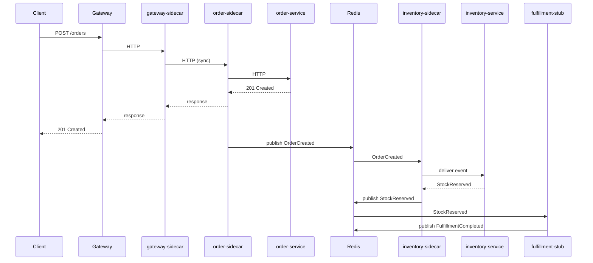
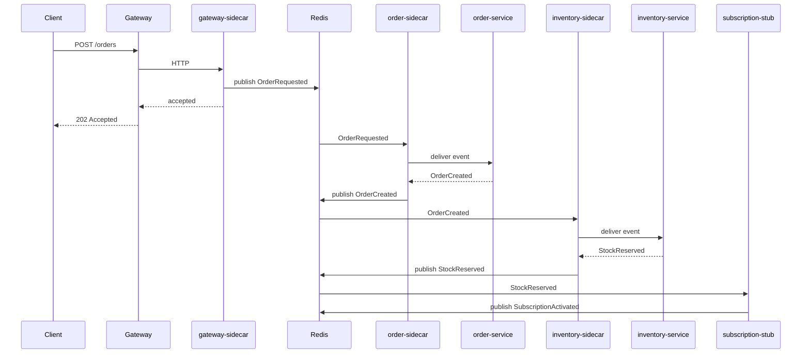
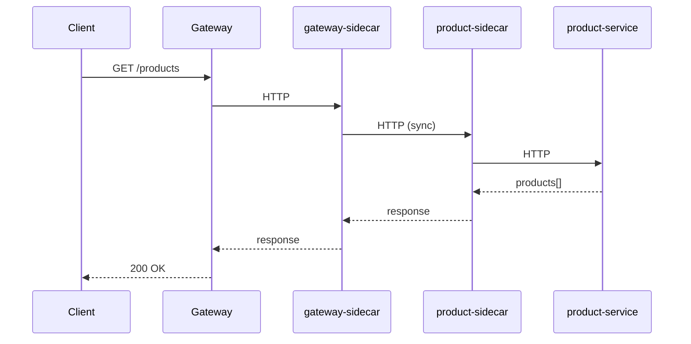
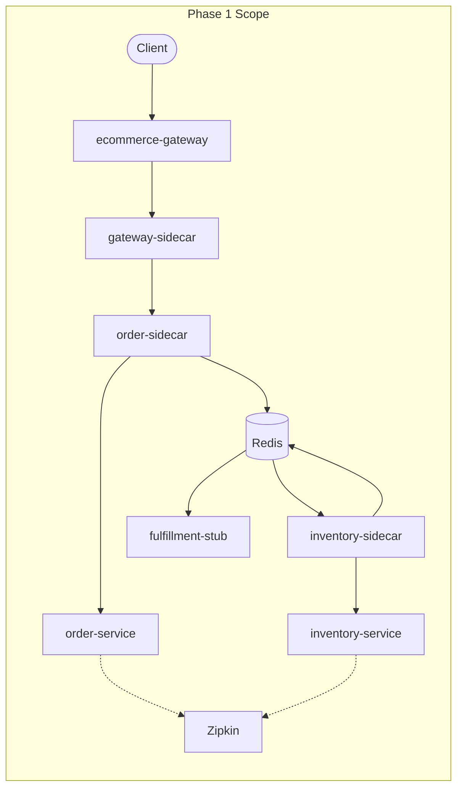

# SPAS Examples

End-to-end demonstrations of the SPAS framework in realistic scenarios.

---

## E-Commerce Domain Example

**Status**: 🔨 Design Phase  
**Branch**: `phase5-example-design`

This example demonstrates the complete SPAS framework in a multi-service e-commerce domain.

---

## Design Decisions

### 1. High-Level Requirements

**Goal**: What does this example prove about SPAS?

| # | Requirement | Priority | Rationale |
|---|-------------|----------|-----------|
| 1 | **Service reuse across domains** — Same services (e.g., order-service, product-service) deployed to multiple domain contexts with different choreographies and transformations | **Mandatory** | Core SPAS value proposition: services don't change when deployed to different domains |
| 2 | **Repository as service catalogue** — Demonstrate Repository API for service discovery and metadata browsing | Optional | Shows Repository is more than storage; enables service marketplace patterns |
| 3 | **End-to-end observability** — Single W3C Trace ID flows through entire event chain, visible in Zipkin | Recommended | Proves choreography doesn't break distributed tracing |
| 4 | **Single-command deployment workflow** — From `spas-compose init` to `docker compose up` with minimal manual steps | Recommended | Validates toolchain integration and developer experience |

**Scenario Summary**:

Two domains share the same reusable services but compose them differently:

| Domain | Purpose | How it uses shared services |
|--------|---------|----------------------------|
| **Public E-Commerce** | Customers browse & order products | `OrderCreated` → `orders-requested` → triggers fulfillment |
| **B2B Subscription** | Businesses subscribe to recurring product deliveries | `OrderCreated` → `subscriptions-requested` → triggers recurring billing & scheduled fulfillment |

Same `order-service`, same `product-service` — different choreographies, different transformations, different downstream consumers.

---

### 2. Scope Boundaries

**In Scope**:

| Category | Items |
|----------|-------|
| **Shared Services** | 2 reusable SPAS services with SDK integration (extensible to more) |
| **Stub Services** | 2 mock/stub downstream services (replaceable with real SPAS services later) |
| **Domain Contexts** | 2 domains with separate choreography.yaml demonstrating different compositions |
| **Choreography Artifacts** | Topic mappings, JSONata transformations, sidecar configs for each domain |
| **Deployment** | Docker Compose for each domain (infrastructure: Redis, Zipkin, sidecars) |
| **Observability** | Zipkin trace visualization showing cross-service correlation |
| **State Inspection** | REST endpoints on each service to view in-memory state (e.g., `GET /orders`) |
| **Documentation** | README walkthroughs for each domain showing the full workflow |
| **Repository Integration** | Services published to Repository; domains pull from Repository |

**Out of Scope**:

| Category | Rationale |
|----------|-----------|
| **Real business logic** | Services use minimal in-memory state; focus is on SPAS integration, not e-commerce implementation |
| **Persistent storage** | In-memory only; restart = clean state *(SQLite as optional future enhancement)* |
| **UI/Frontend** | No web interface; state inspection via REST endpoints and curl/Postman |
| **Authentication/Authorization** | Identity in payload (PoC pattern); no real auth implementation |
| **Kubernetes deployment** | Docker Compose only; K8s is production concern |
| **Contract testing** | Deferred from PoC per constitution |
| **Multiple languages** | All services in one language initially *(future extensibility for SDK demos in Java/Node)* |
| **Performance testing** | Focus is correctness, not scale |

---

### 3. Service Portfolio

**SPAS Services (Shared/Reusable)**:

| Service | Responsibility | Publishes | Subscribes |
|---------|----------------|-----------|------------|
| **order-service** | Order lifecycle management | `OrderCreated`, `OrderConfirmed` | E-Commerce: HTTP via sidecar; B2B: `OrderRequested` event |
| **inventory-service** | Stock tracking, reservation | `StockReserved`, `StockDepleted` | `OrderCreated` |
| **product-service** | Product catalogue (browse) | *(future: `ProductCreated`)* | *(Phase 1: none)* |

**Stub Services (Domain-Specific)**:

| Service | Domain | Responsibility | Publishes | Subscribes |
|---------|--------|----------------|-----------|------------|
| **fulfillment-service** | E-Commerce | Logistics mock (pick, pack, ship) | `FulfillmentCompleted` | `StockReserved` |
| **subscription-service** | B2B | Recurring order mock | `SubscriptionActivated` | `OrderCreated` |

**Gateway (External to SPAS)**:

| Gateway | Description |
|---------|-------------|
| **api-gateway** | Single codebase; sync vs async behavior determined by domain's sidecar-config.json |

| Domain | Sidecar Mode | Behavior |
|--------|--------------|----------|
| E-Commerce | HTTP proxy | Gateway-sidecar → order-sidecar (HTTP); sync response |
| B2B | Event publishing | Gateway-sidecar → Redis → order-sidecar; returns 202 Accepted |

**Event Flows**:

**E-Commerce Domain (Sync Edge via Sidecar HTTP Proxy → Async Internal)**:



**B2B Subscription Domain (Async Edge → Async Internal)**:



**Query Pattern** (both domains):



**Design Decisions**:

| Decision | Choice | Rationale |
|----------|--------|-----------|
| Gateway per domain | Yes | Domains represent different organizations; separate infrastructure |
| Gateway technology | Custom Node.js (Express/Fastify) | Aligns with sidecar (both Node.js); can share event publishing code |
| Sync vs Async edge | E-Commerce sync (HTTP), B2B async (events) | Demonstrates both patterns; same services handle both |
| Sidecar-to-sidecar HTTP | E-Commerce uses HTTP between sidecars | Principles-compliant; gateway never talks directly to service |
| inventory-service naming | inventory-service (not stock-service) | Industry-standard naming; avoids "stock" ambiguity |

**Evolution Paths**:

| Enhancement | Description | When |
|-------------|-------------|------|
| Product sync to order-service | Choreography syncs products for validation | After Phase 1 |
| Admin sub-domain (E-Commerce) | Product management CRUD | Future |
| Request-reply in B2B | Gateway waits for response event via correlation | Future |
| Product browsing via CLI | CLI → Gateway → product-service | Future |

---

### 4. Technology Decisions

| Decision | Choice | Rationale |
|----------|--------|-----------|
| **Service Language** | .NET (C#) | SDK exists; validates SDK integration end-to-end |
| **Gateway Language** | Node.js (Express) | Aligns with sidecar; can reuse event publishing patterns |
| **Stub Language** | Node.js | Lightweight; no SDK needed; fast to implement |
| **Business Logic Depth** | Minimal in-memory state | Focus is SPAS integration, not e-commerce logic |
| **State Inspection** | REST endpoints per service | `GET /orders`, `GET /products`, `GET /inventory` for debugging |
| **Event Transport** | Redis Streams | Already proven in prototype; CloudEvents format |
| **Tracing** | Zipkin | W3C Trace Context propagation; visual trace inspection |
| **Container Orchestration** | Docker Compose | Per-domain compose files; no K8s in PoC |

---

### 5. Folder Structure

```text
examples/
├── README.md                              # Design decisions (this file)
│
├── services/                              # Shared SPAS services (.NET + SDK)
│   ├── order-service/
│   │   ├── src/
│   │   ├── Dockerfile
│   │   └── spas.yaml                      # Service manifest
│   ├── inventory-service/
│   │   ├── src/
│   │   ├── Dockerfile
│   │   └── spas.yaml
│   └── product-service/
│       ├── src/
│       ├── Dockerfile
│       └── spas.yaml
│
├── stubs/                                 # Domain-specific stubs (Node.js)
│   ├── fulfillment-service/
│   │   ├── index.js
│   │   └── Dockerfile
│   └── subscription-service/
│       ├── index.js
│       └── Dockerfile
│
├── gateways/                              # Custom gateway (Node.js)
│   └── api-gateway/                       # Single codebase; behavior via sidecar config
│       ├── index.js
│       └── Dockerfile
│
└── domains/                               # Domain deployments
    ├── ecommerce/                         # E-commerce organization
    │   ├── public/                        # Phase 1: customer-facing
    │   │   ├── choreography.yaml
    │   │   ├── sidecar-config.json        # HTTP proxy mode for gateway
    │   │   ├── docker-compose.yaml
    │   │   └── README.md                  # Domain walkthrough
    │   └── admin/                         # Future: product management
    │       └── (placeholder)
    │
    └── b2b/                               # B2B organization
        └── subscription/                  # Phase 1: recurring orders
            ├── choreography.yaml
            ├── sidecar-config.json        # Event publishing mode for gateway
            ├── docker-compose.yaml
            └── README.md                  # Domain walkthrough
```

**Notes**:
- `services/` contains reusable SPAS services; published to Repository
- `stubs/` contains domain-specific mocks; not published to Repository
- `gateways/` single api-gateway codebase; sync vs async determined by sidecar config
- `domains/` groups sub-domains by organization; each has its own choreography and sidecar config

---

### 6. Development Phases

| Phase | Description | Deliverables |
|-------|-------------|-------------|
| **1** | Core services + E-Commerce public | order-service, inventory-service, fulfillment-stub, ecommerce-gateway, choreography.yaml, docker-compose.yaml |
| **2** | B2B subscription domain | subscription-stub, b2b-gateway, choreography.yaml, docker-compose.yaml |
| **3** | Product service | product-service, query routing in both gateways |
| **4** | Repository integration | Publish services to Repository; pull into domain deployments |
| **5** | CLI workflow | `spas-compose init` → `choreography build` → `docker compose up` |
| **6** | Documentation & polish | README walkthroughs, Zipkin trace screenshots, demo script |

**Phase 1 Details** (MVP):



**Phase 2 Deliverable**: Same services, different choreography → proves reuse.

---

### 7. Success Criteria

**Mandatory** (must pass for PoC success):

- [ ] **Reuse proven**: Same order-service and inventory-service deployed to both E-Commerce and B2B domains without code changes
- [ ] **Choreography differentiation**: Different `choreography.yaml` routes events to different downstream consumers
- [ ] **End-to-end trace**: Single W3C Trace ID visible in Zipkin across all services in a request flow
- [ ] **Docker Compose up**: Each domain starts with `docker compose up` and handles requests

**Recommended** (validates toolchain):

- [ ] **Repository publish**: Services published to Repository with manifests
- [ ] **CLI workflow**: `spas-compose init` + `choreography build` generates working artifacts
- [ ] **State inspection**: REST endpoints return in-memory state for debugging

**Demo Scenarios**:

| # | Scenario | Expected Outcome |
|---|----------|------------------|
| 1 | POST order in E-Commerce | Sync 201 response; Zipkin shows trace through inventory → fulfillment |
| 2 | POST order in B2B | Async 202 response; Zipkin shows trace through inventory → subscription |
| 3 | GET products (both domains) | Sync response with product list |
| 4 | Restart and re-order | State cleared; new order created (in-memory proof) |

---

## Related Documents

- [TASKS.md](../TASKS.md) — Phase 5 overview
- [principles/02-architecture-overview.md](../principles/02-architecture-overview.md) — System architecture
- [principles/component/14-domain-choreography.md](../principles/component/14-domain-choreography.md) — Choreography patterns
- [prototypes/spas-sidecar-prototype/README.md](../prototypes/spas-sidecar-prototype/README.md) — Working prototype reference
