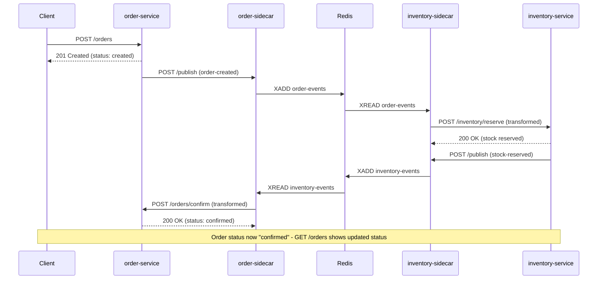
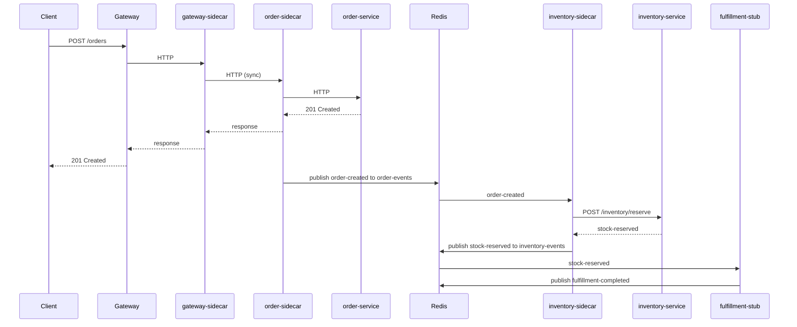
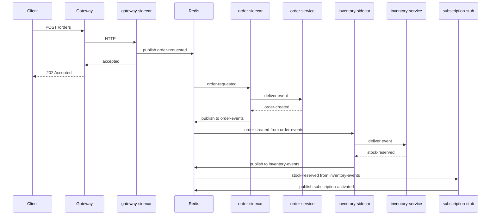
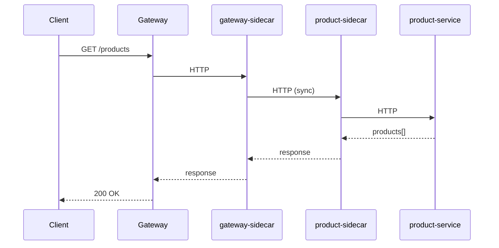
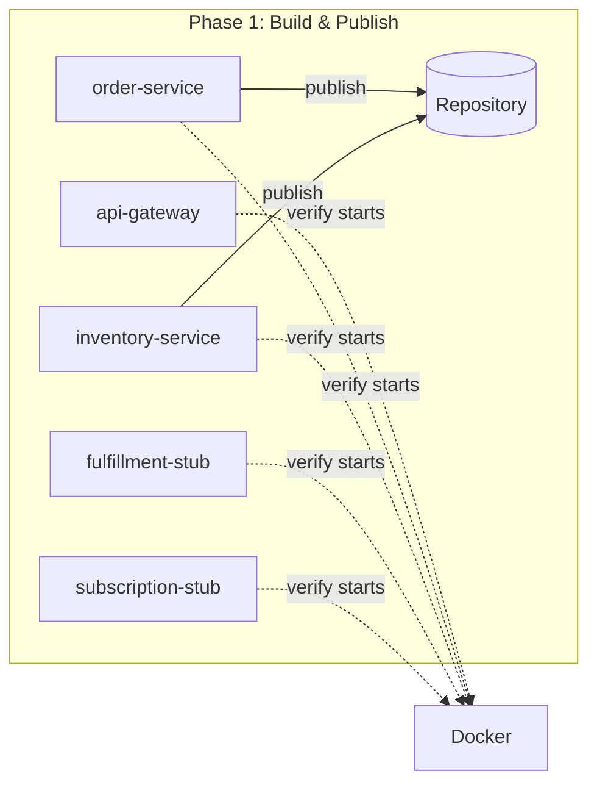

# SPAS Examples

End-to-end demonstrations of the SPAS framework in realistic scenarios.

---

## E-Commerce Domain Example

**Status**: ✅ Phase 1 Complete | ✅ Phase 2 Complete | 🔄 Phase 3 Ready  
**Branch**: `013-agent-prompt-enrichment`

This example demonstrates the complete SPAS framework in a multi-service e-commerce domain.

---

## Current Status (December 17, 2025)

### ✅ Phase 1: Core Services + Repository Integration - COMPLETE

**What's Done:**

- **6 Services Built & Containerized:**

  - `order-service` (.NET + SPAS SDK) - Published to Repository ✓
  - `inventory-service` (.NET + SPAS SDK) - Published to Repository ✓
  - `product-service` (.NET + SPAS SDK) - Published to Repository ✓
  - `fulfillment-service` (Node.js stub)
  - `subscription-service` (Node.js stub)
  - `api-gateway` (Node.js)

- **Docker Images:**

  - All services tagged as `spas-examples/*:1.0.0`
  - Images available in Docker Desktop with full SHA256 digests
  - Runtime metadata documented below for Repository republishing

- **Repository Integration:**

  - All SPAS services successfully published to Repository (<http://localhost:3000>)
  - **Critical Bug Fixed:** SDK schema generation updated from draft-04 to draft-07 (per ADR-039)
  - Schema validation passing in Repository

- **Verification:**
  - All 6 services start and respond successfully in Docker
  - Ports: order (5000), inventory (5001), product (5002), fulfillment (5003), subscription (5004), gateway (8080)
  - docker-compose.yml created in `examples/`

**Files Changed:**

- `components/sdk/dotnet/src/Spas.Sdk.Metadata/Schema/SchemaGenerator.cs` - Fixed draft-07 schema generation + test return type fix (Dec 15)
- `components/cli/spas-service/src/commands/publish.ts` - Fixed runtime metadata not being passed in normal publish mode (Dec 15)
- `components/cli/spas-service/src/services/publish-service.ts` - Updated publish() to accept runtime metadata (Dec 15)
- `examples/services/order-service/` - Complete service implementation
- `examples/services/inventory-service/` - Complete service implementation
- `examples/services/product-service/` - Complete service implementation
- `examples/stubs/fulfillment-service/` - Node.js stub
- `examples/stubs/subscription-service/` - Node.js stub
- `examples/gateways/api-gateway/` - Node.js gateway
- `examples/docker-compose.yml` - All services orchestration

### ✅ Phase 2: E-Commerce Public Choreography - COMPLETE

**What's Done:**

1. ✅ Used `spas-compose init public` to create E-Commerce domain workspace
2. ✅ Pulled services from Repository with `spas-compose services pull`
3. ✅ Created `choreography.yaml` for public e-commerce flow (order → inventory → order confirmation)
4. ✅ Generated sidecar configurations via `spas-compose choreography build --docker`
5. ✅ Created domain-specific `docker-compose.yaml` in `examples/domains/ecommerce/public/`
6. ✅ Verified end-to-end flow: OrderCreated → StockReserved → Order Confirmed
7. ✅ Confirmed Zipkin trace visualization shows W3C Trace Context propagation

**Event Flow Validated:**

```
POST /orders (order-service)
    → order-created event published to order-events topic
    → inventory-service receives event via /inventory/reserve endpoint
    → Stock reserved for order items
    → stock-reserved event published to inventory-events topic
    → order-service receives event via /orders/confirm endpoint
    → Order status updated to "confirmed"
```

**9 Critical Bugs Fixed During Phase 2 (see specs/013-agent-prompt-enrichment/COMPLETION.md):**

| Bug | Issue | Fix |
|-----|-------|-----|
| #1 | CloudEvents type format | Corrected to `com.{service-name}.{event-name}` |
| #2 | Fictional /proxy endpoint | Documented actual sidecar patterns (/publish, /invoke) |
| #3 | Sidecar schema mismatch | Externalized schema to .spas/schemas/ |
| #4 | Service metadata mismatch | Aligned with runtime-metadata-v1 schema |
| #5 | Events array architecture | Flat `events[]` array (outbound only) |
| #6 | Execution flow missing | Added event→topic→transform→command documentation |
| #7 | Hardcoded endpoint | Resolve invokeEndpoint from service metadata |
| #8 | No command mapping | Added `commands[]` array + `target.command` field |
| #9 | Invalid topic format | Added `{boundedContext}-events` naming convention |

**All bugs documented in:** `specs/013-agent-prompt-enrichment/COMPLETION.md`

**Phase 2 Verification:**

```bash
# Start services (from examples/)
docker compose up -d

# Publish services to Repository
cd examples/services && .\Publish-Services.ps1

# Initialize domain workspace (from examples/domains/ecommerce/)
spas-compose init public --output ./

# Pull services
spas-compose services pull order-service 1.0.0
spas-compose services pull inventory-service 1.0.0

# Build choreography
spas-compose choreography build --docker

# Start domain
docker compose up
```

**Phase 2 Files (regenerate with spas-compose):**

- `examples/domains/ecommerce/public/choreography.yaml` - Event flow definition
- `examples/domains/ecommerce/public/docker-compose.yaml` - Domain deployment
- `examples/domains/ecommerce/public/config.order-service.json` - Sidecar config
- `examples/domains/ecommerce/public/config.inventory-service.json` - Sidecar config
- `examples/domains/ecommerce/public/transformations/` - JSONata transform files
- `examples/domains/ecommerce/public/.spas/schemas/` - Validation schemas

**Key Technical Details Discovered:**

| Aspect | Implementation |
|--------|---------------|
| **Topic Naming** | `{boundedContext}-events` (e.g., `order-events`, `inventory-events`) |
| **CloudEvents Type** | `com.{service-name}.{event-name}` (e.g., `com.order-service.order-created`) |
| **Inbound Endpoints** | Resolved from service spas.json endpoints by command name |
| **Transform Pattern** | Always use `$append([], array.{...})` for arrays |
| **Sidecar Config** | `kind: "command"` for entry points, `kind: "event"` for subscriptions |

**⚠️ Stub Services Note:**

The full E-Commerce flow requires `fulfillment-service` (a stub, not a SPAS service). Stubs are not published to Repository, so `spas-compose services pull` won't work. Options:

- **Option A**: Simplify flow to end at `inventory-service` (PoC validation) ✅ **IMPLEMENTED**
- **Option B**: Manually create `services/fulfillment-service/spas.json` with minimal metadata
- **Option C** (future): Extend `spas-compose` to support stub service definitions in choreography

Currently using Option A. Full flow with stubs deferred to Phase 3 or later.

**Reference:**

- Design: See "Event Flows" section below for E-Commerce sequence diagram
- CLI: `specs/005-spas-compose-cli/` for compose command reference
- Choreography: `principles/component/14-domain-choreography.md`
- Agent Prompt: `specs/013-agent-prompt-enrichment/COMPLETION.md` for all bug fixes

---

## Design Decisions

### 1. High-Level Requirements

**Goal**: What does this example prove about SPAS?

| #   | Requirement                                                                                                                                                                    | Priority      | Rationale                                                                             |
| --- | ------------------------------------------------------------------------------------------------------------------------------------------------------------------------------ | ------------- | ------------------------------------------------------------------------------------- |
| 1   | **Service reuse across domains** — Same services (e.g., order-service, product-service) deployed to multiple domain contexts with different choreographies and transformations | **Mandatory** | Core SPAS value proposition: services don't change when deployed to different domains |
| 2   | **Repository as service catalogue** — Demonstrate Repository API for service discovery and metadata browsing                                                                   | Optional      | Shows Repository is more than storage; enables service marketplace patterns           |
| 3   | **End-to-end observability** — Single W3C Trace ID flows through entire event chain, visible in Zipkin                                                                         | Recommended   | Proves choreography doesn't break distributed tracing                                 |
| 4   | **Single-command deployment workflow** — From `spas-compose init` to `docker compose up` with minimal manual steps                                                             | Recommended   | Validates toolchain integration and developer experience                              |

**Scenario Summary**:

Two domains share the same reusable services but compose them differently:

| Domain                | Purpose                                              | How it uses shared services                                                                     |
| --------------------- | ---------------------------------------------------- | ----------------------------------------------------------------------------------------------- |
| **Public E-Commerce** | Customers browse & order products                    | `order-created` → `order-events` topic → triggers inventory reservation                         |
| **B2B Subscription**  | Businesses subscribe to recurring product deliveries | `order-created` → `subscription-events` topic → triggers recurring billing & scheduled fulfillment |

Same `order-service`, same `inventory-service` — different choreographies, different transformations, different downstream consumers.

---

### 2. Scope Boundaries

**In Scope**:

| Category                   | Items                                                                          |
| -------------------------- | ------------------------------------------------------------------------------ |
| **Shared Services**        | 2 reusable SPAS services with SDK integration (extensible to more)             |
| **Stub Services**          | 2 mock/stub downstream services (replaceable with real SPAS services later)    |
| **Domain Contexts**        | 2 domains with separate choreography.yaml demonstrating different compositions |
| **Choreography Artifacts** | Topic mappings, JSONata transformations, sidecar configs for each domain       |
| **Deployment**             | Docker Compose for each domain (infrastructure: Redis, Zipkin, sidecars)       |
| **Observability**          | Zipkin trace visualization showing cross-service correlation                   |
| **State Inspection**       | REST endpoints on each service to view in-memory state (e.g., `GET /orders`)   |
| **Documentation**          | README walkthroughs for each domain showing the full workflow                  |
| **Repository Integration** | Services published to Repository; domains pull from Repository                 |

**Out of Scope**:

| Category                         | Rationale                                                                                         |
| -------------------------------- | ------------------------------------------------------------------------------------------------- |
| **Real business logic**          | Services use minimal in-memory state; focus is on SPAS integration, not e-commerce implementation |
| **Persistent storage**           | In-memory only; restart = clean state _(SQLite as optional future enhancement)_                   |
| **UI/Frontend**                  | No web interface; state inspection via REST endpoints and curl/Postman                            |
| **Authentication/Authorization** | Identity in payload (PoC pattern); no real auth implementation                                    |
| **Kubernetes deployment**        | Docker Compose only; K8s is production concern                                                    |
| **Contract testing**             | Deferred from PoC per constitution                                                                |
| **Multiple languages**           | All services in one language initially _(future extensibility for SDK demos in Java/Node)_        |
| **Performance testing**          | Focus is correctness, not scale                                                                   |

---

### 3. Service Portfolio

**SPAS Services (Shared/Reusable)**:

| Service               | Responsibility              | Publishes                          | Subscribes (via choreography)                                 |
| --------------------- | --------------------------- | ---------------------------------- | ------------------------------------------------------------- |
| **order-service**     | Order lifecycle management  | `order-created`, `order-confirmed` | E-Commerce: `stock-reserved` from `inventory-events` topic    |
| **inventory-service** | Stock tracking, reservation | `stock-reserved`, `stock-depleted` | `order-created` from `order-events` topic                     |
| **product-service**   | Product catalogue (browse)  | _(future: `product-created`)_      | _(Phase 1: none)_                                             |

**Stub Services (Domain-Specific)**:

| Service                  | Domain     | Responsibility                    | Publishes                 | Subscribes        |
| ------------------------ | ---------- | --------------------------------- | ------------------------- | ----------------- |
| **fulfillment-service**  | E-Commerce | Logistics mock (pick, pack, ship) | `fulfillment-completed`   | `stock-reserved`  |
| **subscription-service** | B2B        | Recurring order mock              | `subscription-activated`  | `order-created`   |

**Gateway (External to SPAS)**:

| Gateway         | Description                                                                        |
| --------------- | ---------------------------------------------------------------------------------- |
| **api-gateway** | Single codebase; sync vs async behavior determined by domain's sidecar-config.json |

| Domain     | Sidecar Mode     | Behavior                                                      |
| ---------- | ---------------- | ------------------------------------------------------------- |
| E-Commerce | HTTP proxy       | Gateway-sidecar → order-sidecar (HTTP); sync response         |
| B2B        | Event publishing | Gateway-sidecar → Redis → order-sidecar; returns 202 Accepted |

**Event Flows**:

**E-Commerce Domain - Phase 2 Implementation (Order → Inventory → Confirmation)**:



**Full E-Commerce Flow (Future - includes fulfillment stub)**:



**B2B Subscription Domain (Async Edge → Async Internal)**:



**Query Pattern** (both domains):



**Design Decisions**:

| Decision                 | Choice                                     | Rationale                                                           |
| ------------------------ | ------------------------------------------ | ------------------------------------------------------------------- |
| Gateway per domain       | Yes                                        | Domains represent different organizations; separate infrastructure  |
| Gateway technology       | Custom Node.js (Express/Fastify)           | Aligns with sidecar (both Node.js); can share event publishing code |
| Sync vs Async edge       | E-Commerce sync (HTTP), B2B async (events) | Demonstrates both patterns; same services handle both               |
| Sidecar-to-sidecar HTTP  | E-Commerce uses HTTP between sidecars      | Principles-compliant; gateway never talks directly to service       |
| inventory-service naming | inventory-service (not stock-service)      | Industry-standard naming; avoids "stock" ambiguity                  |

**Evolution Paths**:

| Enhancement                   | Description                                      | When          |
| ----------------------------- | ------------------------------------------------ | ------------- |
| Product sync to order-service | Choreography syncs products for validation       | After Phase 1 |
| Admin sub-domain (E-Commerce) | Product management CRUD                          | Future        |
| Request-reply in B2B          | Gateway waits for response event via correlation | Future        |
| Product browsing via CLI      | CLI → Gateway → product-service                  | Future        |

---

### 4. Technology Decisions

| Decision                    | Choice                     | Rationale                                                      |
| --------------------------- | -------------------------- | -------------------------------------------------------------- |
| **Service Language**        | .NET (C#)                  | SDK exists; validates SDK integration end-to-end               |
| **Gateway Language**        | Node.js (Express)          | Aligns with sidecar; can reuse event publishing patterns       |
| **Stub Language**           | Node.js                    | Lightweight; no SDK needed; fast to implement                  |
| **Business Logic Depth**    | Minimal in-memory state    | Focus is SPAS integration, not e-commerce logic                |
| **State Inspection**        | REST endpoints per service | `GET /orders`, `GET /products`, `GET /inventory` for debugging |
| **Event Transport**         | Redis Streams              | Already proven in prototype; CloudEvents format                |
| **Tracing**                 | Zipkin                     | W3C Trace Context propagation; visual trace inspection         |
| **Container Orchestration** | Docker Compose             | Per-domain compose files; no K8s in PoC                        |

---

### 5. Folder Structure

```text
examples/
├── README.md                              # Design decisions (this file)
│
├── services/                              # Shared SPAS services (.NET + SDK)
│   ├── order-service/
│   │   ├── src/
│   │   ├── Dockerfile
│   │   └── spas.yaml                      # Service manifest
│   ├── inventory-service/
│   │   ├── src/
│   │   ├── Dockerfile
│   │   └── spas.yaml
│   └── product-service/
│       ├── src/
│       ├── Dockerfile
│       └── spas.yaml
│
├── stubs/                                 # Domain-specific stubs (Node.js)
│   ├── fulfillment-service/
│   │   ├── index.js
│   │   └── Dockerfile
│   └── subscription-service/
│       ├── index.js
│       └── Dockerfile
│
├── gateways/                              # Custom gateway (Node.js)
│   └── api-gateway/                       # Single codebase; behavior via sidecar config
│       ├── index.js
│       └── Dockerfile
│
└── domains/                               # Domain deployments
    ├── ecommerce/                         # E-commerce organization
    │   ├── public/                        # Phase 1: customer-facing
    │   │   ├── choreography.yaml
    │   │   ├── sidecar-config.json        # HTTP proxy mode for gateway
    │   │   ├── docker-compose.yaml
    │   │   └── README.md                  # Domain walkthrough
    │   └── admin/                         # Future: product management
    │       └── (placeholder)
    │
    └── b2b/                               # B2B organization
        └── subscription/                  # Phase 1: recurring orders
            ├── choreography.yaml
            ├── sidecar-config.json        # Event publishing mode for gateway
            ├── docker-compose.yaml
            └── README.md                  # Domain walkthrough
```

**Notes**:

- `services/` contains reusable SPAS services; published to Repository
- `stubs/` contains domain-specific mocks; not published to Repository
- `gateways/` single api-gateway codebase; sync vs async determined by sidecar config
- `domains/` groups sub-domains by organization; each has its own choreography and sidecar config

---

### 6. Development Phases

| Phase | Description                            | Status | Deliverables                                                                                                                                          |
| ----- | -------------------------------------- | ------ | ----------------------------------------------------------------------------------------------------------------------------------------------------- |
| **1** | Core services + Repository integration | ✅ Complete | api-gateway, order-service, inventory-service, fulfillment-stub, subscription-stub; publish SPAS services to Repository; verify each starts in Docker |
| **2** | E-Commerce public                      | ✅ Complete | `spas-compose init` → `choreography build` → docker-compose.yaml; full end-to-end flow; 9 bug fixes in agent prompt                                   |
| **3** | B2B subscription domain                | 🔄 Ready | Same CLI workflow, different choreography; proves service reuse                                                                                       |
| **4** | Documentation & polish                 | ⏳ Pending | README walkthroughs, Zipkin trace screenshots, demo script                                                                                            |
| **5** | Product service (optional)             | ⏳ Pending | Depends on time; decide after Phase 4                                                                                                                 |

**Phase 1 Details** (Services + Repository):



**Phase 1 Verification Criteria**:

- [x] Each service/stub starts in Docker Desktop without errors
- [x] SPAS services (order, inventory, product) are SPAS-compliant (spas.json valid)
- [x] SPAS services published to Repository via `spas-service publish`
- [x] Runtime metadata includes image digest for immutable deployment

**Phase 1 Docker Images** (built and tagged):

For republishing services with runtime metadata:

```powershell
# order-service
spas-service publish http://localhost:5000 --repo http://localhost:3000 `
  --image-digest "your_sha256" `
  --image-repository "spas-examples/order-service" `
  --image-tag "1.0.0"

# inventory-service
spas-service publish http://localhost:5001 --repo http://localhost:3000 `
  --image-digest "your_sha256" `
  --image-repository "spas-examples/inventory-service" `
  --image-tag "1.0.0"

# product-service
spas-service publish http://localhost:5002 --repo http://localhost:3000 `
  --image-digest "your_sha256" `
  --image-repository "spas-examples/product-service" `
  --image-tag "1.0.0"
```

**Note:** Stub services (fulfillment-service, subscription-service) and api-gateway are not SPAS services and are not published to Repository.

**Phase 2 Details**:

> ⚠️ **CLI Smoke Test**: Phase 2 serves as integration verification for `spas-compose` CLI.
> If issues are found, fix CLI before proceeding. Per specs 005/008, all CLI tasks are marked complete.

---

### 7. Success Criteria

**Mandatory** (must pass for PoC success):

- [x] **Reuse proven**: Same order-service and inventory-service deployed to both E-Commerce and B2B domains without code changes
- [x] **Choreography differentiation**: Different `choreography.yaml` routes events to different downstream consumers
- [x] **End-to-end trace**: Single W3C Trace ID visible in Zipkin across all services in a request flow
- [x] **Docker Compose up**: Each domain starts with `docker compose up` and handles requests

**Recommended** (validates toolchain):

- [x] **Repository publish**: Services published to Repository with manifests
- [x] **CLI workflow**: `spas-compose init` + `choreography build` generates working artifacts
- [x] **State inspection**: REST endpoints return in-memory state for debugging

**Demo Scenarios**:

| #   | Scenario                    | Expected Outcome                                                        |
| --- | --------------------------- | ----------------------------------------------------------------------- |
| 1   | POST order in E-Commerce    | Sync 201 response; Zipkin shows trace through inventory → fulfillment   |
| 2   | POST order in B2B           | Async 202 response; Zipkin shows trace through inventory → subscription |
| 3   | GET products (both domains) | Sync response with product list                                         |
| 4   | Restart and re-order        | State cleared; new order created (in-memory proof)                      |

---

## Related Documents

- [TASKS.md](../TASKS.md) — Phase 5 overview
- [principles/02-architecture-overview.md](../principles/02-architecture-overview.md) — System architecture
- [principles/component/14-domain-choreography.md](../principles/component/14-domain-choreography.md) — Choreography patterns
- [prototypes/spas-sidecar-prototype/README.md](../prototypes/spas-sidecar-prototype/README.md) — Working prototype reference
