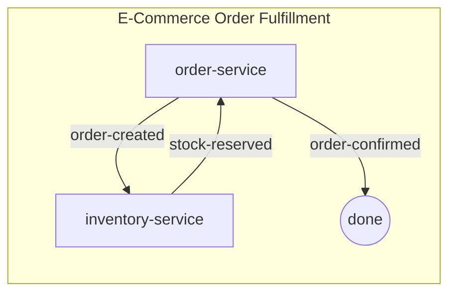
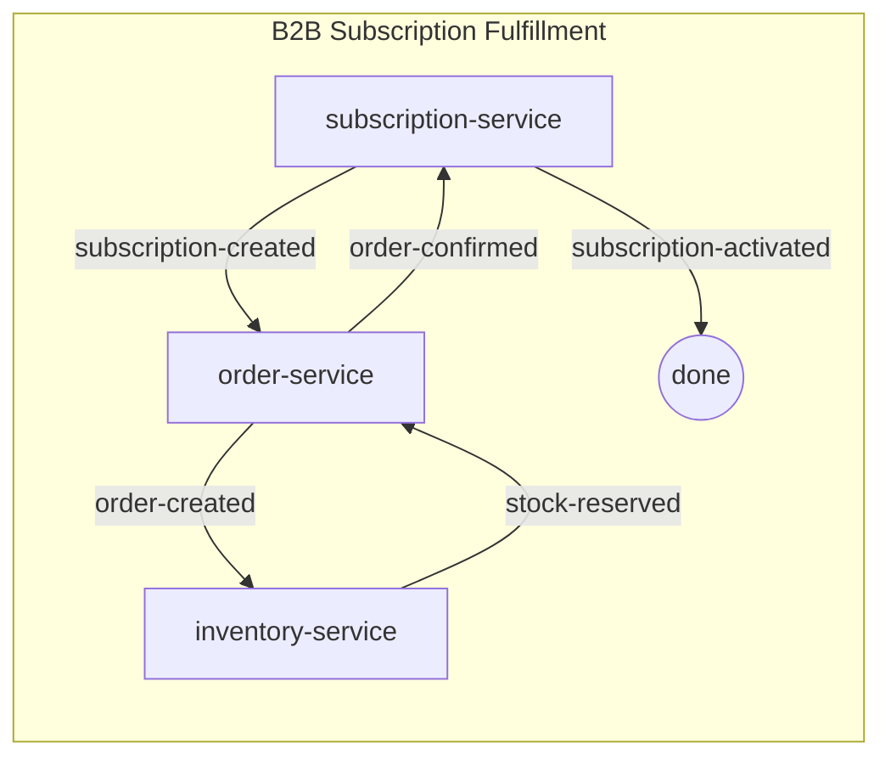

# SPAS Example Domains

This directory contains example SPAS domain choreographies demonstrating event-driven service composition patterns.

---

## How It Works

SPAS enables service choreography through declarative YAML configuration. Each domain defines **flows** that describe how events route between services with automatic payload transformation.

### Key Concepts

| Concept | Description |
|---------|-------------|
| **Choreography** | A YAML file defining event flows between services |
| **Flow** | A named sequence of events connecting participants |
| **Transform** | JSONata expressions adapting payloads between services |
| **Sidecar** | Infrastructure proxy handling routing, transformation, and tracing |

### Building a Choreography

```bash
# Option 1: Use the /spas.compose agent command in VS Code
# Describe your requirements and the agent generates choreography.yaml

# Option 2: Manual workflow
spas-compose init --domain my-domain --output examples/domains/my-domain
spas-compose choreography build --docker --dev
```

### Running Examples

```bash
# 1. Build the sidecar image (one-time)
cd components/sidecar
docker build -t spas-sidecar:latest .

# 2. Navigate to a domain and run
cd examples/domains/ecommerce
docker compose up -d

# 3. View traces in Zipkin
open http://localhost:9411
```

### Viewing Distrfullfiibuted Traces

All examples include Zipkin for observability:

1. Open http://localhost:9411
2. Click **Run Query** to see recent traces
3. Click on a trace to see the full flow across services
4. Click **Dependencies** to see the service topology graph

---

## E-Commerce Domain

**Location:** `examples/domains/ecommerce`

A straightforward order fulfillment choreography demonstrating the core SPAS pattern: services communicate through events, with the sidecar handling routing and transformation.

### What It Does

A customer places an order. The order service publishes an event, inventory service reserves stock, and the order is confirmed automatically.

### Services

| Service | Role | Port |
|---------|------|------|
| `order-service` | Manages order lifecycle | 5002 |
| `inventory-service` | Handles stock reservation | 5001 |

### Choreography Diagram



### Try It

```bash
cd examples/domains/ecommerce
docker compose up -d

# Create an order
curl -X POST http://localhost:5002/orders \
  -H "Content-Type: application/json" \
  -d '{
    "customerId": "cust-123",
    "items": [{"productId": "prod-001", "quantity": 2, "price": 10}],
    "total": 20
  }'

# Check traces at http://localhost:9411
```

---

## B2B Subscription Domain

**Location:** `examples/domains/b2b/subscription`

A multi-service choreography demonstrating **service reuse**—the same `order-service` and `inventory-service` from e-commerce participate in a different domain context, proving SPAS portability.

### What It Does

A B2B customer creates a subscription. This triggers order creation, inventory reservation, order confirmation, and finally subscription activation—all through event choreography.

### Services

| Service | Role | Port |
|---------|------|------|
| `subscription-service` | Manages subscription lifecycle | 5003 |
| `order-service` | Creates orders for subscriptions | 5002 |
| `inventory-service` | Handles stock reservation | 5001 |

### Choreography Diagram



### Try It

```bash
cd examples/domains/b2b/subscription
docker compose up -d

# Create a subscription
curl -X POST http://localhost:5003/subscriptions \
  -H "Content-Type: application/json" \
  -d '{
    "customerId": "cust-456",
    "plan": "premium",
    "items": [{"productId": "prod-002", "quantity": 1}]
  }'

# Check traces at http://localhost:9411
```

---

## Infrastructure (All Examples)

| Component | Port | Purpose |
|-----------|------|---------|
| Redis | 6379 | Event bus (pub/sub) |
| Zipkin | 9411 | Distributed tracing UI |

### Cleanup

```bash
# Stop and remove containers
docker compose down

# Also remove volumes (Redis data)
docker compose down -v
```
