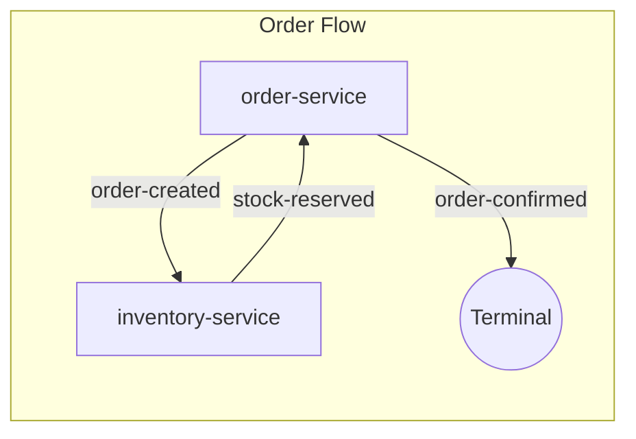
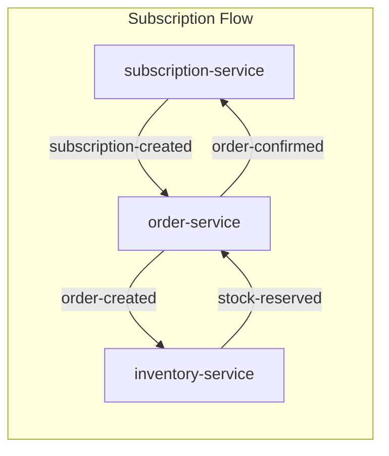

# Example Domains

This directory contains example SPAS domain choreographies demonstrating event-driven service composition patterns.

## Prerequisites

- Docker and Docker Compose
- Node.js 20+ (for building CLI tools)
- SPAS CLI tools built (`spas-compose`, `spas-service`)
- SPAS Sidecar image built (`spas-sidecar:latest`)

## Quick Start

```bash
# 1. Build the sidecar image (from components/sidecar)
cd components/sidecar
docker build -t spas-sidecar:latest .

# 2. Navigate to an example domain
cd examples/domains/ecommerce

# 3. Build and run
docker compose up -d

# 4. View traces
open http://localhost:9411
```

---

## Ecommerce Domain

A simple e-commerce choreography demonstrating order fulfillment with inventory reservation.

### Services

| Service             | Description                               |
| ------------------- | ----------------------------------------- |
| `order-service`     | Manages order lifecycle (create, confirm) |
| `inventory-service` | Handles stock reservation                 |

### Choreography Flow



**Flow Description:**

1. **Order Created** → `order-service` publishes `order-created` event
2. **Stock Reserved** → `inventory-service` reserves stock and publishes `stock-reserved`
3. **Order Confirmed** → `order-service` confirms the order (terminal event)

### Running the Example

```bash
cd examples/domains/ecommerce
docker compose up -d

# Test the flow
curl -X POST http://localhost:5002/orders \
  -H "Content-Type: application/json" \
  -d '{"customerId": "cust-123", "items": [{"productId": "prod-001", "quantity": 2, "price": 10}], "total": 20}'

# View traces
open http://localhost:9411
```

### Ports

| Service           | Port |
| ----------------- | ---- |
| order-service     | 5002 |
| inventory-service | 5001 |
| Zipkin            | 9411 |
| Redis             | 6379 |

---

## B2B Subscription Domain

A more complex choreography demonstrating B2B subscription fulfillment with correlation across multiple services.

### Services

| Service                | Description                      |
| ---------------------- | -------------------------------- |
| `subscription-service` | Manages subscription lifecycle   |
| `order-service`        | Creates orders for subscriptions |
| `inventory-service`    | Handles stock reservation        |

### Choreography Flow



**Flow Description:**

1. **Subscription Created** → `subscription-service` publishes `subscription-created`
2. **Order Created** → `order-service` creates an order and publishes `order-created`
3. **Stock Reserved** → `inventory-service` reserves stock and publishes `stock-reserved`
4. **Order Confirmed** → `order-service` confirms the order and publishes `order-confirmed`
5. **Subscription Activated** → `subscription-service` activates the subscription

### Running the Example

```bash
cd examples/domains/b2b/subscription
docker compose up -d

# Test the flow
curl -X POST http://localhost:5003/subscriptions \
  -H "Content-Type: application/json" \
  -d '{"customerId": "cust-456", "plan": "premium", "items": [{"productId": "prod-002", "quantity": 1}]}'

# View traces
open http://localhost:9411
```

### Ports

| Service              | Port |
| -------------------- | ---- |
| subscription-service | 5003 |
| order-service        | 5002 |
| inventory-service    | 5001 |
| Zipkin               | 9411 |
| Redis                | 6379 |

---

## Composing New Domains

To create a new choreography using AI assistance:

```bash
# 1. Initialize a new domain
spas-compose init --domain my-domain --output examples/domains/my-domain

# 2. Pull services from the repository
spas-compose services pull order-service inventory-service

# 3. Use AI to compose the choreography
# In VS Code, use /spas.compose command with your requirements

# 4. Build the domain artifacts
spas-compose choreography build --docker --dev

# 5. Run the domain
docker compose up -d
```

## Viewing Traces

All examples include Zipkin for distributed tracing. After running a domain:

1. Open http://localhost:9411
2. Click "Run Query" to see recent traces
3. Click on a trace to see the full flow across services
4. Click "Dependencies" to see the service topology
