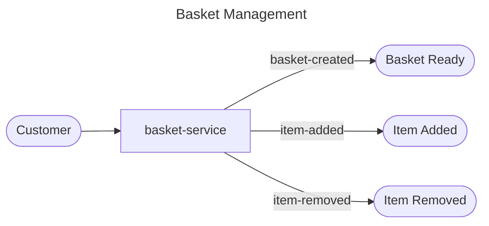
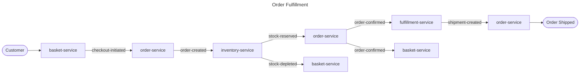
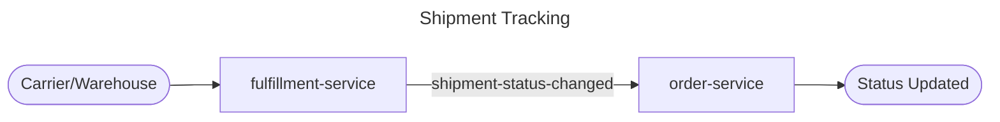
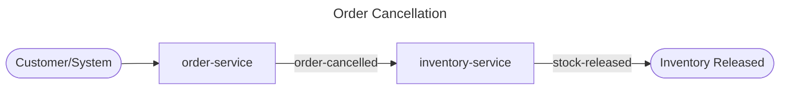
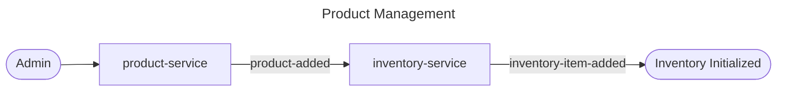

# basket-checkout

## Choreography Flows

### Flow: Basket Management

**Description**: Customer manages shopping basket items (terminal events for audit/analytics)



### Flow: Order Fulfillment

**Description**: Complete checkout flow from basket through shipment creation



### Flow: Shipment Tracking

**Description**: Update order status as shipment progresses through fulfillment lifecycle



### Flow: Order Cancellation

**Description**: Compensating flow to release reserved inventory when order cancelled



### Flow: Product Management

**Description**: Initialize inventory tracking when new products added to catalog



---

**SPAS Domain Workspace**

This workspace contains choreography configuration for composing SPAS services into a domain context.

## Structure

```
basket-checkout/
├── README.md                    # This file
├── choreography.yaml            # Choreography configuration
├── services/                    # Pulled service metadata
├── transformations/             # JSONata transformation files
└── .spas/
    └── schemas/                 # JSON Schemas for validation/AI
        ├── choreography-v1.schema.json
        ├── runtime-metadata-v1.schema.json
        └── sidecar-config-v1.schema.json
```

## Workflow

### 1. Pull Services

Download service metadata from SPAS Repository:

```bash
spas-compose services pull <service-name> <version>
```

**Example:**

```bash
spas-compose services pull order-service 1.0.0
spas-compose services pull fulfillment-service 1.0.0
```

### 2. Compose Choreography

Use the `/spas.compose` agent prompt to analyze service contracts and generate choreography:

```
/spas.compose DOMAIN:basket-checkout Analyze order-service and fulfillment-service contracts.
Propose topic mappings and generate transformations.
```

The agent will:
- Parse service contracts from `services/*/spas.json`
- Propose event mappings and topic routes
- Generate JSONata transformation files
- Update `choreography.yaml`

### 3. Build

Build Docker Compose deployment:

```bash
spas-compose choreography build --dry-run   # Validate
spas-compose choreography build --docker    # Generate docker-compose.yaml
```

### 4. Run

Start services:

```bash
docker compose up
```

## Configuration

### Repository URL

Set repository URL via:
- `--repo` flag: `spas-compose services pull order-service 1.0.0 --repo http://repo.example.com`
- Environment: `export SPAS_REPOSITORY_URL=http://repo.example.com`
- Default: `http://localhost:3000`

## Documentation

- [spas-compose CLI](../../components/cli/spas-compose/README.md)
- [SPAS Principles](../../principles/README.md)
- [Domain Choreography](../../principles/component/14-domain-choreography.md)
