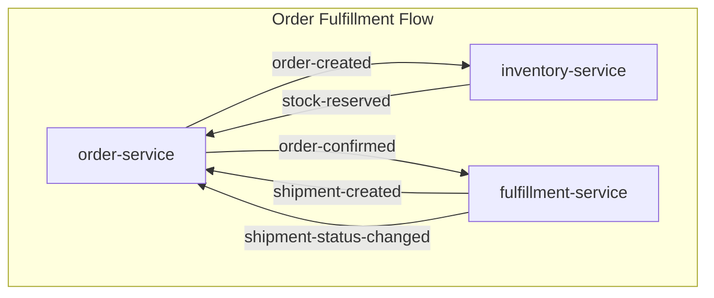

# order-fulfillment

**SPAS Domain Workspace**

This workspace contains choreography configuration for composing SPAS services into a domain context.

## Structure

```
order-fulfillment/
├── README.md                    # This file
├── choreography.yaml            # Choreography configuration
├── services/                    # Pulled service metadata
├── transformations/             # JSONata transformation files
└── .spas/
    └── schemas/                 # JSON Schemas for validation/AI
        ├── choreography-v1.schema.json
        ├── runtime-metadata-v1.schema.json
        └── sidecar-config-v1.schema.json
```

## Workflow

Follow the standard workflow in [spas-compose CLI](../../../components/cli/spas-compose/README.md).

Typical services for this domain:

- order-service 1.0.0
- inventory-service 1.0.0
- fulfillment-service 1.0.0

## Choreography

The following diagram illustrates the sequence of events between the participating services.



## Configuration

Repository configuration (including `SPAS_REPOSITORY_URL` and `--repo`) is documented in [spas-compose CLI](../../../components/cli/spas-compose/README.md).

## Documentation

See also: [spas-compose CLI](../../../components/cli/spas-compose/README.md) and [Domain Choreography](../../../principles/component/14-domain-choreography.md).
