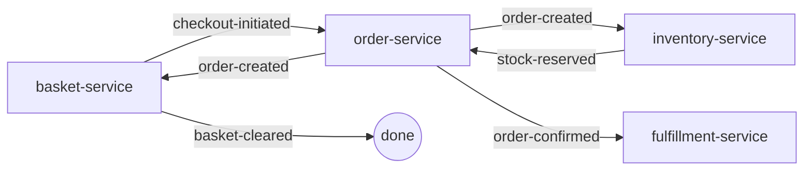

# Basket Service (Java)

A SPAS-compliant shopping basket service demonstrating the Java SDK in an e-commerce choreography.

## Overview

This service manages shopping baskets for customers, handling item additions/removals and checkout initiation. It demonstrates:

- **Java SPAS SDK integration** with Spring Boot
- **Compile-time metadata generation** via annotation processor
- **Capability declaration** via `@SpasService(capabilities = {"basket-management", "checkout-initiation"})`
- **Event consumption** from sidecar (`stock-depleted`, `order-created`)
- **Event publishing** to sidecar (`basket-created`, `item-added`, `item-removed`, `checkout-initiated`)
- **W3C Trace Context propagation** for distributed tracing
- **Choreography integration** with order-service, inventory-service, and fulfillment-service

### Service Capabilities

- **basket-management**: Create baskets, add/remove items, and query basket state
- **checkout-initiation**: Initiate checkout process and publish checkout events

## Quick Start

### Prerequisites

- Java 21+
- Maven 3.8+
- Docker (for containerized deployment)

### Build

```bash
# Build and run tests
mvn clean verify

# Build without tests
mvn clean package -DskipTests
```

### Run Locally

```bash
# Run with Maven
mvn spring-boot:run

# Or run the JAR directly
java -jar target/basket-service-1.0.0-SNAPSHOT.jar
```

### Run with Docker

```bash
# Build Docker image
docker build -t basket-service .

# Run container
docker run -p 8080:8080 basket-service
```

## API Endpoints

### REST API

| Method | Endpoint | Description |
|--------|----------|-------------|
| POST | `/api/baskets` | Create a new basket |
| POST | `/api/baskets/{id}/items` | Add item to basket |
| DELETE | `/api/baskets/{id}/items/{productId}` | Remove item from basket |
| POST | `/api/baskets/{id}/checkout` | Initiate checkout |
| GET | `/api/baskets` | List all baskets (demo) |
| GET | `/api/baskets/{id}` | Get basket by ID |

### Command Endpoints (Event Handlers)

| Method | Endpoint | Description |
|--------|----------|-------------|
| POST | `/baskets/mark-unavailable` | Mark product unavailable (triggered by stock-depleted event) |
| POST | `/baskets/clear` | Clear basket after order (triggered by order-created event) |

### Health & Metrics

| Method | Endpoint | Description |
|--------|----------|-------------|
| GET | `/actuator/health` | Health check |
| GET | `/actuator/info` | Application info |
| GET | `/actuator/metrics` | Application metrics |

## Events

### Consumed Events

| Event | Source | Handler |
|-------|--------|---------|
| `stock-depleted` | inventory-service | Marks product as unavailable in baskets |
| `order-created` | order-service | Clears basket after successful order |

### Published Events

| Event | Trigger | Description |
|-------|---------|-------------|
| `basket-created` | Basket creation | New basket created |
| `item-added` | Item added | Product added to basket |
| `item-removed` | Item removed | Product removed from basket |
| `checkout-initiated` | Checkout | Checkout initiated with full order details |

## Configuration

### application.yml

```yaml
spas:
  service:
    id: basket-service
    bounded-context: shopping
  sidecar:
    timeout: 5000
  tracing:
    enabled: true
    propagate-context: true
```

### Environment Variables

| Variable | Description | Default |
|----------|-------------|---------|
| `SERVICE_NAME` | Service identifier | `unknown-service` |
| `SIDECAR_URL` | Sidecar URL (optional override) | Derived by convention |
| `SIDECAR_HOST` | Sidecar host (optional override) | Derived by convention |
| `SIDECAR_PORT` | Sidecar port (optional override) | `7000` |
| `SERVER_PORT` | Service port | `8080` |

## SPAS Metadata

The service generates `spas.json` at compile-time via the SPAS annotation processor:

```bash
# Generated metadata location
target/classes/spas.json
```

The recommended publication artifact is the metadata archive ZIP (written without starting the server):

```bash
# Default output: ./metadata/service.metadata.zip
java -Dspas.generate-metadata=true -jar target/basket-service-1.0.0-SNAPSHOT.jar

# Optional: override output directory (directory will be created if missing)
java -Dspas.generate-metadata=true -Dspas.metadata.output=./out -jar target/basket-service-1.0.0-SNAPSHOT.jar
```

### Annotations Used

- `@SpasService` - Service identity and bounded context
- `@SpasEvent` - Event type definitions
- `@SpasCommand` - Command endpoint contracts
- `@SpasQuery` - Query endpoint contracts

## Testing

### Manual Testing

```bash
# Create basket
curl -X POST http://localhost:8080/api/baskets \
  -H "Content-Type: application/json" \
  -d '{"customerId": "cust-123"}'

# Add item
curl -X POST http://localhost:8080/api/baskets/bas-abc123/items \
  -H "Content-Type: application/json" \
  -d '{"productId": "prod-001", "quantity": 2}'

# Get basket
curl http://localhost:8080/api/baskets/bas-abc123

# Checkout
curl -X POST http://localhost:8080/api/baskets/bas-abc123/checkout \
  -H "Content-Type: application/json" \
  -d '{
    "shippingAddress": {
      "street": "1 Main St",
      "city": "Seattle",
      "state": "WA",
      "postalCode": "98101",
      "country": "US"
    }
  }'
```

## Dependencies

- **SPAS SDK**: spas-sdk-core, spas-sdk-metadata, spas-sdk-events, spas-sdk-spring
- **Spring Boot**: 3.4.1
- **Java**: 17+

## Choreography Integration

### basket-checkout Domain



## Related Documentation

- [Java SPAS SDK](../../../components/sdk/java/README.md)
- [Domain Choreography](../../../principles/component/14-domain-choreography.md)
