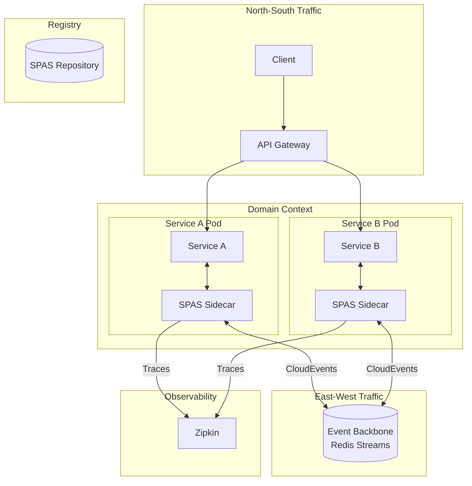
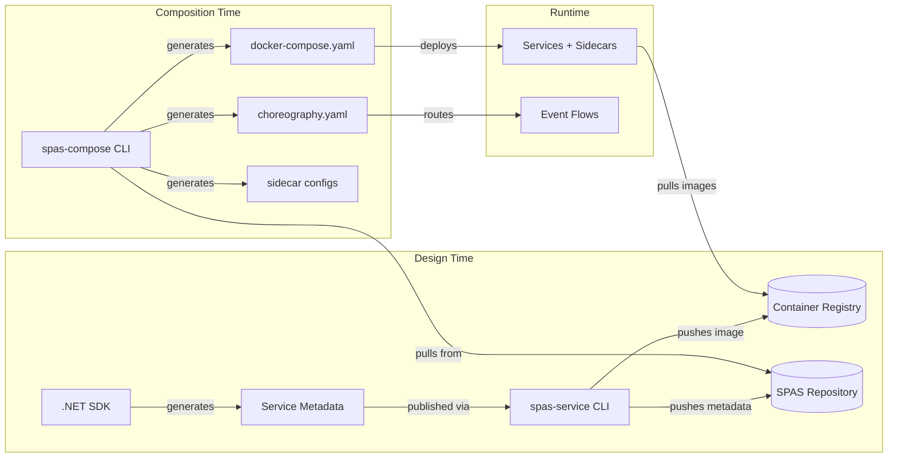
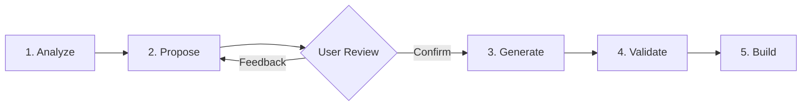

# Architecture Overview

This document provides a high-level view of SPAS components and how they interact.

## Components

- SPAS Services: Packaged bounded contexts exposing APIs and events
- Sidecar/Mesh: Platform-injected proxy handling networking, security, transformation, and event I/O
- API Gateway (external): Edge REST→HTTP/gRPC, auth, routing, TLS termination
- SPAS Repository: Stores metadata (spas.json) and SPAS Service event/message schemas. It does not store transformation configs.
- SDKs & CLI: Language/tooling to build, validate, and compose services

## Component Architecture

## Logical Flow

## Key Patterns

| Pattern           | Implementation              | Purpose                              |
| ----------------- | --------------------------- | ------------------------------------ |
| **Sidecar**       | SPAS Sidecar (Node.js)      | Offloads networking, events, tracing |
| **Event-first**   | CloudEvents + Redis Streams | Decoupled east-west communication    |
| **Choreography**  | choreography.yaml + JSONata | Domain-specific event routing        |
| **Schema-driven** | JSON Schema validation      | Contract enforcement at boundaries   |

## AI-in-the-Loop Choreography

SPAS supports **AI-assisted choreography design** through GitHub Copilot agent integration. The `spas-compose init` command scaffolds a domain workspace with an AI agent prompt (`.github/agents/spas.compose.agent.md`) that guides developers through a structured 5-phase workflow:

| Phase        | AI Actions                                        | Human Actions                    |
| ------------ | ------------------------------------------------- | -------------------------------- |
| **Analyze**  | Read service metadata, identify events/commands   | Provide domain context           |
| **Propose**  | Generate choreography diagram, design flows       | Review diagram, provide feedback |
| **Generate** | Create choreography.yaml, transformation files    | Confirm to proceed               |
| **Validate** | Check YAML syntax, schema compliance, consistency | Review validation results        |
| **Build**    | Suggest build commands                            | Execute deployment               |

**Key Benefits:**

- **Visual-first design**: Mermaid diagrams let you see event flows before generating code
- **Schema-aware**: AI uses pulled service metadata to propose valid transformations
- **Iterative refinement**: Feedback loop between Propose and Generate phases
- **Guardrails**: Validation phase catches errors before deployment

To use: Run `spas-compose init <domain>` then run `spas-compose services pull <service-name> <service-version>` for each service you wish to use, and finally invoke the agent with `/spas.compose` in GitHub Copilot Chat.

## Communication Model

- North–South (client ↔ service)
  - PoC: HTTP (sidecar ↔ service); gRPC planned for future
  - Edge: REST→HTTP translation, auth (OIDC/JWT), routing, TLS termination
- East–West (service ↔ service)
  - Event-first via sidecar/mesh (CloudEvents JSON)
  - Sidecar-mediated invocation: Sidecars can invoke services directly for command/query patterns (configured in `choreography.yaml`)
  - Identity propagation (PoC: in payload; Future: middleware injection)
  - No direct service-to-service communication (all traffic flows through sidecars)

## Choreography & Adaptation

- Domain Composition described by `choreography.yaml`:
  - Services (id + version)
  - Event routing rules (topics)
  - Transformation mappings (domain ↔ internal)
  - Service configuration overrides
  - Network policies (informative in PoC)
- Adaptation is performed at the sidecar/mesh layer

## Packaging & Distribution

- Service artifacts:
  - Container image (OCI) — published to standard registries
  - Metadata (`spas.json`) — published to SPAS repository
  - Schemas — stored in SPAS repo-integrated schema registry (PoC)

## Security Model (High Level)

- Edge: OIDC/JWT validation; TLS termination
- Mesh/Sidecar: mTLS, policy enforcement, identity propagation
- Enclosure levels: strict | moderate | open (PoC: declarative only)
- Data classification: declared in metadata (PoC: declarative only, but should be enforceable in production in future)

## Execution Environments

- Kubernetes (primary target)
- Docker Compose (local development)
- Bare metal (future)

> PoC vs Production
>
> - PoC: SPAS sidecar component; HTTP transport; identity in payload/headers; Zipkin tracing; local repository (no auth); declarative-only policies; SQLite-backed storage
> - Production: Mesh-agnostic sidecar contract (Istio/Linkerd compatible); gRPC transport; mTLS + SPIFFE/SPIRE identity; OpenTelemetry + Prometheus; authenticated repository with signed packages; enforceable policies; PostgreSQL (JSONB) + S3

## Related Documents

- [Principles](README.md)
- [Communication Model](protocol/07-communication-model.md)
- [Domain Choreography](component/14-domain-choreography.md)
- [Runtime Environment](infrastructure/17-runtime-environment.md)
