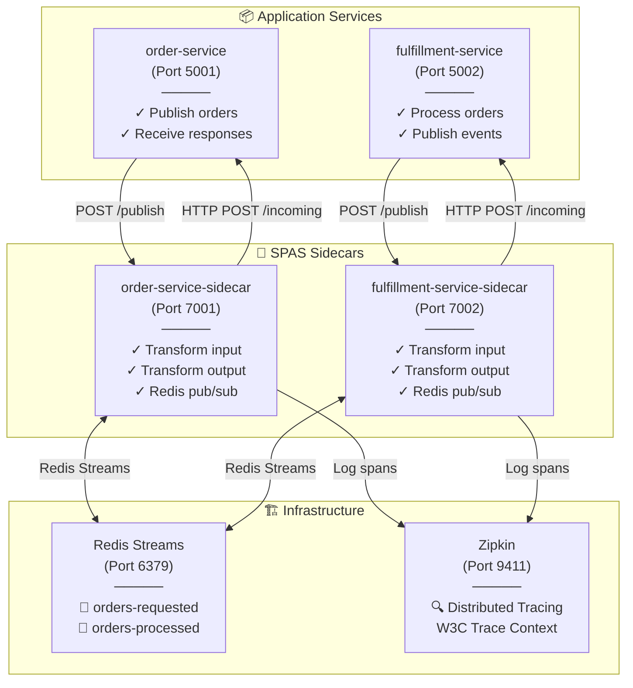
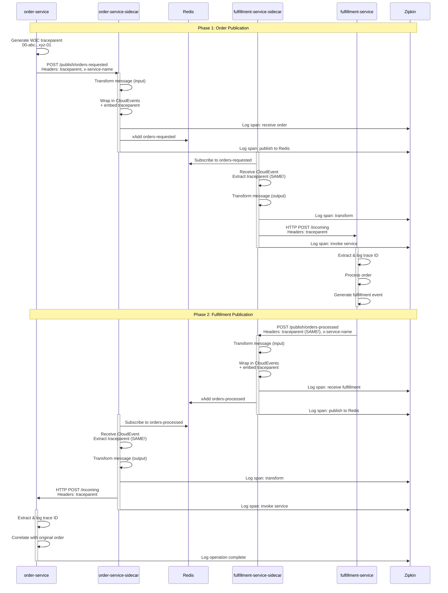
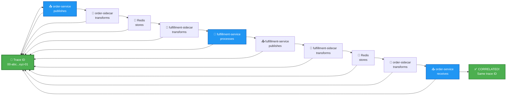
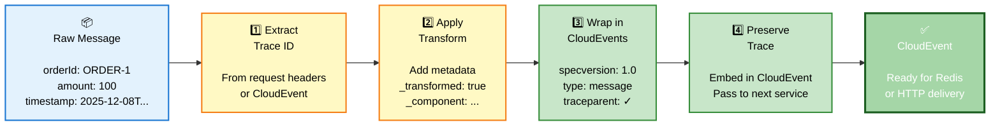
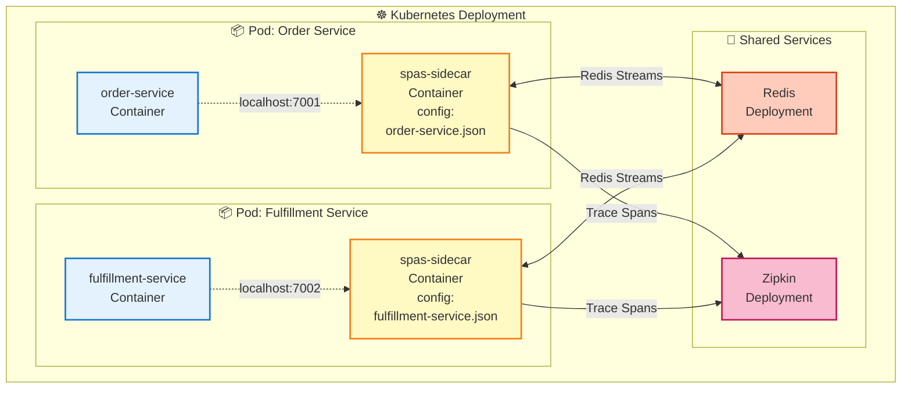
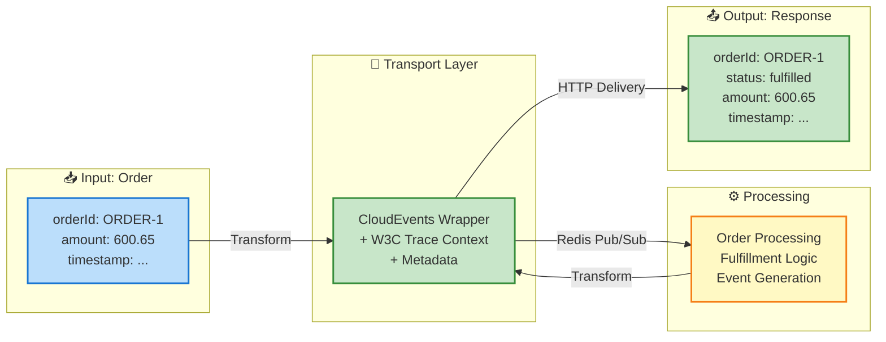

# SPAS Architecture Diagrams

## 1. System Architecture - Component Interaction

## 2. Message Flow - Complete Cycle with Trace Propagation

## 3. Trace Correlation - Single Trace ID Throughout

## 4. Sidecar Pattern - Publisher vs Subscriber

```mermaid
graph TB
    subgraph Publisher["📤 Publishing Pattern"]
        PApp["Application<br/>Service"]
        PApp -->|POST /publish/topic| PSidecar["Sidecar"]
        PSidecar -->|Transform<br/>Input| PCE["CloudEvents<br/>+ Trace"]
        PCE -->|Publish| PRedis["Redis<br/>Stream"]
        
        style PApp fill:#E3F2FD,stroke:#1976D2,stroke-width:2px
        style PSidecar fill:#FFF9C4,stroke:#F57F17,stroke-width:2px
        style PCE fill:#C8E6C9,stroke:#388E3C,stroke-width:2px
        style PRedis fill:#FFCCBC,stroke:#D84315,stroke-width:2px
    end
    
    subgraph Subscriber["📥 Subscribing Pattern"]
        SRedis["Redis<br/>Stream"]
        SRedis -->|Subscribe| SSidecar["Sidecar"]
        SSidecar -->|Extract<br/>Trace ID| SSidecar2["Transform<br/>Output"]
        SSidecar2 -->|HTTP POST| SApp["Application<br/>Service<br/>/incoming"]
        
        style SApp fill:#E3F2FD,stroke:#1976D2,stroke-width:2px
        style SSidecar fill:#FFF9C4,stroke:#F57F17,stroke-width:2px
        style SSidecar2 fill:#FFF9C4,stroke:#F57F17,stroke-width:2px
        style SRedis fill:#FFCCBC,stroke:#D84315,stroke-width:2px
    end
```

## 5. Message Transformation Pipeline

## 6. Zipkin Trace Visualization

```mermaid
graph TB
    subgraph Trace["🔍 Single Trace ID: 00-abc...xyz-01"]
        Span1["Span 1: order-service<br/>publishes order<br/>Duration: 2ms"]
        Span2["Span 2: order-sidecar<br/>transforms & publishes<br/>Duration: 5ms"]
        Span3["Span 3: fulfillment-sidecar<br/>receives & invokes<br/>Duration: 8ms"]
        Span4["Span 4: fulfillment-service<br/>processes order<br/>Duration: 15ms"]
        Span5["Span 5: fulfillment-sidecar<br/>transforms & publishes<br/>Duration: 6ms"]
        Span6["Span 6: order-sidecar<br/>receives & invokes<br/>Duration: 7ms"]
        Span7["Span 7: order-service<br/>processes response<br/>Duration: 3ms"]
        
        Span1 --> Span2
        Span2 --> Span3
        Span3 --> Span4
        Span4 --> Span5
        Span5 --> Span6
        Span6 --> Span7
        
        style Span1 fill:#BBDEFB,stroke:#1976D2,stroke-width:2px
        style Span2 fill:#FFF9C4,stroke:#F57F17,stroke-width:2px
        style Span3 fill:#FFF9C4,stroke:#F57F17,stroke-width:2px
        style Span4 fill:#BBDEFB,stroke:#1976D2,stroke-width:2px
        style Span5 fill:#FFF9C4,stroke:#F57F17,stroke-width:2px
        style Span6 fill:#FFF9C4,stroke:#F57F17,stroke-width:2px
        style Span7 fill:#BBDEFB,stroke:#1976D2,stroke-width:2px
    end
    
    Legend["Service Spans (Blue)<br/>Sidecar Spans (Yellow)<br/>Total Latency: 46ms"]
```

## 7. Framework Integration Deployment

## 8. Data Flow - Order to Fulfillment

---

## How to Use These Diagrams

1. **System Architecture (Diagram 1)**: Overview of all components and their interactions
2. **Message Flow (Diagram 2)**: Detailed sequence showing trace propagation through phases
3. **Trace Correlation (Diagram 3)**: Shows how single trace ID flows through system
4. **Sidecar Pattern (Diagram 4)**: Illustrates publish/subscribe patterns
5. **Transformation (Diagram 5)**: Details message transformation pipeline
6. **Zipkin Visualization (Diagram 6)**: How traces appear in Zipkin UI
7. **Kubernetes Deployment (Diagram 7)**: How to deploy in framework
8. **Data Flow (Diagram 8)**: End-to-end data transformation

## Integration Notes

When integrating SPAS into the framework (`src/sidecar`):

1. **Deploy sidecars in same pod** as service (see Diagram 7)
2. **Services communicate via localhost** to sidecar (port 7001, 7002, etc.)
3. **Configure via JSON files** (order-service.json, fulfillment-service.json)
4. **Enable Zipkin** for distributed tracing backend
5. **Deploy Redis Streams** as message broker (can be external service)
6. **Use CloudEvents SDK** in services for message handling
7. **Implement /incoming endpoint** in services for sidecar invocation

All diagrams are in Mermaid format and render in:
- GitHub markdown (.md files)
- GitLab markdown
- Notion
- Confluence
- Any Mermaid-compatible viewer
