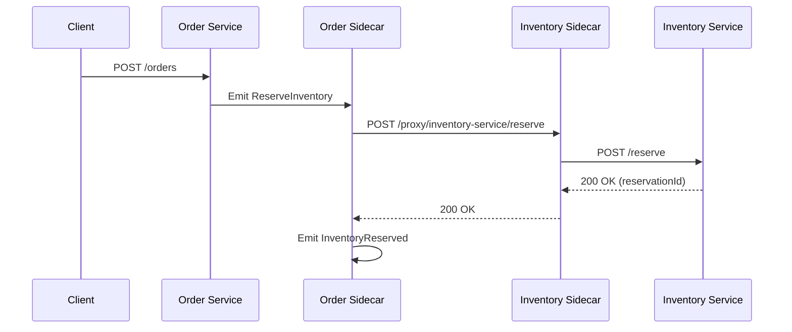

# Research: Agent Prompt Enrichment

**Date**: 2025-12-17 | **Plan**: [plan.md](plan.md) | **Spec**: [spec.md](spec.md)

## Purpose

Consolidate all technical knowledge required to make the agent prompt self-contained. This document resolves all NEEDS CLARIFICATION items from planning and documents lessons learned from E2E choreography testing.

---

## 1. Current Agent Prompt Analysis

### Location
- **File**: `components/cli/spas-compose/src/utils/templates.ts`
- **Function**: `generateAgentFile(domainRoot: string)` (lines 127-434)
- **Output**: `.github/agents/spas.compose.agent.md`

### Current Size
- Approximately 300 lines in template literal
- Estimated 8-10KB output file

### Current Structure
1. Purpose & File Selection
2. Domain Selection instructions
3. Responsibilities (7 items)
4. Phase Awareness (no diagrams currently)
5. Workspace Structure
6. 5-Step Workflow (Validate → Analyze → Propose → Generate → Build)
7. Constraints (5 items)
8. Error Handling
9. Sidecar Config Mapping
10. Testing Guidance

### Gaps vs Requirements

| Requirement | Current State | Gap |
|-------------|--------------|-----|
| FR-001: CloudEvents type format | ❌ Missing | Need `com.{bounded-context}.{event-name-kebab}` |
| FR-002: Sidecar config inline docs | ⚠️ Partial | Schema exists but lacks field-level guidance |
| FR-003: JSONata patterns | ❌ Missing | Need `$append([], ...)` and output patterns |
| FR-004: Endpoint routing | ❌ Missing | Need full routing explanation |
| FR-005: Field naming conventions | ❌ Missing | Need camelCase emphasis |
| FR-006: Working examples | ❌ Missing | Need complete choreography sets |
| FR-007: Diagrams in Propose | ❌ Missing | Need Mermaid diagram generation |
| FR-008: Validation checkpoints | ⚠️ Partial | Steps exist but no explicit gates |
| FR-009: Pre-proceed confirmation | ❌ Missing | No "do you want to continue?" prompts |
| FR-010: Troubleshooting | ❌ Missing | No error→solution mappings |
| FR-011: Sidecar health explanation | ❌ Missing | No registration flow explanation |

---

## 2. CloudEvents Type Format

### Decision
CloudEvents `type` field follows format: `com.{bounded-context}.{event-name-kebab}`

### Construction
The sidecar constructs the CloudEvents `type` from service metadata:
```
source: x-service-name from metadata (e.g., "order-service")
event name: x-event-name from choreography (e.g., "order-completed")
→ type: com.order.order-completed
```

### Bounded Context Derivation
- Extracted from `x-service-name` by removing `-service` suffix
- `order-service` → `order`
- `inventory-service` → `inventory`

### Rationale
Aligns with SPAS principles and CloudEvents best practices. Enables filtering by bounded context or specific event type.

### Alternatives Considered
- Full service name in type (`com.order-service.order-completed`) - rejected, redundant `-service` suffix
- No prefix (`order-completed`) - rejected, lacks namespace for filtering

---

## 3. JSONata Patterns (E2E Lessons)

### Pattern 1: Array Construction with $append

**Problem**: Agent often generates `[item1, item2]` which fails.
**Solution**: Always use `$append([], ...)` pattern.

```jsonata
// ❌ WRONG - fails in JSONata
[item1, item2, item3]

// ✅ CORRECT - works in JSONata
$append($append([], item1), item2)

// ✅ CORRECT - single item
$append([], singleItem)
```

### Pattern 2: Object Construction

```jsonata
// Build payload from event data
{
  "orderId": orderId,
  "items": $append([], {"sku": sku, "quantity": quantity}),
  "timestamp": $now()
}
```

### Pattern 3: Conditional Fields

```jsonata
// Include field only if present
$merge([
  {"required": value},
  source.optional ? {"optional": source.optional} : {}
])
```

### Source
Discovered during specs 009-012 E2E testing. The JSONata runtime in the sidecar has specific array handling requirements.

---

## 4. Endpoint Routing

### Decision
Choreography endpoints must match sidecar proxy routing rules.

### Endpoint Format
```
http://sidecar-host:8080/proxy/{serviceId}/{path}
```

### Configuration Mapping
```yaml
# In choreography
downstream:
  endpoint: http://sidecar:8080/proxy/inventory-service/stock
  
# In sidecar config
proxies:
  inventory-service:
    target: http://inventory-service:3000
```

### Key Rules
1. `serviceId` in endpoint path must match key in `proxies` config
2. Remaining path (`/stock`) is appended to target URL
3. Sidecar handles service discovery within Docker network

### Rationale
Standardizes service communication through sidecar proxy, enabling observability and circuit breaking.

---

## 5. Field Naming Conventions

### Decision
All field names in choreographies MUST use camelCase.

### Examples
```yaml
# ✅ CORRECT
inputMapping:
  orderId: $.order.orderId
  customerEmail: $.customer.email

# ❌ WRONG
inputMapping:
  order_id: $.order.order_id
  customer-email: $.customer.email
```

### Consistency Rule
Match the field names used in:
1. Service request/response schemas
2. Event payloads
3. JSONata expressions

### Rationale
JavaScript/TypeScript ecosystem convention. Ensures SDK serialization works correctly.

---

## 6. Sidecar Config Schema (Complete)

### Fields Reference

| Field | Type | Required | Description |
|-------|------|----------|-------------|
| `serviceId` | string | ✅ | Unique identifier for this service |
| `serviceName` | string | ✅ | Human-readable name (matches x-service-name) |
| `servicePort` | number | ✅ | Port the actual service listens on |
| `sidecarPort` | number | ✅ | Port sidecar exposes (usually 8080) |
| `choreographyPath` | string | ✅ | Path to choreography directory |
| `repositoryUrl` | string | ❌ | SPAS repository URL for schema/choreography fetch |
| `proxies` | object | ❌ | Map of serviceId → proxy config |
| `proxies.*.target` | string | ✅* | Downstream service URL |
| `proxies.*.timeout` | number | ❌ | Request timeout in ms (default: 30000) |
| `enableHealthCheck` | boolean | ❌ | Enable /health endpoint (default: true) |
| `healthCheckPath` | string | ❌ | Custom health check path (default: /health) |

### Example Complete Config
```json
{
  "serviceId": "order-service",
  "serviceName": "order-service", 
  "servicePort": 3000,
  "sidecarPort": 8080,
  "choreographyPath": "/app/choreographies",
  "proxies": {
    "inventory-service": {
      "target": "http://inventory-sidecar:8080",
      "timeout": 5000
    },
    "payment-service": {
      "target": "http://payment-sidecar:8080"
    }
  }
}
```

---

## 7. Known Pitfalls (E2E Testing Lessons)

### Pitfall 1: Missing $append for Arrays
- **Symptom**: JSONata evaluation error
- **Cause**: Using `[item]` instead of `$append([], item)`
- **Fix**: Always use `$append([], ...)` pattern

### Pitfall 2: Wrong Endpoint Service ID
- **Symptom**: 404 from sidecar proxy
- **Cause**: Endpoint path serviceId doesn't match proxies key
- **Fix**: Ensure `/proxy/{serviceId}/` matches proxies config exactly

### Pitfall 3: Inconsistent Field Casing
- **Symptom**: null/undefined values in transformed payload
- **Cause**: Using snake_case when service expects camelCase
- **Fix**: Match exact casing from service schemas

### Pitfall 4: Missing x-service-name in Metadata
- **Symptom**: Choreography not loaded by sidecar
- **Cause**: Metadata missing required `x-service-name` field
- **Fix**: Add `x-service-name` matching service's identity

### Pitfall 5: Circular Event Dependencies
- **Symptom**: Infinite event loop at runtime
- **Cause**: Event A triggers B which triggers A
- **Fix**: Design acyclic event flow, validate in Propose phase

### Pitfall 6: Empty outputMapping
- **Symptom**: Downstream receives empty payload
- **Cause**: JSONata expression returns undefined
- **Fix**: Test JSONata expressions with sample data before generating

---

## 8. Complete Working Example

### Order→Inventory Choreography

```yaml
# choreographies/inventory-reserve.choreography.yaml
openapi: 3.1.0
info:
  title: Reserve Inventory Choreography
  version: 1.0.0
  x-service-name: order-service
  x-event-name: inventory-reserve-requested
  x-choreography-type: event-outbound

x-spas-choreography:
  trigger:
    type: event
    source: internal
    eventType: ReserveInventory
  
  steps:
    - name: reserve-stock
      type: downstream
      downstream:
        endpoint: http://sidecar:8080/proxy/inventory-service/reserve
        method: POST
        inputMapping:
          orderId: $.orderId
          items: $append([], $.items.{"sku": sku, "quantity": quantity})
        outputMapping:
          reservationId: $.reservationId
          reservedItems: $.items
        onSuccess:
          emit:
            eventType: InventoryReserved
            payload:
              orderId: $.orderId
              reservationId: $.reservationId
        onFailure:
          emit:
            eventType: InventoryReserveFailed
            payload:
              orderId: $.orderId
              reason: $.error.message
```

---

## 9. Workflow Diagram Template

### Mermaid Sequence Diagram Pattern



### Usage in Propose Phase
Agent should generate a Mermaid diagram showing:
1. All participants (services + sidecars)
2. Request/response flow
3. Event emissions
4. Error branches (if applicable)

---

## 10. File Size Estimation

### Current: ~8-10KB
### Estimated Addition:
- Technical Reference section: ~4KB
- Known Pitfalls: ~2KB
- Complete Examples: ~3KB
- Diagram templates: ~1KB
- Troubleshooting: ~2KB

### Total Estimated: 20-22KB

**Decision**: Within 25KB limit (SC-005). No modularization needed.

---

## Summary

All NEEDS CLARIFICATION items resolved. Ready to proceed with Phase 1 design.

| Item | Resolution |
|------|------------|
| CloudEvents format | `com.{bounded-context}.{event-name-kebab}` |
| JSONata patterns | `$append([], ...)` required for arrays |
| Endpoint routing | `/proxy/{serviceId}/{path}` matching proxies config |
| Field naming | camelCase everywhere |
| File size | ~20KB, within 25KB limit |
