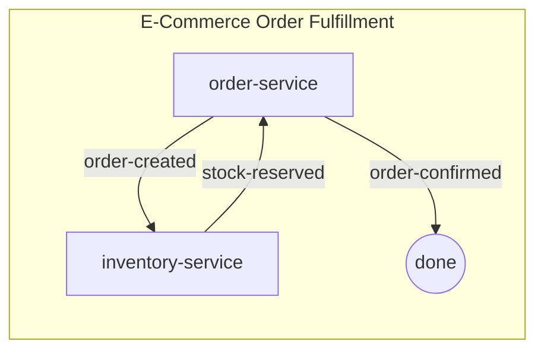

# Data Model: spas-compose init Scaffolding Fixes

**Phase**: 1 - Design & Contracts  
**Date**: December 19, 2025

## Purpose

Define the structure of the runtime metadata schema and document the updated template outputs.

---

## Schema Entities

### Runtime Metadata Schema (JSON Schema v7)

Complete JSON Schema defining SPAS runtime service metadata structure.

**Source**: `components/repository/schemas/runtime-metadata-v1.schema.json`  
**Purpose**: Enables AI agents and validation tools to understand service metadata structure  
**Location**: Generated to `.spas/schemas/runtime-metadata-v1.schema.json`

**Top-Level Properties**:

| Property | Type | Required | Description |
|----------|------|----------|-------------|
| `schemaVersion` | string (const: "runtime-metadata-v1") | Yes | Schema version identifier |
| `id` | string | Yes | Unique service identifier (kebab-case) |
| `name` | string | Yes | Human-readable service name |
| `description` | string | No | Service description |
| `version` | string (semver) | Yes | Service version |
| `boundedContext` | string | Yes | Domain bounded context |
| `capabilities` | string[] | No | List of service capabilities |
| `endpoints` | Endpoint[] | No | Service endpoints (commands/queries) |
| `events` | Event[] | No | Events published by service |
| `consistency` | Consistency | No | Consistency guarantees |
| `network` | Network | No | Network requirements |
| `security` | Security | Yes | Security metadata |
| `license` | string | No | License identifier |
| `runtime` | Runtime | No | Runtime deployment metadata |
| `publishedAt` | string (date-time) | No | Publication timestamp |

**Nested Objects**:

**Endpoint**:
- `name` (string, required): Endpoint name
- `type` (enum: "Command" | "Query", required): Operation type
- `protocol` (enum: "Http" | "Grpc", required): Communication protocol
- `methodPath` (string, required): HTTP method/path or gRPC method
- `version` (string, required): Endpoint version
- `schemaRef` (string URI, required): Schema reference

**Event**:
- `type` (string, required): Event type identifier
- `version` (string, required): Event schema version
- `schemaRef` (string URI, required): Schema reference

**Security**:
- `authentication` (object, optional): Auth configuration
  - `type` (enum: "OAuth2" | "JWT" | "ApiKey" | "mTLS" | "None")
  - `requiredScopes` (string[])
- `dataClassification` (enum[], required): Data classification levels
  - Values: "Public" | "Internal" | "Confidential" | "Restricted"

**Runtime**:
- `image` (string, pattern: OCI image with digest): Full image reference
- `repository` (string): OCI image repository
- `tag` (string): Image tag
- `digest` (string, pattern: sha256:...): SHA256 digest
- `resources` (object): Resource requirements
  - `cpu` (string, pattern: digits + optional 'm')
  - `memory` (string, pattern: digits + Mi|Gi|M|G)
- `env` (string[]): Required environment variable names

---

## Template Outputs

### Workspace README.md Structure Section

**Current (Incorrect)**:
```
.spas/
└── schemas/
    └── sidecar-config-v1.schema.json
```

**Fixed (Correct)**:
```
.spas/
└── schemas/
    ├── sidecar-config-v1.schema.json
    ├── choreography-v1.schema.json
    └── runtime-metadata-v1.schema.json
```

---

### Agent Prompt File Phase 3 Guidance

**Current (Incorrect)**:
- "Generate Sequence Diagram"
- No instruction to add to README.md

**Fixed (Correct)**:
- "Generate Choreography Diagram (mermaid flowchart)"
- "Add the choreography diagram to the workspace README.md"
- Reference format: `flowchart LR` with `subgraph [Domain Name]`

**Example Choreography Diagram**:


---

### Agent Prompt File Actions Section

**Current (Incorrect)**:
```
- Dry-run validation: spas-compose choreography build --dry-run
```

**Fixed (Correct)**:
```
- Dry-run validation: spas-compose choreography build --docker --dry-run
- Docker dev build: spas-compose choreography build --docker --dev
- Docker prod build: spas-compose choreography build --docker
```

---

## State Transitions

N/A - This feature involves template generation (stateless functions). No entity lifecycle or state transitions.

---

## Validation Rules

### Runtime Metadata Schema Generation

1. **Completeness**: Generated schema MUST contain all 224 lines from source schema
2. **Validity**: Generated JSON MUST be valid JSON Schema Draft 7 format
3. **Formatting**: Generated JSON MUST use 2-space indentation for readability
4. **Immutability**: Schema content MUST NOT change between invocations (deterministic generation)

### README Structure Documentation

1. **Accuracy**: Structure section MUST list all files actually scaffolded
2. **Ordering**: Schema files SHOULD be listed in alphabetical order
3. **Completeness**: All three schemas MUST be documented

### Agent Prompt Guidance

1. **Terminology**: MUST use "Choreography Diagram" (not "Sequence Diagram")
2. **Format**: MUST specify "mermaid flowchart" format
3. **Output Location**: MUST instruct adding diagram to workspace README.md
4. **Commands**: All build commands MUST include `--docker` flag when generating docker-compose.yaml

---

## Relationships

```
workspace-service.ts
    ↓ calls
generateRuntimeMetadataSchema() → runtime-metadata-v1.schema.json
generateSidecarConfigSchema() → sidecar-config-v1.schema.json
generateChoreographySchema() → choreography-v1.schema.json
    ↓ written to
.spas/schemas/
    ↓ documented in
generateWorkspaceReadme() → README.md
    ↓ referenced by
generateAgentFile() → .github/agents/spas.compose.agent.md
```

---

## Notes

- Schema content is copied verbatim from `components/repository/schemas/runtime-metadata-v1.schema.json`
- No schema evolution needed - this is a bug fix preserving existing schema structure
- Template functions are pure (no side effects, deterministic output)
