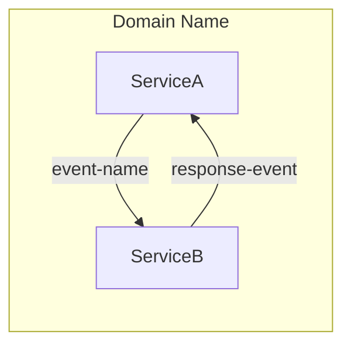

# Research: spas-compose init Scaffolding Fixes

**Phase**: 0 - Outline & Research  
**Date**: December 19, 2025

## Purpose

All technical details are clear from bug investigation. This document confirms research findings for the four identified bugs and their solutions.

## Research Findings

### Finding 1: Runtime Metadata Schema File Copy Limitation

**Issue**: `workspace-service.ts` (lines 146-164) attempts to copy `runtime-metadata-v1.schema.json` from `components/repository/schemas/` which doesn't exist in external projects.

**Decision**: Generate schema inline using `generateRuntimeMetadataSchema()` function  
**Rationale**: Consistent with existing `generateSidecarConfigSchema()` and `generateChoreographySchema()` pattern. Self-contained, no external file dependencies.  
**Alternatives Considered**:
- Embed schema as static string: Rejected - harder to maintain, less readable
- Package schema file with CLI: Rejected - adds deployment complexity, version sync issues

**Implementation Path**: 
1. Copy complete schema from `components/repository/schemas/runtime-metadata-v1.schema.json` (224 lines)
2. Create `generateRuntimeMetadataSchema()` function in `templates.ts`  
3. Update `workspace-service.ts` to call generator instead of file copy

---

### Finding 2: README Structure Section Missing Schemas

**Issue**: `generateWorkspaceReadme()` in `templates.ts` (line 18-23) only shows `sidecar-config-v1.schema.json` but three schemas are scaffolded.

**Decision**: Update README template to list all three schemas  
**Rationale**: Documentation must match actual scaffolded structure. Critical for developer discoverability.  
**Alternatives Considered**: None needed - straightforward documentation fix.

**Implementation Path**:
1. Locate Structure section in `generateWorkspaceReadme()` template  
2. Add two missing schema files: `choreography-v1.schema.json`, `runtime-metadata-v1.schema.json`

---

### Finding 3: Agent Prompt Diagram Type Guidance

**Issue**: `generateAgentFile()` Phase 3 instructs "Generate Sequence Diagram" but should use choreography flowchart format.

**Decision**: Change to "Generate Choreography Diagram" with mermaid flowchart format guidance  
**Rationale**: Choreography diagrams show event flows between services (what SPAS does). Sequence diagrams show temporal ordering (wrong semantic model).  
**Alternatives Considered**:
- Keep sequence diagrams: Rejected - wrong semantics, inconsistent with existing examples
- Use both diagram types: Rejected - adds complexity without value

**Reference Pattern** (from `examples/domains/README.md`):

**Implementation Path**:
1. Find Phase 3: Propose section in `generateAgentFile()`  
2. Replace "Sequence Diagram" with "Choreography Diagram (mermaid flowchart)"  
3. Add instruction to add diagram to workspace README.md  
4. Reference examples/domains/README.md pattern

---

### Finding 4: Build Command Documentation

**Issue**: Agent prompt Actions section shows `spas-compose choreography build --dry-run` (missing `--docker` flag).

**Decision**: Document three distinct build commands with correct flags  
**Rationale**: `choreography build` requires `--docker` flag to generate docker-compose.yaml. `--dry-run` validates, `--dev` enables dev mode, no flags = production.  
**Alternatives Considered**: None needed - straightforward documentation correction.

**Correct Commands**:
- Dry-run validation: `spas-compose choreography build --docker --dry-run`
- Docker dev build: `spas-compose choreography build --docker --dev`
- Docker prod build: `spas-compose choreography build --docker`

**Implementation Path**:
1. Locate Actions section in `generateAgentFile()`  
2. Replace single dry-run command with three distinct variations  
3. Ensure each variation clearly documents its purpose

---

## Technology Decisions

### Template Generation Approach

**Decision**: Use JSON.stringify() with formatting for schema generation  
**Rationale**: Same pattern as `generateSidecarConfigSchema()` and `generateChoreographySchema()` (lines 977-1318 in templates.ts)  
**Best Practice**: Format with 2-space indentation for readability

### Testing Strategy

**Decision**: Unit tests for template functions, integration test for full `spas-compose init`  
**Rationale**: Template generation is pure function (easily unit testable). Integration test verifies all schemas scaffolded correctly.  
**Coverage**: 
- Unit: Each `generate*Schema()` function outputs valid JSON Schema
- Integration: `spas-compose init` creates all three schemas in `.spas/schemas/`

---

## Dependencies

**No new dependencies required**. All changes use existing:
- TypeScript/Node.js standard library for JSON operations
- Existing jest test infrastructure
- Existing file I/O utilities in workspace-service.ts

---

## Resolved Questions

All questions resolved during bug investigation:

✅ Where is runtime-metadata schema defined? → `components/repository/schemas/runtime-metadata-v1.schema.json`  
✅ What format for choreography diagrams? → Mermaid flowchart LR with subgraph (see examples/domains/README.md)  
✅ What are correct build command variations? → Three variants with --docker flag and optional --dev, --dry-run  
✅ Should schema generation match other schemas? → Yes, use JSON.stringify() pattern

**Conclusion**: No further research needed. All implementation details clear from codebase inspection.
