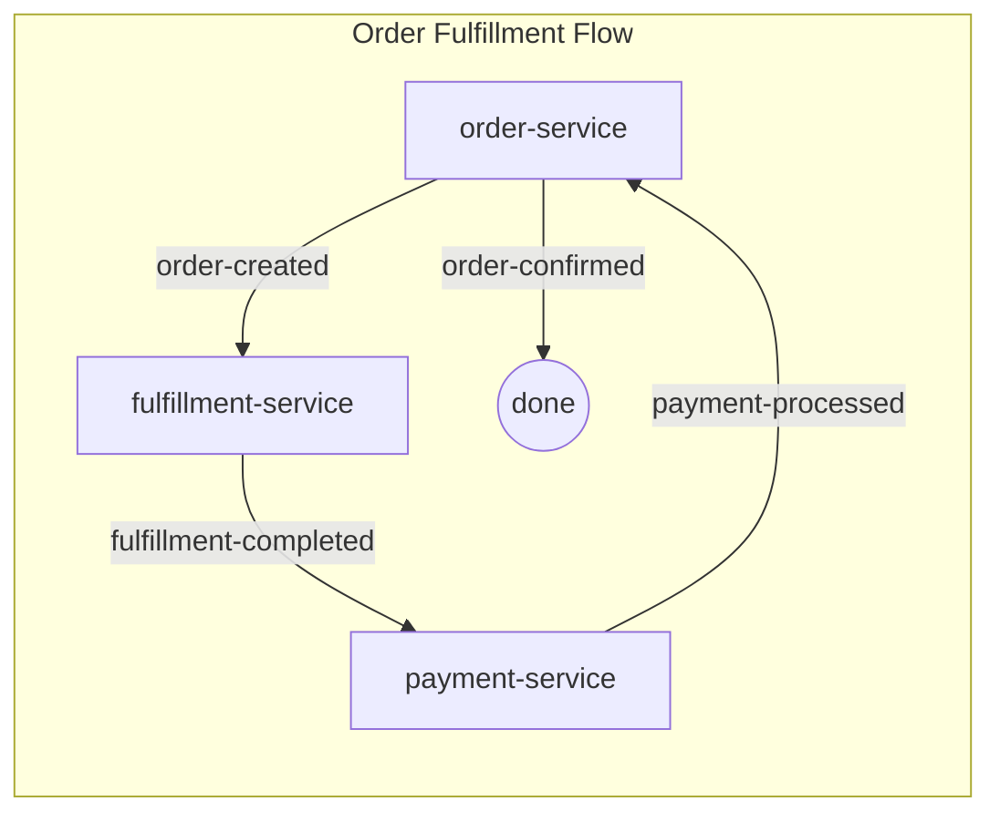
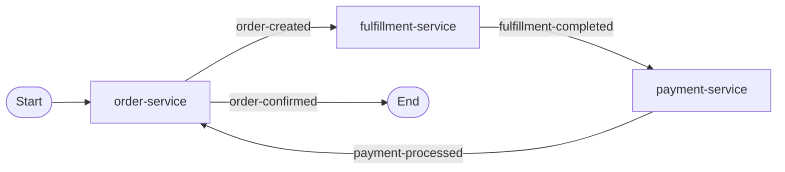

# Completion Report: Compose Diagram Flow Notations

**Feature**: 019-compose-diagram-flow  
**Canonical Title**: Compose Diagram Flow Notations  
**Date Completed**: December 23, 2025  
**Implementation Status**: ✅ Complete - All 16 tasks (100%)

---

## Summary

This feature extends the `spas-compose init` CLI command to generate agent prompt templates that instruct the AI agent to include **Start/End flow notations** in Mermaid choreography diagrams and ensure diagrams are automatically inserted into domain README files.

The primary change is an update to the embedded template in `templates.ts` within the `spas-compose` CLI codebase, modifying the Phase 2: Propose section of the agent workflow.

**Key outcomes**:

- ✅ Agent prompt now instructs use of `Start([Start])` and `End([End])` stadium-shaped nodes
- ✅ Diagram template updated with proper Start/End notation pattern
- ✅ Explicit diagram requirements section added with all rules
- ✅ README auto-update instruction included with placement guidance
- ✅ Removed subgraph wrapper for cleaner diagram structure

---

## Completed User Stories

### US1: Agent Generates Diagram with Start/End Nodes (P1) 🎯 MVP ✅

**Requirement**: When a user invokes the `/spas.compose` agent command, the agent generates a Mermaid flowchart diagram that includes explicit "Start" and "End" nodes to clearly indicate the beginning and termination of the event flow.

**Implementation Highlights**:

- Updated `generateWorkflowPhases()` in `templates.ts` to include:
  - `**MUST include \`Start([Start])\` node**` instruction
  - `**MUST include \`End([End])\` node**` instruction
  - `**MUST label all edges**` with event type format
- Changed diagram template from `END((done))` to proper `Start([Start])` and `End([End])` pattern
- Added explicit **Diagram Requirements** section with:
  - Start node: stadium shape, connect to first service
  - End node: stadium shape, connect from terminal events
  - Direction: `flowchart LR` (no subgraph)
  - Edge labels: mandatory event type labels

---

### US2: Diagram Auto-Inserted into Domain README (P1) ✅

**Requirement**: When the `/spas.compose` agent generates a choreography, it automatically inserts or updates the Mermaid diagram in the domain's `README.md` file.

**Implementation Highlights**:

- Added instruction: `**MUST insert/update the choreography diagram in the domain README.md file** (at top, after title)`
- Placement guidance ensures consistent diagram location across all domains

---

## Template Changes

### Before (v1.0.4)



### After (v1.0.5+)



---

## Validation and Test Results

### Automated Tests

- **spas-compose (Jest)**: 12 test suites, 222 tests ✅ (3 new tests added)

### New Test Cases

| Test | Purpose |
|------|---------|
| `should contain Start node in diagram template (019-compose-diagram-flow)` | Verifies `Start([Start])` present |
| `should contain End node in diagram template (019-compose-diagram-flow)` | Verifies `End([End])` present |
| `should require diagram insertion into README (019-compose-diagram-flow)` | Verifies README instruction present |

### Manual Validation

- Ran `spas-compose init test-domain-019 --output c:\temp`
- Verified generated `.github/agents/spas.compose.agent.md` contains:
  - ✅ `Start([Start])` node in template
  - ✅ `End([End])` node in template
  - ✅ `MUST insert/update the choreography diagram in the domain README.md file` instruction
  - ✅ Diagram Requirements section with all rules

---

## Requirements Traceability

| Requirement | Status | Verification |
|-------------|--------|--------------|
| FR-001: Start node instruction | ✅ | Test + manual validation |
| FR-002: End node instruction | ✅ | Test + manual validation |
| FR-003: Start connected to first service | ✅ | Template includes rule |
| FR-004: End connected from terminal events | ✅ | Template includes rule |
| FR-005: README auto-update instruction | ✅ | Test + manual validation |
| FR-006: `flowchart LR` direction | ✅ | Template uses LR, no subgraph |
| FR-007: Edge labels with event types | ✅ | Template includes rule |
| FR-008: Rules embedded in CLI codebase | ✅ | All rules in templates.ts |

---

## Key Files Changed

| File | Changes |
|------|---------|
| `components/cli/spas-compose/src/utils/templates.ts` | Updated `generateWorkflowPhases()` Phase 2 section with Start/End diagram rules |
| `components/cli/spas-compose/test/unit/utils/templates.test.ts` | Added 3 new tests for diagram notation verification |
| `specs/019-compose-diagram-flow/tasks.md` | All 16 tasks marked complete |
| `specs/019-compose-diagram-flow/checklists/requirements.md` | FR-001 to FR-008 marked complete |

---

## Commits

```
9953017 docs(019-compose-diagram-flow): mark all requirements complete and finalize tasks
97af23a Phase 5 done
f9ecd1d Phase 4 done
e2f553b Phase 2+3 done
```

---

## Known Limitations

- Changes only affect **newly initialized** domains; existing domains need to re-run `spas-compose init` or manually update their agent prompt
- Diagram notation is **agent-instructed**; the agent must follow the rules (no enforcement mechanism)
- README update is **advisory**; if agent fails to update README, user must do so manually

---

## Impact on Existing Domains

| Scenario | Impact |
|----------|--------|
| New domains | ✅ Get updated agent prompt automatically |
| Existing domains | ⚠️ Must re-run `spas-compose init` to get updated prompt |
| In-progress choreographies | ⚠️ Agent may continue using old pattern until prompt updated |

---

## Success Criteria Met

| Criteria | Status |
|----------|--------|
| SC-001: 100% of diagrams include Start/End nodes | ✅ Template enforces |
| SC-002: README contains diagram after `/spas.compose` | ✅ Instruction included |
| SC-003: Diagram reflects choreography.yaml flows | ✅ Existing behavior |
| SC-004: No manual diagram editing required | ✅ Agent generates complete diagram |
