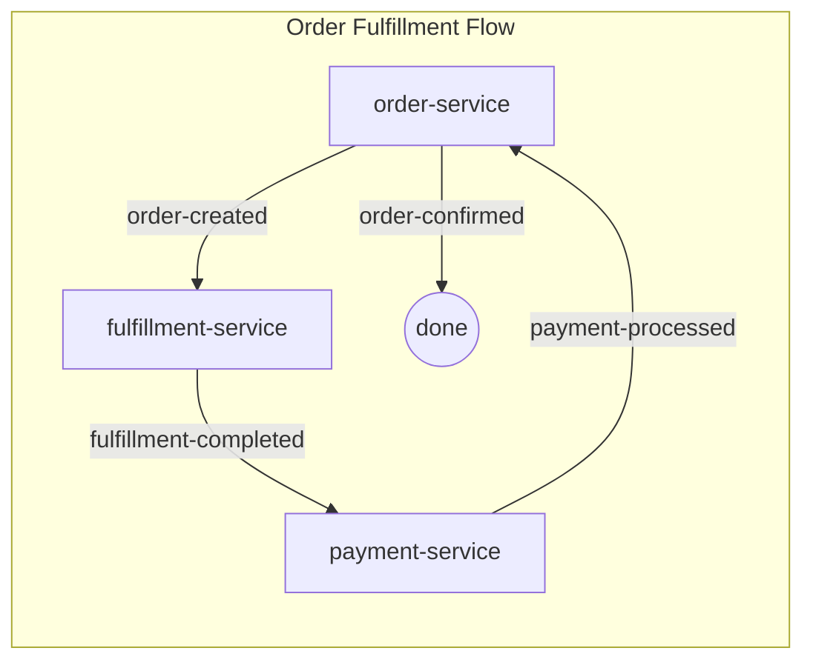
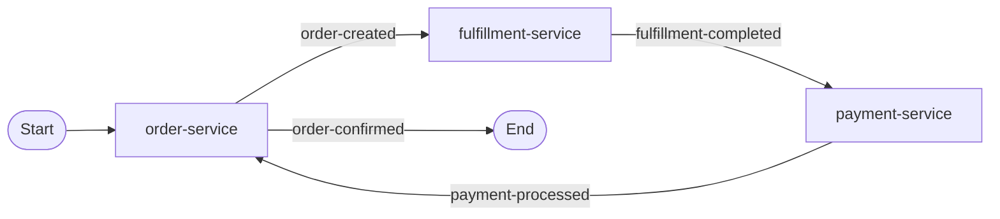

# Implementation Plan: Compose Diagram Flow Notations

**Branch**: `019-compose-diagram-flow` | **Date**: 2025-12-23 | **Spec**: [spec.md](spec.md)
**Input**: Feature specification from `/specs/019-compose-diagram-flow/spec.md`

**Note**: This template is filled in by the `/speckit.plan` command. See `.specify/templates/commands/plan.md` for the execution workflow.

## Summary

Extend the `spas-compose init` CLI command to generate agent prompt templates that instruct the agent to include Start/End flow notations in Mermaid choreography diagrams and ensure diagrams are added to domain README files. The implementation modifies the embedded template in `templates.ts` within the `spas-compose` CLI codebase.

## Technical Context

**Language/Version**: TypeScript 5.x (Node.js CLI)  
**Primary Dependencies**: Commander.js (CLI framework)  
**Storage**: N/A (template strings in source code)  
**Testing**: Jest (unit tests)  
**Target Platform**: Node.js CLI (cross-platform)
**Project Type**: Single CLI project  
**Performance Goals**: N/A (template generation is instant)  
**Constraints**: Template changes must be backward compatible with existing domains  
**Scale/Scope**: ~50 lines of template text changes

## Constitution Check

*GATE: Must pass before Phase 0 research. Re-check after Phase 1 design.*

| Principle | Status | Notes |
|-----------|--------|-------|
| I. Single Bounded Context | ✅ N/A | CLI tool, not a service |
| II. No Direct Service-to-Service | ✅ N/A | CLI tool, not a service |
| III. Event-First Integration | ✅ N/A | CLI tool, not a service |
| IV. Convention Over Configuration | ✅ Pass | Follows existing template conventions |
| V. Security by Default | ✅ N/A | No security impact |
| VI. Observability First | ✅ N/A | CLI tool, not a service |
| VII. Portable Packaging | ✅ N/A | CLI already npm-packaged |
| VIII. Adaptable Through Configuration | ✅ Pass | Templates are embedded but follow existing pattern |
| CLI Quality Gates | ✅ Pass | Unit tests required for template changes |

**Gate Result**: ✅ PASS - No violations

## Project Structure

### Documentation (this feature)

```text
specs/019-compose-diagram-flow/
├── spec.md              # Feature specification
├── plan.md              # This file
├── research.md          # Phase 0 output (N/A - no research needed)
├── checklists/
│   └── requirements.md  # Requirement checklist
└── tasks.md             # Phase 2 output (/speckit.tasks command)
```

### Source Code (repository root)

```text
components/cli/spas-compose/
├── src/
│   └── utils/
│       └── templates.ts     # ← MODIFY: generateWorkflowPhases(), generatePromptFile()
└── test/
    └── unit/
        └── utils/
            └── templates.test.ts  # ← ADD: tests for diagram template changes
```

**Structure Decision**: Minimal change - only modify existing `templates.ts` file where agent prompt templates are already defined. No new files needed except test additions.

## Implementation Details

### Phase 0: Research

**Status**: Not needed - implementation location identified

The agent prompt is generated by `generatePromptFile()` which returns a minimal frontmatter. The actual prompt content is in `generateWorkflowPhases()` which already contains diagram template rules in Phase 2: Propose section.

**Key Findings:**
1. Agent prompt template location: `components/cli/spas-compose/src/utils/templates.ts`
2. Diagram template already exists in `generateWorkflowPhases()` at line ~540
3. Current template shows `END((done))` pattern but doesn't use Start/End stadium-shaped nodes
4. Need to modify template to use `Start([Start])` and `End([End])` pattern
5. Need to add explicit instruction to insert diagram into README

### Phase 1: Design

**Changes Required:**

1. **Update `generateWorkflowPhases()` - Diagram Template Section** (~line 540)
   - Change diagram template from current pattern to include `Start([Start])` and `End([End])` nodes
   - Add explicit instruction that diagram MUST be added to workspace README.md

2. **Update diagram instructions in Phase 2: Propose section**
   - Add rule: "Diagram MUST include `Start([Start])` node connected to first service"
   - Add rule: "Diagram MUST include `End([End])` node connected from terminal events"
   - Add rule: "Agent MUST insert/update diagram in domain README.md"

**Template Change Preview:**

Current:


New:


### Data Model

N/A - No data model changes; this is template text modification only.

### Contracts

N/A - No API contracts; CLI template generation is internal.

## Quickstart

After implementation, the flow will be:

1. **Initialize domain workspace:**
   ```bash
   spas-compose init my-domain --output examples/domains
   ```

2. **Pull services:**
   ```bash
   spas-compose services pull order-service 1.0.0
   spas-compose services pull fulfillment-service 1.0.0
   ```

3. **Compose choreography (agent generates diagram with Start/End):**
   ```
   /spas.compose Compose DOMAIN:my-domain choreography
   ```

4. **Verify README contains diagram:**
   - Open `examples/domains/my-domain/README.md`
   - Confirm Mermaid diagram has `Start([Start])` and `End([End])` nodes

## Complexity Tracking

> No Constitution violations to justify - all gates passed.

| Item | Complexity | Notes |
|------|------------|-------|
| Template text changes | Low | ~50 lines of string template modification |
| Test additions | Low | Add/modify 2-3 test cases |
| No breaking changes | ✅ | Existing domains unaffected until re-init |
