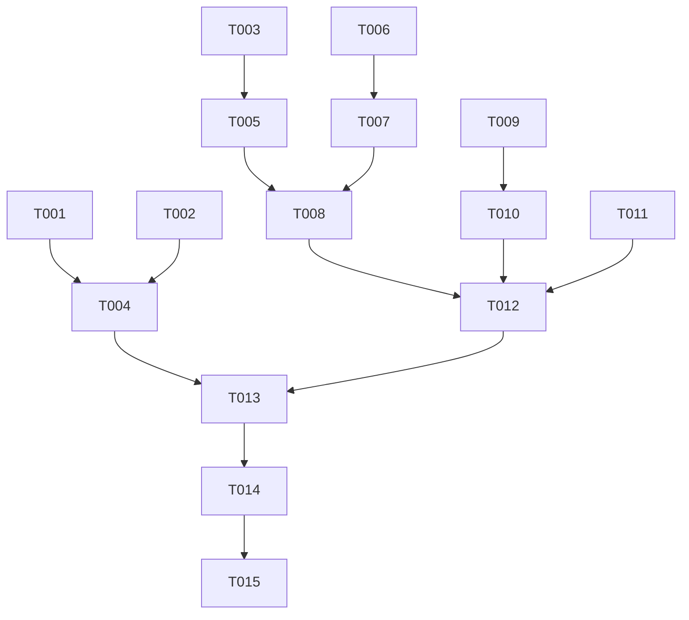

# Tasks: Refactor spas-compose Agent Prompt

**Feature Branch**: `024-compose-prompt-refactor`
**Status**: Pending
**Spec**: [specs/024-compose-prompt-refactor/spec.md](specs/024-compose-prompt-refactor/spec.md)

## Phase 1: Setup & Dependencies

- [ ] T001 Add `eta` dependency to `components/cli/spas-compose/package.json`
- [ ] T002 Add `copy:templates` script to `components/cli/spas-compose/package.json`
- [ ] T003 Create directory `components/cli/spas-compose/src/templates/partials`

## Phase 2: Foundational (Template Engine)

- [ ] T004 Refactor `components/cli/spas-compose/src/utils/templates.ts` to initialize Eta
- [ ] T005 Create skeleton `components/cli/spas-compose/src/templates/agent-prompt.eta`

## Phase 3: User Story 1 - Strict Workflow Enforcement

**Goal**: Enforce a gated 5-phase workflow where the agent must stop for confirmation.

- [ ] T006 [US1] Create `components/cli/spas-compose/src/templates/partials/confirmation-gates.eta`
- [ ] T007 [US1] Create `components/cli/spas-compose/src/templates/partials/workflow-phases.eta` with gates
- [ ] T008 [US1] Update `components/cli/spas-compose/src/templates/agent-prompt.eta` to include workflow partials

## Phase 4: User Story 2 - Explicit Documentation Updates

**Goal**: Ensure the agent treats README updates as a mandatory standalone step.

- [ ] T009 [US2] Create `components/cli/spas-compose/src/templates/partials/documentation-rules.eta`
- [ ] T010 [US2] Update `components/cli/spas-compose/src/templates/partials/workflow-phases.eta` to include README step

## Phase 5: User Story 3 - Decoupled Prompt Templates

**Goal**: Complete the migration to Eta templates and remove hardcoded strings.

- [ ] T011 [US3] Create `components/cli/spas-compose/src/templates/partials/technical-reference.eta`
- [ ] T012 [US3] Finalize `components/cli/spas-compose/src/templates/agent-prompt.eta` with all partials
- [ ] T013 [US3] Update `generateAgentFile` in `components/cli/spas-compose/src/utils/templates.ts` to use `renderAgentPrompt`
- [ ] T014 [US3] Remove hardcoded prompt strings from `components/cli/spas-compose/src/utils/templates.ts`

## Phase 6: Polish & Verification

- [ ] T015 Add unit tests for template rendering in `components/cli/spas-compose/test/templates.test.ts`

## Dependencies

## Parallel Execution Examples

**User Story 1 (Strict Workflow)**
- T006 (Confirmation Gates) and T007 (Workflow Phases) can be drafted in parallel, but T007 depends on T006 concepts.

**User Story 3 (Decoupling)**
- T011 (Technical Reference) can be done in parallel with T006/T007/T009.

## Implementation Strategy

1.  **MVP (Phase 1-3)**: Get the template engine running and the strict workflow defined.
2.  **Incremental (Phase 4)**: Add the documentation rules.
3.  **Finalize (Phase 5)**: Switch the CLI to use the new system and clean up.
