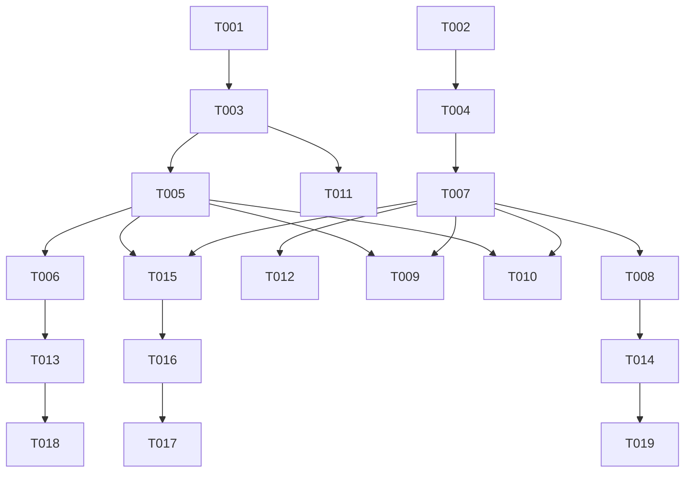

# Tasks: Standard SDK Health Endpoints

**Branch**: `028-sdk-health-endpoints` | **Spec**: [spec.md](spec.md) | **Plan**: [plan.md](plan.md)

## Phase 1: Setup
*Project initialization and dependency management.*

- [x] T001: Add `spring-boot-starter-actuator` dependency to `components/sdk/java/spas-sdk-spring/pom.xml`.
- [x] T002: Add `Microsoft.AspNetCore.Diagnostics.HealthChecks` framework reference to `components/sdk/dotnet/src/Spas.Sdk.Inbound/Spas.Sdk.Inbound.csproj`.

## Phase 2: Foundational
*Blocking prerequisites for all user stories.*

- [x] T003 [P] Create `SpasHealthController` skeleton in `components/sdk/java/spas-sdk-spring/src/main/java/io/spas/sdk/spring/health/SpasHealthController.java`
- [x] T004 [P] Create `SpasEndpointRouteBuilderExtensions` skeleton in `components/sdk/dotnet/src/Spas.Sdk.Inbound/Extensions/SpasEndpointRouteBuilderExtensions.cs`

## Phase 3: Sidecar Probes Readiness (US1)
*Priority: P1 - Critical for preventing message loss during startup.*

- [x] T005 [US1] Implement `/_spas/health/ready` endpoint in `components/sdk/java/spas-sdk-spring/src/main/java/io/spas/sdk/spring/health/SpasHealthController.java` delegating to Actuator
- [x] T006 [US1] Register `SpasHealthController` bean in `components/sdk/java/spas-sdk-spring/src/main/java/io/spas/sdk/spring/SpasAutoConfiguration.java`
- [x] T007 [US1] Implement `MapSpasHealthChecks` extension method in `components/sdk/dotnet/src/Spas.Sdk.Inbound/Extensions/SpasEndpointRouteBuilderExtensions.cs` with custom `ResponseWriter` for JSON format
- [x] T008 [US1] Call `MapSpasHealthChecks` in `components/sdk/dotnet/src/Spas.Sdk.Inbound/Extensions/SpasServiceExtensions.cs` (or equivalent startup extension)
- [x] T009 [US1] Ensure `/_spas/health/ready` returns 503 when checks fail (Java & .NET)
- [x] T010 [US1] Ensure `/_spas/health/ready` returns 200 OK with `{ "status": "UP" }` when healthy (Java & .NET)

## Phase 4: Orchestrator Probes Liveness (US2)
*Priority: P2 - Ensures system resilience.*

- [x] T011 [US2] Add `/_spas/health/live` endpoint to `components/sdk/java/spas-sdk-spring/src/main/java/io/spas/sdk/spring/health/SpasHealthController.java` (always UP if app running)
- [x] T012 [US2] Add `/_spas/health/live` mapping to `components/sdk/dotnet/src/Spas.Sdk.Inbound/Extensions/SpasEndpointRouteBuilderExtensions.cs` (always UP if app running)

## Phase 5: Developer Adds Custom Check (US3)
*Priority: P3 - Prevents service from accepting work it cannot process.*

- [x] T013 [US3] Verify Java SDK picks up custom `HealthIndicator` beans automatically (Integration Test or Manual Verification)
- [x] T014 [US3] Verify .NET SDK picks up custom `IHealthCheck` registrations automatically (Integration Test or Manual Verification)

## Phase 6: Compose Generates Docker Healthchecks (US4)
*Priority: P2 - Zero Configuration inner loop.*

- [x] T015 [US4] Update `spas-compose` generator to inject `healthcheck` block in `components/cli/spas-compose/src/generators/docker-compose/service-generator.ts` (or equivalent)
- [x] T016 [US4] Configure `healthcheck` with: `test: ["CMD", "curl", "-f", "http://localhost:8080/_spas/health/ready"]`, `interval: 10s`, `timeout: 5s`, `retries: 5`
- [x] T017 [US4] Update `depends_on` generation to use `condition: service_healthy` for service dependencies

## Phase 7: Polish & Cross-Cutting
*Documentation and metadata cleanup.*

- [x] T018 Update Java SDK README with custom health check example in `components/sdk/java/README.md`
- [x] T019 Update .NET SDK README with custom health check example in `components/sdk/dotnet/README.md`
- [x] T020 Ensure `/_spas/health/*` endpoints are NOT included in generated `spas.json` (Verify `SpasMetadataArchiveGenerator.java` and .NET equivalent)
- [x] T021 Ensure endpoints are accessible anonymously (Java Security Config & .NET `AllowAnonymous`)

## Dependencies

## Parallel Execution Examples

- **Java vs .NET vs CLI**: T001 (Java), T002 (.NET), and T015 (CLI) can all start independently, though CLI testing requires the endpoints to exist.
- **Docs vs Code**: T018/T019 can be drafted while implementation is in progress.

## Implementation Strategy

1. **MVP (US1)**: Get the `/ready` endpoint working on both platforms first. This unblocks the Sidecar integration.
2. **Automation (US4)**: Update `spas-compose` to use the new endpoints.
3. **Resilience (US2)**: Add the simple `/live` endpoint.
4. **Extensibility (US3)**: Verify custom checks work as expected.
5. **Polish**: Documentation and metadata cleanup.
